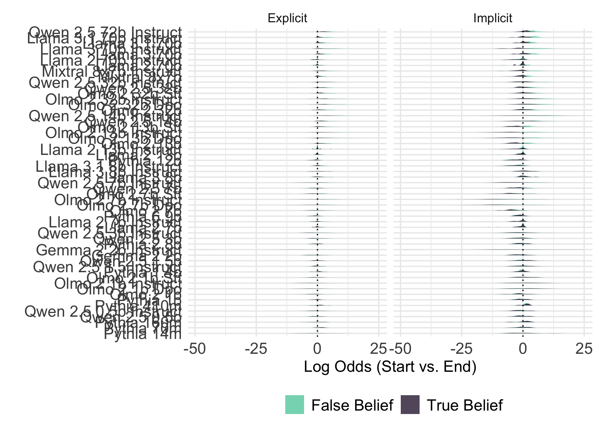
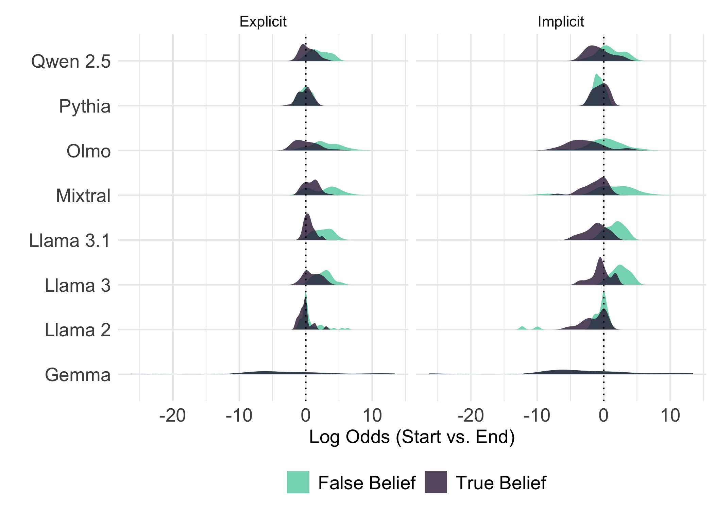
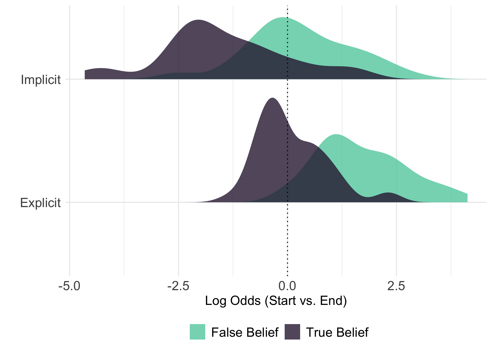
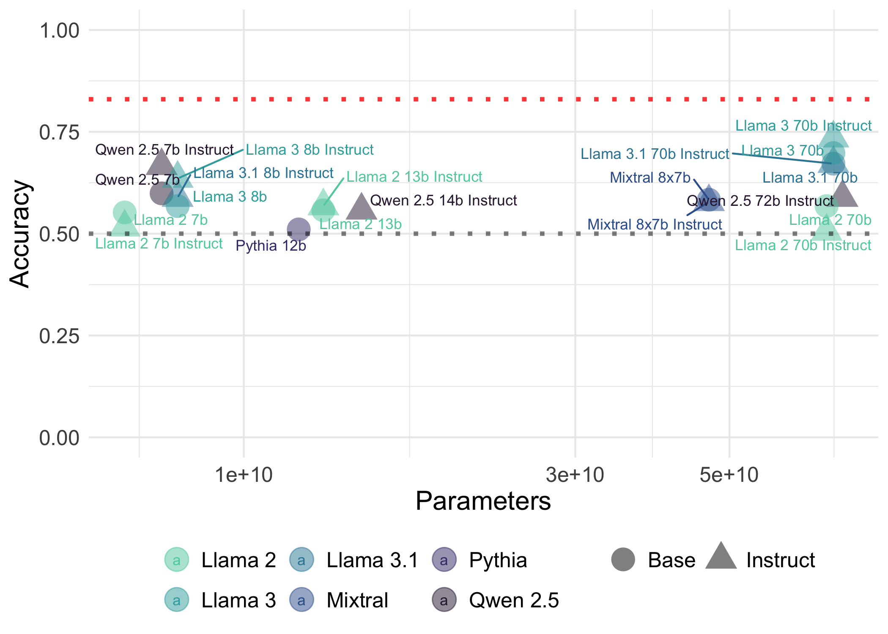
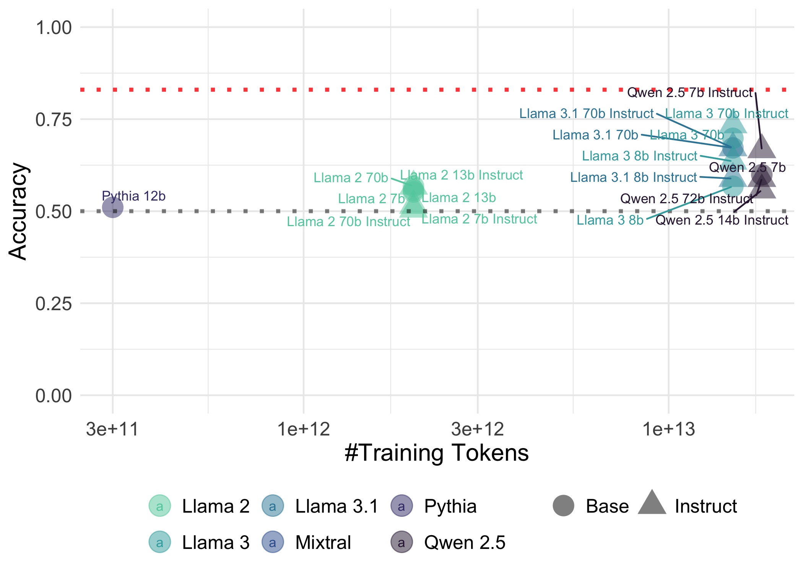
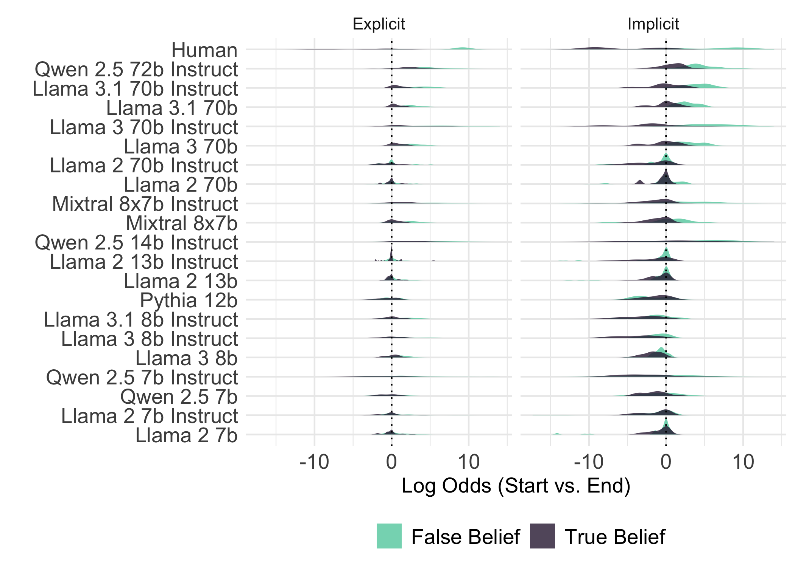
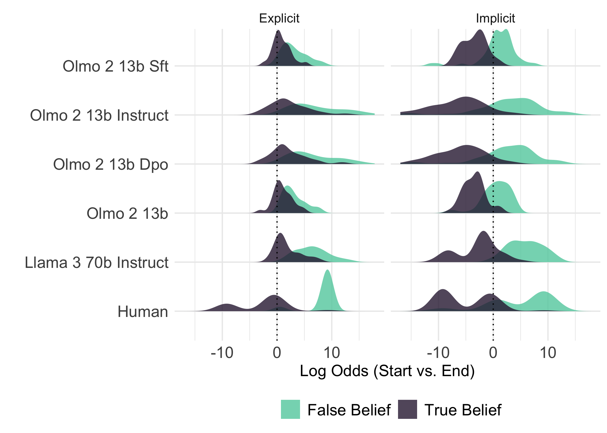

# Load LLM data

**TODO**: Load a separate `.csv` file with information about number of parameters, amount of training data, base vs. instruct.


``` r
# setwd("/Users/seantrott/Dropbox/UCSD/Research/NLMs/open_llm_tom/src/analysis")
directory_path <- "../../data/processed/fb/"
csv_files <- list.files(path = directory_path, pattern = "*.csv", full.names = TRUE)
csv_list <- csv_files %>%
  map(~ read_csv(.))
```

```
## Rows: 192 Columns: 12
## ── Column specification ────────────────────────────────────────────────────────
## Delimiter: ","
## chr (9): passage, start, end, knowledge_cue, first_mention, recent_mention, ...
## dbl (3): lp_start, lp_end, log_odds
## 
## ℹ Use `spec()` to retrieve the full column specification for this data.
## ℹ Specify the column types or set `show_col_types = FALSE` to quiet this message.
## Rows: 192 Columns: 12
## ── Column specification ────────────────────────────────────────────────────────
## Delimiter: ","
## chr (9): passage, start, end, knowledge_cue, first_mention, recent_mention, ...
## dbl (3): lp_start, lp_end, log_odds
## 
## ℹ Use `spec()` to retrieve the full column specification for this data.
## ℹ Specify the column types or set `show_col_types = FALSE` to quiet this message.
## Rows: 192 Columns: 12
## ── Column specification ────────────────────────────────────────────────────────
## Delimiter: ","
## chr (9): passage, start, end, knowledge_cue, first_mention, recent_mention, ...
## dbl (3): lp_start, lp_end, log_odds
## 
## ℹ Use `spec()` to retrieve the full column specification for this data.
## ℹ Specify the column types or set `show_col_types = FALSE` to quiet this message.
## Rows: 192 Columns: 12
## ── Column specification ────────────────────────────────────────────────────────
## Delimiter: ","
## chr (9): passage, start, end, knowledge_cue, first_mention, recent_mention, ...
## dbl (3): lp_start, lp_end, log_odds
## 
## ℹ Use `spec()` to retrieve the full column specification for this data.
## ℹ Specify the column types or set `show_col_types = FALSE` to quiet this message.
## Rows: 192 Columns: 12
## ── Column specification ────────────────────────────────────────────────────────
## Delimiter: ","
## chr (9): passage, start, end, knowledge_cue, first_mention, recent_mention, ...
## dbl (3): lp_start, lp_end, log_odds
## 
## ℹ Use `spec()` to retrieve the full column specification for this data.
## ℹ Specify the column types or set `show_col_types = FALSE` to quiet this message.
## Rows: 192 Columns: 12
## ── Column specification ────────────────────────────────────────────────────────
## Delimiter: ","
## chr (9): passage, start, end, knowledge_cue, first_mention, recent_mention, ...
## dbl (3): lp_start, lp_end, log_odds
## 
## ℹ Use `spec()` to retrieve the full column specification for this data.
## ℹ Specify the column types or set `show_col_types = FALSE` to quiet this message.
## Rows: 192 Columns: 12
## ── Column specification ────────────────────────────────────────────────────────
## Delimiter: ","
## chr (9): passage, start, end, knowledge_cue, first_mention, recent_mention, ...
## dbl (3): lp_start, lp_end, log_odds
## 
## ℹ Use `spec()` to retrieve the full column specification for this data.
## ℹ Specify the column types or set `show_col_types = FALSE` to quiet this message.
## Rows: 192 Columns: 12
## ── Column specification ────────────────────────────────────────────────────────
## Delimiter: ","
## chr (9): passage, start, end, knowledge_cue, first_mention, recent_mention, ...
## dbl (3): lp_start, lp_end, log_odds
## 
## ℹ Use `spec()` to retrieve the full column specification for this data.
## ℹ Specify the column types or set `show_col_types = FALSE` to quiet this message.
## Rows: 192 Columns: 12
## ── Column specification ────────────────────────────────────────────────────────
## Delimiter: ","
## chr (9): passage, start, end, knowledge_cue, first_mention, recent_mention, ...
## dbl (3): lp_start, lp_end, log_odds
## 
## ℹ Use `spec()` to retrieve the full column specification for this data.
## ℹ Specify the column types or set `show_col_types = FALSE` to quiet this message.
## Rows: 192 Columns: 12
## ── Column specification ────────────────────────────────────────────────────────
## Delimiter: ","
## chr (9): passage, start, end, knowledge_cue, first_mention, recent_mention, ...
## dbl (3): lp_start, lp_end, log_odds
## 
## ℹ Use `spec()` to retrieve the full column specification for this data.
## ℹ Specify the column types or set `show_col_types = FALSE` to quiet this message.
## Rows: 192 Columns: 12
## ── Column specification ────────────────────────────────────────────────────────
## Delimiter: ","
## chr (9): passage, start, end, knowledge_cue, first_mention, recent_mention, ...
## dbl (3): lp_start, lp_end, log_odds
## 
## ℹ Use `spec()` to retrieve the full column specification for this data.
## ℹ Specify the column types or set `show_col_types = FALSE` to quiet this message.
## Rows: 192 Columns: 12
## ── Column specification ────────────────────────────────────────────────────────
## Delimiter: ","
## chr (9): passage, start, end, knowledge_cue, first_mention, recent_mention, ...
## dbl (3): lp_start, lp_end, log_odds
## 
## ℹ Use `spec()` to retrieve the full column specification for this data.
## ℹ Specify the column types or set `show_col_types = FALSE` to quiet this message.
## Rows: 192 Columns: 12
## ── Column specification ────────────────────────────────────────────────────────
## Delimiter: ","
## chr (9): passage, start, end, knowledge_cue, first_mention, recent_mention, ...
## dbl (3): lp_start, lp_end, log_odds
## 
## ℹ Use `spec()` to retrieve the full column specification for this data.
## ℹ Specify the column types or set `show_col_types = FALSE` to quiet this message.
## Rows: 192 Columns: 12
## ── Column specification ────────────────────────────────────────────────────────
## Delimiter: ","
## chr (9): passage, start, end, knowledge_cue, first_mention, recent_mention, ...
## dbl (3): lp_start, lp_end, log_odds
## 
## ℹ Use `spec()` to retrieve the full column specification for this data.
## ℹ Specify the column types or set `show_col_types = FALSE` to quiet this message.
## Rows: 192 Columns: 12
## ── Column specification ────────────────────────────────────────────────────────
## Delimiter: ","
## chr (9): passage, start, end, knowledge_cue, first_mention, recent_mention, ...
## dbl (3): lp_start, lp_end, log_odds
## 
## ℹ Use `spec()` to retrieve the full column specification for this data.
## ℹ Specify the column types or set `show_col_types = FALSE` to quiet this message.
## Rows: 192 Columns: 12
## ── Column specification ────────────────────────────────────────────────────────
## Delimiter: ","
## chr (9): passage, start, end, knowledge_cue, first_mention, recent_mention, ...
## dbl (3): lp_start, lp_end, log_odds
## 
## ℹ Use `spec()` to retrieve the full column specification for this data.
## ℹ Specify the column types or set `show_col_types = FALSE` to quiet this message.
## Rows: 192 Columns: 12
## ── Column specification ────────────────────────────────────────────────────────
## Delimiter: ","
## chr (9): passage, start, end, knowledge_cue, first_mention, recent_mention, ...
## dbl (3): lp_start, lp_end, log_odds
## 
## ℹ Use `spec()` to retrieve the full column specification for this data.
## ℹ Specify the column types or set `show_col_types = FALSE` to quiet this message.
## Rows: 192 Columns: 12
## ── Column specification ────────────────────────────────────────────────────────
## Delimiter: ","
## chr (9): passage, start, end, knowledge_cue, first_mention, recent_mention, ...
## dbl (3): lp_start, lp_end, log_odds
## 
## ℹ Use `spec()` to retrieve the full column specification for this data.
## ℹ Specify the column types or set `show_col_types = FALSE` to quiet this message.
## Rows: 192 Columns: 12
## ── Column specification ────────────────────────────────────────────────────────
## Delimiter: ","
## chr (9): passage, start, end, knowledge_cue, first_mention, recent_mention, ...
## dbl (3): lp_start, lp_end, log_odds
## 
## ℹ Use `spec()` to retrieve the full column specification for this data.
## ℹ Specify the column types or set `show_col_types = FALSE` to quiet this message.
## Rows: 192 Columns: 12
## ── Column specification ────────────────────────────────────────────────────────
## Delimiter: ","
## chr (9): passage, start, end, knowledge_cue, first_mention, recent_mention, ...
## dbl (3): lp_start, lp_end, log_odds
## 
## ℹ Use `spec()` to retrieve the full column specification for this data.
## ℹ Specify the column types or set `show_col_types = FALSE` to quiet this message.
```

``` r
df_all_models <- bind_rows(csv_list) %>%
  mutate(model_shorthand = str_to_title(model_shorthand))
nrow(df_all_models)
```

```
## [1] 3840
```

``` r
table(df_all_models$model_path)
```

```
## 
##                EleutherAI/pythia-12b       meta-llama/Llama-2-13b-chat-hf 
##                                  192                                  192 
##            meta-llama/Llama-2-13b-hf       meta-llama/Llama-2-70b-chat-hf 
##                                  192                                  192 
##            meta-llama/Llama-2-70b-hf        meta-llama/Llama-2-7b-chat-hf 
##                                  192                                  192 
##             meta-llama/Llama-2-7b-hf             meta-llama/Llama-3.1-70B 
##                                  192                                  192 
##    meta-llama/Llama-3.1-70B-Instruct     meta-llama/Llama-3.1-8B-Instruct 
##                                  192                                  192 
##          meta-llama/Meta-Llama-3-70B meta-llama/Meta-Llama-3-70B-Instruct 
##                                  192                                  192 
##           meta-llama/Meta-Llama-3-8B  meta-llama/Meta-Llama-3-8B-Instruct 
##                                  192                                  192 
## mistralai/Mixtral-8x7B-Instruct-v0.1          mistralai/Mixtral-8x7B-v0.1 
##                                  192                                  192 
##            Qwen/Qwen2.5-14B-Instruct            Qwen/Qwen2.5-72B-Instruct 
##                                  192                                  192 
##                      Qwen/Qwen2.5-7B             Qwen/Qwen2.5-7B-Instruct 
##                                  192                                  192
```

``` r
table(df_all_models$model_shorthand)
```

```
## 
##            Llama 2 13b   Llama 2 13b Instruct            Llama 2 70b 
##                    192                    192                    192 
##   Llama 2 70b Instruct             Llama 2 7b    Llama 2 7b Instruct 
##                    192                    192                    192 
##            Llama 3 70b   Llama 3 70b Instruct             Llama 3 8b 
##                    192                    192                    192 
##    Llama 3 8b Instruct          Llama 3.1 70b Llama 3.1 70b Instruct 
##                    192                    192                    192 
##  Llama 3.1 8b Instruct           Mixtral 8x7b  Mixtral 8x7b Instruct 
##                    192                    192                    192 
##             Pythia 12b  Qwen 2.5 14b Instruct  Qwen 2.5 72b Instruct 
##                    192                    192                    192 
##            Qwen 2.5 7b   Qwen 2.5 7b Instruct 
##                    192                    192
```

``` r
### Load #params
df_model_properties = read_csv("../../data/processed/model_properties.csv") %>% 
  mutate(model_shorthand = str_to_title(model_shorthand))
```

```
## Rows: 21 Columns: 5
## ── Column specification ────────────────────────────────────────────────────────
## Delimiter: ","
## chr (4): model_path, model_shorthand, base_instruct, model_family
## dbl (1): num_params
## 
## ℹ Use `spec()` to retrieve the full column specification for this data.
## ℹ Specify the column types or set `show_col_types = FALSE` to quiet this message.
```

``` r
nrow(df_model_properties)
```

```
## [1] 21
```

``` r
### Load training data
df_training_data = read_csv("../../data/processed/model_training_data.csv")%>% 
  mutate(model_shorthand = str_to_title(model_shorthand))
```

```
## Rows: 21 Columns: 3
## ── Column specification ────────────────────────────────────────────────────────
## Delimiter: ","
## chr (2): model_path, model_shorthand
## dbl (1): num_training_tokens
## 
## ℹ Use `spec()` to retrieve the full column specification for this data.
## ℹ Specify the column types or set `show_col_types = FALSE` to quiet this message.
```

``` r
table(df_training_data$model_shorthand)
```

```
## 
##            Llama 2 13b   Llama 2 13b Instruct            Llama 2 70b 
##                      1                      1                      1 
##   Llama 2 70b Instruct             Llama 2 7b    Llama 2 7b Instruct 
##                      1                      1                      1 
##            Llama 3 70b   Llama 3 70b Instruct             Llama 3 8b 
##                      1                      1                      1 
##    Llama 3 8b Instruct          Llama 3.1 70b Llama 3.1 70b Instruct 
##                      1                      1                      1 
##           Llama 3.1 8b  Llama 3.1 8b Instruct           Mixtral 8x7b 
##                      1                      1                      1 
##  Mixtral 8x7b Instruct             Pythia 12b  Qwen 2.5 14b Instruct 
##                      1                      1                      1 
##  Qwen 2.5 72b Instruct            Qwen 2.5 7b   Qwen 2.5 7b Instruct 
##                      1                      1                      1
```

``` r
### Join
df_all_properties = df_training_data %>%
  inner_join(df_model_properties)
```

```
## Joining with `by = join_by(model_path, model_shorthand)`
```

``` r
nrow(df_all_properties)
```

```
## [1] 21
```

``` r
#### Bind with FB data
df_all_models = df_all_models %>%
  inner_join(df_all_properties)
```

```
## Joining with `by = join_by(model_path, model_shorthand)`
```

``` r
nrow(df_all_models)
```

```
## [1] 3840
```

``` r
table(df_all_models$model_shorthand)
```

```
## 
##            Llama 2 13b   Llama 2 13b Instruct            Llama 2 70b 
##                    192                    192                    192 
##   Llama 2 70b Instruct             Llama 2 7b    Llama 2 7b Instruct 
##                    192                    192                    192 
##            Llama 3 70b   Llama 3 70b Instruct             Llama 3 8b 
##                    192                    192                    192 
##    Llama 3 8b Instruct          Llama 3.1 70b Llama 3.1 70b Instruct 
##                    192                    192                    192 
##  Llama 3.1 8b Instruct           Mixtral 8x7b  Mixtral 8x7b Instruct 
##                    192                    192                    192 
##             Pythia 12b  Qwen 2.5 14b Instruct  Qwen 2.5 72b Instruct 
##                    192                    192                    192 
##            Qwen 2.5 7b   Qwen 2.5 7b Instruct 
##                    192                    192
```

``` r
df_all_models = df_all_models %>%
  mutate(model_shorthand = str_to_title(model_shorthand))
```


# LLM Analysis

## Sensitivity to mental states


``` r
### Visualization
df_all_models %>%
  ggplot(aes(x = log_odds,
             y = reorder(model_shorthand, num_params),
             fill = condition)) +
  geom_density_ridges2(aes(height = ..density..), 
                       color=NA, 
                       scale=.85, 
                       # size=1, 
                       alpha = .8,
                       stat="density") +
  labs(x = "Log Odds (Start vs. End)",
       y = "",
       fill = "") +
  theme_minimal() +
  geom_vline(xintercept = 0, linetype = "dotted") +
  theme(
    legend.position = "bottom"
  ) + 
  theme(axis.title = element_text(size=rel(1.2)),
        axis.text = element_text(size = rel(1.2)),
        legend.text = element_text(size = rel(1.2)),
        legend.title = element_text(size = rel(1.2)),
        strip.text.x = element_text(size = rel(1.2))) +
    scale_fill_manual(values = viridisLite::viridis(2, option = "mako", 
                                                    begin = 0.8, end = 0.15)) +
  facet_wrap(~knowledge_cue)
```

```
## Warning: The dot-dot notation (`..density..`) was deprecated in ggplot2 3.4.0.
## ℹ Please use `after_stat(density)` instead.
## This warning is displayed once every 8 hours.
## Call `lifecycle::last_lifecycle_warnings()` to see where this warning was
## generated.
```

<!-- -->

``` r
### Visualization by model family
df_all_models %>%
  group_by(passage, condition, knowledge_cue, model_family) %>%
  summarise(m_lo = mean(log_odds)) %>%
  ggplot(aes(x = m_lo,
             y = model_family,
             fill = condition)) +
  geom_density_ridges2(aes(height = ..density..), 
                       color=NA, 
                       scale=.85, 
                       # size=1, 
                       alpha = .8,
                       stat="density") +
  labs(x = "Log Odds (Start vs. End)",
       y = "",
       fill = "") +
  theme_minimal() +
  geom_vline(xintercept = 0, linetype = "dotted") +
  theme(
    legend.position = "bottom"
  ) + 
  theme(axis.title = element_text(size=rel(1.2)),
        axis.text = element_text(size = rel(1.2)),
        legend.text = element_text(size = rel(1.2)),
        legend.title = element_text(size = rel(1.2)),
        strip.text.x = element_text(size = rel(1.2))) +
    scale_fill_manual(values = viridisLite::viridis(2, option = "mako", 
                                                    begin = 0.8, end = 0.15)) +
  facet_wrap(~knowledge_cue)
```

```
## `summarise()` has grouped output by 'passage', 'condition', 'knowledge_cue'.
## You can override using the `.groups` argument.
```

<!-- -->

``` r
### Visualization altogether
df_all_models %>%
  group_by(passage, condition, knowledge_cue) %>%
  summarise(m_lo = mean(log_odds)) %>%
  ggplot(aes(x = m_lo,
             y = knowledge_cue,
             fill = condition)) +
  geom_density_ridges2(aes(height = ..density..), 
                       color=NA, 
                       scale=.85, 
                       # size=1, 
                       alpha = .8,
                       stat="density") +
  labs(x = "Log Odds (Start vs. End)",
       y = "",
       fill = "") +
  theme_minimal() +
  geom_vline(xintercept = 0, linetype = "dotted") +
  theme(
    legend.position = "bottom"
  ) + 
  theme(axis.title = element_text(size=rel(1.2)),
        axis.text = element_text(size = rel(1.2)),
        legend.text = element_text(size = rel(1.2)),
        legend.title = element_text(size = rel(1.2)),
        strip.text.x = element_text(size = rel(1.2))) +
    scale_fill_manual(values = viridisLite::viridis(2, option = "mako", 
                                                    begin = 0.8, end = 0.15))
```

```
## `summarise()` has grouped output by 'passage', 'condition'. You can override
## using the `.groups` argument.
```

<!-- -->

Each model on its own:


``` r
# Function to fit models and perform model comparison
compare_models <- function(df) {
  if (n_distinct(df$condition) < 2) return(NULL)  # Skip if only one condition
  
  mod_full <- tryCatch(
    lmer(log_odds ~ condition + knowledge_cue + first_mention + recent_mention +
           (1 + condition | start), data = df, REML = FALSE),
    error = function(e) NULL
  )
  
  mod_reduced <- tryCatch(
    lmer(log_odds ~ knowledge_cue + first_mention + recent_mention +
           (1 + condition | start), data = df, REML = FALSE),
    error = function(e) NULL
  )
  
  if (is.null(mod_full) || is.null(mod_reduced)) return(NULL)
  
  anova_result <- anova(mod_full, mod_reduced)
  delta_aic <- AIC(mod_reduced) - AIC(mod_full)
  lrt_stat <- anova_result$Chisq[2]
  p_val <- anova_result$`Pr(>Chisq)`[2]
  
  # Extract condition coefficient from full model (assuming it's a factor and second level is the contrast)
  cond_coef <- tryCatch({
    coefs <- fixef(mod_full)
    cond_name <- grep("^condition", names(coefs), value = TRUE)
    coefs[cond_name]
  }, error = function(e) NA)

  tibble(
    model_path = unique(df$model_path),
    delta_AIC = delta_aic,
    LRT_stat = lrt_stat,
    p_value = p_val,
    condition_coef = cond_coef
  )
}

# Apply to each model_path
results_by_model_path <- df_all_models %>%
  group_by(model_path) %>%
  group_split() %>%
  map_dfr(compare_models)
```

```
## boundary (singular) fit: see help('isSingular')
## boundary (singular) fit: see help('isSingular')
```

``` r
results_by_model_path %>%
  arrange(LRT_stat)
```

```
## # A tibble: 20 × 5
##    model_path                          delta_AIC LRT_stat p_value condition_coef
##    <chr>                                   <dbl>    <dbl>   <dbl>          <dbl>
##  1 meta-llama/Llama-2-7b-hf               -1.99   0.00780 9.30e-1        -0.0446
##  2 meta-llama/Llama-2-7b-chat-hf          -1.93   0.0691  7.93e-1        -0.179 
##  3 meta-llama/Llama-2-13b-hf              -1.93   0.0750  7.84e-1        -0.129 
##  4 meta-llama/Llama-2-70b-hf              -1.56   0.436   5.09e-1        -0.258 
##  5 meta-llama/Llama-2-13b-chat-hf         -0.577  1.42    2.33e-1        -0.892 
##  6 Qwen/Qwen2.5-7B                         0.389  2.39    1.22e-1        -0.673 
##  7 EleutherAI/pythia-12b                   0.390  2.39    1.22e-1         0.215 
##  8 meta-llama/Llama-2-70b-chat-hf          1.91   3.91    4.81e-2        -0.723 
##  9 Qwen/Qwen2.5-7B-Instruct                3.24   5.24    2.21e-2        -2.19  
## 10 Qwen/Qwen2.5-14B-Instruct               4.64   6.64    9.95e-3        -3.25  
## 11 mistralai/Mixtral-8x7B-v0.1             4.83   6.83    8.95e-3        -1.46  
## 12 mistralai/Mixtral-8x7B-Instruct-v0…     6.54   8.54    3.47e-3        -2.71  
## 13 meta-llama/Meta-Llama-3-8B-Instruct    12.2   14.2     1.63e-4        -2.04  
## 14 meta-llama/Llama-3.1-8B-Instruct       15.9   17.9     2.29e-5        -1.59  
## 15 meta-llama/Llama-3.1-70B-Instruct      17.3   19.3     1.10e-5        -3.39  
## 16 meta-llama/Meta-Llama-3-70B-Instru…    17.6   19.6     9.55e-6        -6.52  
## 17 Qwen/Qwen2.5-72B-Instruct              19.1   21.1     4.34e-6        -3.17  
## 18 meta-llama/Meta-Llama-3-8B             19.6   21.6     3.39e-6        -0.882 
## 19 meta-llama/Meta-Llama-3-70B            22.4   24.4     7.76e-7        -2.59  
## 20 meta-llama/Llama-3.1-70B               23.5   25.5     4.52e-7        -2.34
```

``` r
summary(results_by_model_path$LRT_stat)
```

```
##      Min.   1st Qu.    Median      Mean   3rd Qu.      Max. 
##  0.007797  2.147319  6.738296 10.079958 19.393260 25.458603
```

``` r
summary(results_by_model_path$condition_coef)
```

```
##    Min. 1st Qu.  Median    Mean 3rd Qu.    Max. 
## -6.5204 -2.6196 -1.5270 -1.7414 -0.5692  0.2154
```


All models together:


``` r
### Mixed models
mod_full = lmer(data = df_all_models,
                log_odds ~ condition + knowledge_cue + first_mention + recent_mention + 
                  (1 + condition | model_path) + (1 + condition | start),
                REML = FALSE)

mod_reduced = lmer(data = df_all_models,
                log_odds ~ knowledge_cue + first_mention + recent_mention + 
                  (1 + condition | model_path) + (1 + condition | start),
                REML = FALSE)

summary(mod_full)
```

```
## Linear mixed model fit by maximum likelihood . t-tests use Satterthwaite's
##   method [lmerModLmerTest]
## Formula: 
## log_odds ~ condition + knowledge_cue + first_mention + recent_mention +  
##     (1 + condition | model_path) + (1 + condition | start)
##    Data: df_all_models
## 
##       AIC       BIC    logLik -2*log(L)  df.resid 
##   16848.8   16923.9   -8412.4   16824.8      3828 
## 
## Scaled residuals: 
##     Min      1Q  Median      3Q     Max 
## -6.2699 -0.4768  0.0321  0.5073  5.8817 
## 
## Random effects:
##  Groups     Name                 Variance Std.Dev. Corr 
##  model_path (Intercept)          4.4164   2.1015        
##             conditionTrue Belief 2.4095   1.5523   -0.91
##  start      (Intercept)          1.6359   1.2790        
##             conditionTrue Belief 0.4941   0.7029   -0.73
##  Residual                        4.4459   2.1085        
## Number of obs: 3840, groups:  model_path, 20; start, 10
## 
## Fixed effects:
##                         Estimate Std. Error         df t value Pr(>|t|)    
## (Intercept)              1.92600    0.62480   28.13621   3.083 0.004560 ** 
## conditionTrue Belief    -1.72307    0.41815   27.47140  -4.121 0.000313 ***
## knowledge_cueImplicit   -1.60995    0.06805 3782.24596 -23.658  < 2e-16 ***
## first_mentionStart       0.08859    0.06805 3782.24596   1.302 0.193050    
## recent_mentionStart      0.14621    0.06805 3782.24597   2.149 0.031735 *  
## ---
## Signif. codes:  0 '***' 0.001 '**' 0.01 '*' 0.05 '.' 0.1 ' ' 1
## 
## Correlation of Fixed Effects:
##             (Intr) cndtTB knwl_I frst_S
## condtnTrBlf -0.830                     
## knwldg_cImp -0.054  0.000              
## frst_mntnSt -0.054  0.000  0.000       
## rcnt_mntnSt -0.054  0.000  0.000  0.000
```

``` r
anova(mod_full, mod_reduced)
```

```
## Data: df_all_models
## Models:
## mod_reduced: log_odds ~ knowledge_cue + first_mention + recent_mention + (1 + condition | model_path) + (1 + condition | start)
## mod_full: log_odds ~ condition + knowledge_cue + first_mention + recent_mention + (1 + condition | model_path) + (1 + condition | start)
##             npar   AIC   BIC  logLik -2*log(L)  Chisq Df Pr(>Chisq)    
## mod_reduced   11 16860 16929 -8419.0     16838                         
## mod_full      12 16849 16924 -8412.4     16825 13.226  1  0.0002761 ***
## ---
## Signif. codes:  0 '***' 0.001 '**' 0.01 '*' 0.05 '.' 0.1 ' ' 1
```


## Accuracy metric

**TODO**: Add in features like number of training tokens.


``` r
df_all_models = df_all_models %>%
  mutate(correct = case_when(
    condition == "False Belief" & log_odds > 0 ~ TRUE,
    condition == "True Belief" & log_odds <= 0 ~ TRUE,
    TRUE ~ FALSE  # all other cases are incorrect
  ))


df_summ = df_all_models %>%
  group_by(model_path, model_shorthand, model_family,
           num_params, num_training_tokens, base_instruct) %>%
  summarise(mean_accuracy = mean(correct))
```

```
## `summarise()` has grouped output by 'model_path', 'model_shorthand',
## 'model_family', 'num_params', 'num_training_tokens'. You can override using the
## `.groups` argument.
```

``` r
df_summ %>%
  select(model_shorthand, mean_accuracy)
```

```
## Adding missing grouping variables: `model_path`, `model_family`, `num_params`,
## `num_training_tokens`
```

```
## # A tibble: 20 × 6
## # Groups:   model_path, model_shorthand, model_family, num_params,
## #   num_training_tokens [20]
##    model_path        model_family num_params num_training_tokens model_shorthand
##    <chr>             <chr>             <dbl>               <dbl> <chr>          
##  1 EleutherAI/pythi… Pythia          1.20e10             3   e11 Pythia 12b     
##  2 Qwen/Qwen2.5-14B… Qwen 2.5        1.48e10             1.80e13 Qwen 2.5 14b I…
##  3 Qwen/Qwen2.5-72B… Qwen 2.5        7.27e10             1.80e13 Qwen 2.5 72b I…
##  4 Qwen/Qwen2.5-7B   Qwen 2.5        7.62e 9             1.80e13 Qwen 2.5 7b    
##  5 Qwen/Qwen2.5-7B-… Qwen 2.5        7.62e 9             1.80e13 Qwen 2.5 7b In…
##  6 meta-llama/Llama… Llama 2         1.30e10             2   e12 Llama 2 13b In…
##  7 meta-llama/Llama… Llama 2         1.30e10             2   e12 Llama 2 13b    
##  8 meta-llama/Llama… Llama 2         6.90e10             2   e12 Llama 2 70b In…
##  9 meta-llama/Llama… Llama 2         6.90e10             2   e12 Llama 2 70b    
## 10 meta-llama/Llama… Llama 2         6.74e 9             2   e12 Llama 2 7b Ins…
## 11 meta-llama/Llama… Llama 2         6.74e 9             2   e12 Llama 2 7b     
## 12 meta-llama/Llama… Llama 3.1       7.06e10             1.5 e13 Llama 3.1 70b  
## 13 meta-llama/Llama… Llama 3.1       7.06e10             1.5 e13 Llama 3.1 70b …
## 14 meta-llama/Llama… Llama 3.1       8.03e 9             1.5 e13 Llama 3.1 8b I…
## 15 meta-llama/Meta-… Llama 3         7.06e10             1.5 e13 Llama 3 70b    
## 16 meta-llama/Meta-… Llama 3         7.06e10             1.5 e13 Llama 3 70b In…
## 17 meta-llama/Meta-… Llama 3         8.03e 9             1.5 e13 Llama 3 8b     
## 18 meta-llama/Meta-… Llama 3         8.03e 9             1.5 e13 Llama 3 8b Ins…
## 19 mistralai/Mixtra… Mixtral         4.67e10            NA       Mixtral 8x7b I…
## 20 mistralai/Mixtra… Mixtral         4.67e10            NA       Mixtral 8x7b   
## # ℹ 1 more variable: mean_accuracy <dbl>
```

``` r
mean(df_all_models$correct)
```

```
## [1] 0.5958333
```

``` r
### "Wisdom of the crowd"?
df_lo_avg = df_all_models %>%
  group_by(passage, condition) %>%
  summarise(m_lo = mean(log_odds)) %>%
  mutate(correct = case_when(
    condition == "False Belief" & m_lo > 0 ~ TRUE,
    condition == "True Belief" & m_lo <= 0 ~ TRUE,
    TRUE ~ FALSE  # all other cases are incorrect
  )) 
```

```
## `summarise()` has grouped output by 'passage'. You can override using the
## `.groups` argument.
```

``` r
mean(df_lo_avg$correct)
```

```
## [1] 0.71875
```

``` r
df_summ %>%
  ggplot(aes(x = num_params,
             y = mean_accuracy,
             color = model_family,
             shape = base_instruct)) +
  geom_point(size = 6,
             alpha = .5) +
  geom_hline(yintercept = .83,##TODO: Calculate from scratch
             linetype = "dotted", color = "red",
             size = 1.2, alpha = .8) + 
  geom_hline(yintercept = .5, linetype = "dotted",
             size = 1.2, alpha = .5) +
  scale_x_log10() +
  geom_text_repel(aes(label=model_shorthand), size=3) +
  scale_y_continuous(limits = c(0, 1)) +
  labs(x = "Parameters",
       y = "Accuracy",
       color = "",
       shape = "") +
  theme_minimal() +
  scale_color_manual(values = viridisLite::viridis(6, option = "mako", 
                                                  begin = 0.8, end = 0.15)) +
  theme(text = element_text(size = 15),
        legend.position="bottom")
```

```
## Warning: Using `size` aesthetic for lines was deprecated in ggplot2 3.4.0.
## ℹ Please use `linewidth` instead.
## This warning is displayed once every 8 hours.
## Call `lifecycle::last_lifecycle_warnings()` to see where this warning was
## generated.
```

<!-- -->

``` r
df_summ %>%
  ggplot(aes(x = num_training_tokens,
             y = mean_accuracy,
             color = model_family,
             shape = base_instruct)) +
  geom_point(size = 6,
             alpha = .5) +
  geom_hline(yintercept = .83,##TODO: Calculate from scratch
             linetype = "dotted", color = "red",
             size = 1.2, alpha = .8) + 
  geom_hline(yintercept = .5, linetype = "dotted",
             size = 1.2, alpha = .5) +
  scale_x_log10() +
  geom_text_repel(aes(label=model_shorthand), size=3) +
  scale_y_continuous(limits = c(0, 1)) +
  labs(x = "#Training Tokens",
       y = "Accuracy",
       color = "",
       shape = "") +
  theme_minimal() +
  scale_color_manual(values = viridisLite::viridis(6, option = "mako", 
                                                  begin = 0.8, end = 0.15)) +
  theme(text = element_text(size = 15),
        legend.position="bottom")
```

```
## Warning: Removed 2 rows containing missing values or values outside the scale range
## (`geom_point()`).
```

```
## Warning: Removed 2 rows containing missing values or values outside the scale range
## (`geom_text_repel()`).
```

<!-- -->

``` r
### How does model size predict accuracy?
mod_full = glmer(data = df_all_models,
                 correct ~ condition + knowledge_cue +
                   log10(num_params) + log10(num_training_tokens) + base_instruct + 
                   (1 | start) + (1|model_family), 
                 family = binomial())
```

```
## Warning in checkConv(attr(opt, "derivs"), opt$par, ctrl = control$checkConv, :
## Model failed to converge with max|grad| = 0.0346688 (tol = 0.002, component 1)
```

``` r
summary(mod_full)
```

```
## Generalized linear mixed model fit by maximum likelihood (Laplace
##   Approximation) [glmerMod]
##  Family: binomial  ( logit )
## Formula: 
## correct ~ condition + knowledge_cue + log10(num_params) + log10(num_training_tokens) +  
##     base_instruct + (1 | start) + (1 | model_family)
##    Data: df_all_models
## 
##       AIC       BIC    logLik -2*log(L)  df.resid 
##    4598.0    4647.2   -2291.0    4582.0      3448 
## 
## Scaled residuals: 
##     Min      1Q  Median      3Q     Max 
## -1.5975 -1.1491  0.6735  0.8278  1.2564 
## 
## Random effects:
##  Groups       Name        Variance Std.Dev.
##  start        (Intercept) 0.014752 0.12146 
##  model_family (Intercept) 0.002433 0.04932 
## Number of obs: 3456, groups:  start, 10; model_family, 5
## 
## Fixed effects:
##                            Estimate Std. Error z value Pr(>|z|)    
## (Intercept)                -5.67546    1.30330  -4.355 1.33e-05 ***
## conditionTrue Belief       -0.39503    0.07031  -5.618 1.93e-08 ***
## knowledge_cueImplicit       0.17493    0.07026   2.490   0.0128 *  
## log10(num_params)           0.18972    0.08256   2.298   0.0216 *  
## log10(num_training_tokens)  0.33233    0.08298   4.005 6.20e-05 ***
## base_instructInstruct      -0.04448    0.07622  -0.584   0.5596    
## ---
## Signif. codes:  0 '***' 0.001 '**' 0.01 '*' 0.05 '.' 0.1 ' ' 1
## 
## Correlation of Fixed Effects:
##             (Intr) cndtTB knwl_I l10(_) l10(__
## condtnTrBlf -0.014                            
## knwldg_cImp -0.033 -0.008                     
## lg10(nm_pr) -0.590 -0.007  0.003              
## lg10(nm_t_) -0.757 -0.012  0.005 -0.076       
## bs_nstrctIn  0.244  0.001  0.000 -0.032 -0.311
## optimizer (Nelder_Mead) convergence code: 0 (OK)
## Model failed to converge with max|grad| = 0.0346688 (tol = 0.002, component 1)
```


# Comparison to human baseline

## Load human data


``` r
df_human = read_csv("../../data/processed/human/human_fb_cleaned.csv") %>%
  select(participant_id, item_id, passage,
         is_correct, is_start, is_end,
         reaction_time, condition, response, knowledge_cue)
```

```
## New names:
## Rows: 613 Columns: 51
## ── Column specification
## ──────────────────────────────────────────────────────── Delimiter: "," chr
## (26): item_id, item_type, correct_answer, response, condition, first_men... dbl
## (21): ...1, id, participant_id, item, trial_index, reaction_time, trial_... lgl
## (4): is_correct, is_start, is_end, excluded.attention
## ℹ Use `spec()` to retrieve the full column specification for this data. ℹ
## Specify the column types or set `show_col_types = FALSE` to quiet this message.
## • `` -> `...1`
```

``` r
mean(df_human$is_correct)
```

```
## [1] 0.8270799
```

``` r
df_by_item = df_human %>%
  group_by(condition, passage, knowledge_cue) %>%
  summarise(p_start = mean(is_start) + .0001,
            p_end = mean(is_end) + .0001) %>%
  mutate(log_odds = log((p_start / p_end))) %>%
  mutate(model_shorthand = "Human")
```

```
## `summarise()` has grouped output by 'condition', 'passage'. You can override
## using the `.groups` argument.
```

``` r
### Merge
df_merged = df_all_models %>%
  bind_rows(df_by_item)
```

## Recreate model-wise distributiosn


``` r
### Visualization
df_merged %>%
  ggplot(aes(x = log_odds,
             y = reorder(model_shorthand, num_params),
             fill = condition)) +
  geom_density_ridges2(aes(height = ..density..), 
                       color=NA, 
                       scale=.85, 
                       # size=1, 
                       alpha = .8,
                       stat="density") +
  labs(x = "Log Odds (Start vs. End)",
       y = "",
       fill = "") +
  theme_minimal() +
  geom_vline(xintercept = 0, linetype = "dotted") +
  theme(
    legend.position = "bottom"
  ) + 
  theme(axis.title = element_text(size=rel(1.2)),
        axis.text = element_text(size = rel(1.2)),
        legend.text = element_text(size = rel(1.2)),
        legend.title = element_text(size = rel(1.2)),
        strip.text.x = element_text(size = rel(1.2))) +
    scale_fill_manual(values = viridisLite::viridis(2, option = "mako", 
                                                    begin = 0.8, end = 0.15)) +
  facet_wrap(~knowledge_cue)
```

<!-- -->


## Correlation matrix


``` r
df_model_means = df_all_models %>%
  group_by(passage, condition, knowledge_cue) %>%
  summarise(log_odds = mean(log_odds)) %>%
  mutate(model_shorthand = "All Models")
```

```
## `summarise()` has grouped output by 'passage', 'condition'. You can override
## using the `.groups` argument.
```

``` r
# df_merged = df_merged %>%
#   bind_rows(df_model_means)


df_wide <- df_merged %>%
  select(passage, model_shorthand, log_odds) %>%
  pivot_wider(names_from = model_shorthand, values_from = log_odds)

cor_matrix <- df_wide %>%
  select(-passage) %>%
  cor(use = "pairwise.complete.obs")
cor_matrix
```

```
##                        Llama 2 13b Instruct  Llama 2 13b Llama 2 70b Instruct
## Llama 2 13b Instruct             1.00000000  0.875170547           0.81918154
## Llama 2 13b                      0.87517055  1.000000000           0.81015621
## Llama 2 70b Instruct             0.81918154  0.810156209           1.00000000
## Llama 2 70b                      0.74763196  0.870534254           0.85408877
## Llama 2 7b Instruct              0.86722391  0.919057551           0.81709285
## Llama 2 7b                       0.80992181  0.960932122           0.79137968
## Llama 3.1 70b Instruct           0.33467391  0.240569854           0.49875767
## Llama 3.1 70b                    0.41052800  0.345186408           0.57704564
## Llama 3.1 8b Instruct            0.52020093  0.503729418           0.54197076
## Llama 3 70b Instruct             0.36672710  0.251357132           0.48889958
## Llama 3 70b                      0.44053254  0.381960369           0.61558193
## Llama 3 8b Instruct              0.61195229  0.572409643           0.56426734
## Llama 3 8b                       0.57884349  0.526765595           0.51634830
## Mixtral 8x7b Instruct            0.62652149  0.622445639           0.59956069
## Mixtral 8x7b                     0.69709211  0.739906704           0.72378918
## Pythia 12b                       0.48030189  0.463112401           0.51007276
## Qwen 2.5 14b Instruct            0.02929185  0.003463948           0.11573331
## Qwen 2.5 72b Instruct            0.12548996 -0.021547644           0.03254169
## Qwen 2.5 7b Instruct             0.25485141  0.223195907           0.33815305
## Qwen 2.5 7b                      0.14736790  0.149678440           0.23928095
## Human                            0.21442441  0.113504588           0.18415995
##                        Llama 2 70b Llama 2 7b Instruct  Llama 2 7b
## Llama 2 13b Instruct    0.74763196          0.86722391  0.80992181
## Llama 2 13b             0.87053425          0.91905755  0.96093212
## Llama 2 70b Instruct    0.85408877          0.81709285  0.79137968
## Llama 2 70b             1.00000000          0.81784762  0.89420681
## Llama 2 7b Instruct     0.81784762          1.00000000  0.93351696
## Llama 2 7b              0.89420681          0.93351696  1.00000000
## Llama 3.1 70b Instruct  0.31905167          0.27182375  0.22610095
## Llama 3.1 70b           0.46060293          0.36391189  0.33293488
## Llama 3.1 8b Instruct   0.38512549          0.44729188  0.44633773
## Llama 3 70b Instruct    0.31348125          0.26585539  0.21747706
## Llama 3 70b             0.49879545          0.38269300  0.36271528
## Llama 3 8b Instruct     0.44469850          0.52994019  0.51436142
## Llama 3 8b              0.39483394          0.50052708  0.47396785
## Mixtral 8x7b Instruct   0.58912332          0.56177709  0.59063184
## Mixtral 8x7b            0.73576087          0.67845634  0.71674442
## Pythia 12b              0.40005983          0.53253368  0.47426122
## Qwen 2.5 14b Instruct   0.10374771         -0.02943029 -0.01667602
## Qwen 2.5 72b Instruct  -0.09315863         -0.06936221 -0.07526131
## Qwen 2.5 7b Instruct    0.29200709          0.17885015  0.20512626
## Qwen 2.5 7b             0.20480111          0.07058986  0.12985504
## Human                   0.09306858          0.10882484  0.07404699
##                        Llama 3.1 70b Instruct Llama 3.1 70b
## Llama 2 13b Instruct                0.3346739     0.4105280
## Llama 2 13b                         0.2405699     0.3451864
## Llama 2 70b Instruct                0.4987577     0.5770456
## Llama 2 70b                         0.3190517     0.4606029
## Llama 2 7b Instruct                 0.2718238     0.3639119
## Llama 2 7b                          0.2261010     0.3329349
## Llama 3.1 70b Instruct              1.0000000     0.8608541
## Llama 3.1 70b                       0.8608541     1.0000000
## Llama 3.1 8b Instruct               0.4435528     0.4091765
## Llama 3 70b Instruct                0.8980771     0.8407924
## Llama 3 70b                         0.8546858     0.9712669
## Llama 3 8b Instruct                 0.4594460     0.4699737
## Llama 3 8b                          0.3587971     0.4248870
## Mixtral 8x7b Instruct               0.4332483     0.5006308
## Mixtral 8x7b                        0.4591394     0.5546070
## Pythia 12b                          0.2784071     0.2031697
## Qwen 2.5 14b Instruct               0.4023837     0.5392898
## Qwen 2.5 72b Instruct               0.5012959     0.3808458
## Qwen 2.5 7b Instruct                0.4395599     0.5162521
## Qwen 2.5 7b                         0.3556874     0.3546890
## Human                               0.4629338     0.5172369
##                        Llama 3.1 8b Instruct Llama 3 70b Instruct Llama 3 70b
## Llama 2 13b Instruct               0.5202009            0.3667271   0.4405325
## Llama 2 13b                        0.5037294            0.2513571   0.3819604
## Llama 2 70b Instruct               0.5419708            0.4888996   0.6155819
## Llama 2 70b                        0.3851255            0.3134812   0.4987955
## Llama 2 7b Instruct                0.4472919            0.2658554   0.3826930
## Llama 2 7b                         0.4463377            0.2174771   0.3627153
## Llama 3.1 70b Instruct             0.4435528            0.8980771   0.8546858
## Llama 3.1 70b                      0.4091765            0.8407924   0.9712669
## Llama 3.1 8b Instruct              1.0000000            0.5334856   0.4590753
## Llama 3 70b Instruct               0.5334856            1.0000000   0.8640685
## Llama 3 70b                        0.4590753            0.8640685   1.0000000
## Llama 3 8b Instruct                0.8334826            0.5649935   0.5219313
## Llama 3 8b                         0.7598931            0.5195338   0.4657606
## Mixtral 8x7b Instruct              0.5971920            0.4643139   0.5490063
## Mixtral 8x7b                       0.5910956            0.4657407   0.6049605
## Pythia 12b                         0.3226633            0.3446403   0.2536893
## Qwen 2.5 14b Instruct              0.4171172            0.5144387   0.5540899
## Qwen 2.5 72b Instruct              0.3142292            0.5636418   0.3641997
## Qwen 2.5 7b Instruct               0.4595367            0.5408924   0.5405288
## Qwen 2.5 7b                        0.4602438            0.4542387   0.3905061
## Human                              0.3078204            0.4994881   0.4842453
##                        Llama 3 8b Instruct Llama 3 8b Mixtral 8x7b Instruct
## Llama 2 13b Instruct             0.6119523  0.5788435             0.6265215
## Llama 2 13b                      0.5724096  0.5267656             0.6224456
## Llama 2 70b Instruct             0.5642673  0.5163483             0.5995607
## Llama 2 70b                      0.4446985  0.3948339             0.5891233
## Llama 2 7b Instruct              0.5299402  0.5005271             0.5617771
## Llama 2 7b                       0.5143614  0.4739678             0.5906318
## Llama 3.1 70b Instruct           0.4594460  0.3587971             0.4332483
## Llama 3.1 70b                    0.4699737  0.4248870             0.5006308
## Llama 3.1 8b Instruct            0.8334826  0.7598931             0.5971920
## Llama 3 70b Instruct             0.5649935  0.5195338             0.4643139
## Llama 3 70b                      0.5219313  0.4657606             0.5490063
## Llama 3 8b Instruct              1.0000000  0.8727160             0.6669117
## Llama 3 8b                       0.8727160  1.0000000             0.7133193
## Mixtral 8x7b Instruct            0.6669117  0.7133193             1.0000000
## Mixtral 8x7b                     0.6551708  0.6715219             0.9427170
## Pythia 12b                       0.3471049  0.3702602             0.1908592
## Qwen 2.5 14b Instruct            0.3295671  0.3407749             0.2167036
## Qwen 2.5 72b Instruct            0.3198437  0.3177122             0.2513670
## Qwen 2.5 7b Instruct             0.3765864  0.3253445             0.2286581
## Qwen 2.5 7b                      0.3529235  0.2894670             0.1076535
## Human                            0.3494315  0.3097168             0.3394477
##                        Mixtral 8x7b Pythia 12b Qwen 2.5 14b Instruct
## Llama 2 13b Instruct      0.6970921 0.48030189           0.029291848
## Llama 2 13b               0.7399067 0.46311240           0.003463948
## Llama 2 70b Instruct      0.7237892 0.51007276           0.115733309
## Llama 2 70b               0.7357609 0.40005983           0.103747713
## Llama 2 7b Instruct       0.6784563 0.53253368          -0.029430286
## Llama 2 7b                0.7167444 0.47426122          -0.016676016
## Llama 3.1 70b Instruct    0.4591394 0.27840709           0.402383686
## Llama 3.1 70b             0.5546070 0.20316975           0.539289822
## Llama 3.1 8b Instruct     0.5910956 0.32266327           0.417117176
## Llama 3 70b Instruct      0.4657407 0.34464034           0.514438701
## Llama 3 70b               0.6049605 0.25368926           0.554089875
## Llama 3 8b Instruct       0.6551708 0.34710489           0.329567138
## Llama 3 8b                0.6715219 0.37026017           0.340774850
## Mixtral 8x7b Instruct     0.9427170 0.19085920           0.216703611
## Mixtral 8x7b              1.0000000 0.26417811           0.206580652
## Pythia 12b                0.2641781 1.00000000           0.011902066
## Qwen 2.5 14b Instruct     0.2065807 0.01190207           1.000000000
## Qwen 2.5 72b Instruct     0.1458343 0.02903171           0.299161890
## Qwen 2.5 7b Instruct      0.2596182 0.25825210           0.491760748
## Qwen 2.5 7b               0.1533910 0.23156120           0.476551991
## Human                     0.3180337 0.01971754           0.324197769
##                        Qwen 2.5 72b Instruct Qwen 2.5 7b Instruct Qwen 2.5 7b
## Llama 2 13b Instruct              0.12548996            0.2548514  0.14736790
## Llama 2 13b                      -0.02154764            0.2231959  0.14967844
## Llama 2 70b Instruct              0.03254169            0.3381530  0.23928095
## Llama 2 70b                      -0.09315863            0.2920071  0.20480111
## Llama 2 7b Instruct              -0.06936221            0.1788502  0.07058986
## Llama 2 7b                       -0.07526131            0.2051263  0.12985504
## Llama 3.1 70b Instruct            0.50129587            0.4395599  0.35568743
## Llama 3.1 70b                     0.38084582            0.5162521  0.35468903
## Llama 3.1 8b Instruct             0.31422920            0.4595367  0.46024382
## Llama 3 70b Instruct              0.56364184            0.5408924  0.45423872
## Llama 3 70b                       0.36419968            0.5405288  0.39050607
## Llama 3 8b Instruct               0.31984372            0.3765864  0.35292350
## Llama 3 8b                        0.31771224            0.3253445  0.28946704
## Mixtral 8x7b Instruct             0.25136701            0.2286581  0.10765355
## Mixtral 8x7b                      0.14583434            0.2596182  0.15339098
## Pythia 12b                        0.02903171            0.2582521  0.23156120
## Qwen 2.5 14b Instruct             0.29916189            0.4917607  0.47655199
## Qwen 2.5 72b Instruct             1.00000000            0.2778268  0.32356442
## Qwen 2.5 7b Instruct              0.27782679            1.0000000  0.81456020
## Qwen 2.5 7b                       0.32356442            0.8145602  1.00000000
## Human                             0.50144156            0.2818253  0.13728764
##                             Human
## Llama 2 13b Instruct   0.21442441
## Llama 2 13b            0.11350459
## Llama 2 70b Instruct   0.18415995
## Llama 2 70b            0.09306858
## Llama 2 7b Instruct    0.10882484
## Llama 2 7b             0.07404699
## Llama 3.1 70b Instruct 0.46293384
## Llama 3.1 70b          0.51723693
## Llama 3.1 8b Instruct  0.30782040
## Llama 3 70b Instruct   0.49948809
## Llama 3 70b            0.48424530
## Llama 3 8b Instruct    0.34943151
## Llama 3 8b             0.30971679
## Mixtral 8x7b Instruct  0.33944765
## Mixtral 8x7b           0.31803370
## Pythia 12b             0.01971754
## Qwen 2.5 14b Instruct  0.32419777
## Qwen 2.5 72b Instruct  0.50144156
## Qwen 2.5 7b Instruct   0.28182525
## Qwen 2.5 7b            0.13728764
## Human                  1.00000000
```

``` r
# Plot the correlation matrix
ggcorrplot(cor_matrix, 
           hc.order = TRUE,
           method = "square" 
          )
```

<!-- -->


## Baselines analysis

First, merge with raw human data.


``` r
df_human_shortened = df_human %>%
  # mutate(human_is_start = is_start) %>%
  select(participant_id, item_id, passage, condition, knowledge_cue, 
         is_start, reaction_time)

df_all_models_with_human = df_all_models %>%
  inner_join(df_human_shortened)
```

```
## Joining with `by = join_by(passage, knowledge_cue, condition)`
```

```
## Warning in inner_join(., df_human_shortened): Detected an unexpected many-to-many relationship between `x` and `y`.
## ℹ Row 1 of `x` matches multiple rows in `y`.
## ℹ Row 102 of `y` matches multiple rows in `x`.
## ℹ If a many-to-many relationship is expected, set `relationship =
##   "many-to-many"` to silence this warning.
```

``` r
table(df_all_models_with_human$model_path)
```

```
## 
##                EleutherAI/pythia-12b       meta-llama/Llama-2-13b-chat-hf 
##                                  613                                  613 
##            meta-llama/Llama-2-13b-hf       meta-llama/Llama-2-70b-chat-hf 
##                                  613                                  613 
##            meta-llama/Llama-2-70b-hf        meta-llama/Llama-2-7b-chat-hf 
##                                  613                                  613 
##             meta-llama/Llama-2-7b-hf             meta-llama/Llama-3.1-70B 
##                                  613                                  613 
##    meta-llama/Llama-3.1-70B-Instruct     meta-llama/Llama-3.1-8B-Instruct 
##                                  613                                  613 
##          meta-llama/Meta-Llama-3-70B meta-llama/Meta-Llama-3-70B-Instruct 
##                                  613                                  613 
##           meta-llama/Meta-Llama-3-8B  meta-llama/Meta-Llama-3-8B-Instruct 
##                                  613                                  613 
## mistralai/Mixtral-8x7B-Instruct-v0.1          mistralai/Mixtral-8x7B-v0.1 
##                                  613                                  613 
##            Qwen/Qwen2.5-14B-Instruct            Qwen/Qwen2.5-72B-Instruct 
##                                  613                                  613 
##                      Qwen/Qwen2.5-7B             Qwen/Qwen2.5-7B-Instruct 
##                                  613                                  613
```

Now, fit a baselines model for each LLM.

**TODO**: Also get p-value for log-odds coefficient?


``` r
fit_compare_glmer_by_model <- function(df) {
  if (n_distinct(df$is_start) < 2) return(NULL)  # skip degenerate cases

  # Fit full model
  mod_full <- tryCatch(
    glmer(is_start ~ condition + knowledge_cue + 
            first_mention + recent_mention + log_odds +
            (1 | item_id),
          data = df,
          family = binomial()),
    error = function(e) NULL
  )

  # Fit reduced model (no condition)
  mod_reduced <- tryCatch(
    glmer(is_start ~ knowledge_cue + 
            first_mention + recent_mention + log_odds +
            (1 | item_id),
          data = df,
          family = binomial()),
    error = function(e) NULL
  )

  if (is.null(mod_full) || is.null(mod_reduced)) return(NULL)

  # Model comparison (Likelihood Ratio Test)
  anova_result <- anova(mod_reduced, mod_full)
  lrt_stat <- anova_result$Chisq[2]
  p_val <- anova_result$`Pr(>Chisq)`[2]
  delta_aic <- AIC(mod_reduced) - AIC(mod_full)

  # Extract coefficient for log_odds
  log_odds_coef <- tryCatch({
    fixef(mod_full)["log_odds"]
  }, error = function(e) NA)

  tibble(
    model_shorthand = unique(df$model_shorthand),
    delta_AIC = delta_aic,
    LRT_stat = lrt_stat,
    p_value = p_val,
    log_odds_coef = log_odds_coef,
    knowledge_cue_coef = fixef(mod_full)["knowledge_cueImplicit"],
    condition_coef = fixef(mod_full)["conditionTrue Belief"],
    
  )
}

# Apply across model_shorthand groups
glmer_model_comparisons <- df_all_models_with_human %>%
  group_by(model_shorthand) %>%
  group_split() %>%
  map_dfr(fit_compare_glmer_by_model)

glmer_model_comparisons
```

```
## # A tibble: 20 × 7
##    model_shorthand  delta_AIC LRT_stat  p_value log_odds_coef knowledge_cue_coef
##    <chr>                <dbl>    <dbl>    <dbl>         <dbl>              <dbl>
##  1 Llama 2 13b           191.     193. 7.97e-44       -0.0882             -1.05 
##  2 Llama 2 13b Ins…      185.     187. 1.52e-42       -0.0202             -1.01 
##  3 Llama 2 70b           191.     193. 5.60e-44       -0.115              -1.01 
##  4 Llama 2 70b Ins…      188.     190. 2.97e-43       -0.0940             -1.08 
##  5 Llama 2 7b            191.     193. 7.06e-44       -0.0729             -1.01 
##  6 Llama 2 7b Inst…      191.     193. 6.79e-44       -0.0559             -1.05 
##  7 Llama 3 70b           132.     134. 6.21e-31       -0.123              -1.02 
##  8 Llama 3 70b Ins…      135.     137. 1.13e-31       -0.101              -1.28 
##  9 Llama 3 8b            179.     181. 2.39e-41       -0.211              -1.36 
## 10 Llama 3 8b Inst…      173.     175. 7.02e-40       -0.0961             -1.33 
## 11 Llama 3.1 70b         116.     118. 2.07e-27       -0.0667             -0.977
## 12 Llama 3.1 70b I…      138.     140. 2.77e-32       -0.193              -1.04 
## 13 Llama 3.1 8b In…      178.     180. 5.25e-41       -0.0627             -1.16 
## 14 Mixtral 8x7b          173.     175. 7.69e-40       -0.111              -1.07 
## 15 Mixtral 8x7b In…      167.     169. 1.03e-38       -0.0567             -1.09 
## 16 Pythia 12b            190.     192. 1.39e-43       -0.126              -1.10 
## 17 Qwen 2.5 14b In…      167.     169. 1.29e-38        0.0451             -0.888
## 18 Qwen 2.5 72b In…      118.     120. 6.37e-28       -0.0134             -0.979
## 19 Qwen 2.5 7b           190.     192. 9.16e-44       -0.0982             -1.06 
## 20 Qwen 2.5 7b Ins…      176.     178. 1.18e-40       -0.0210             -0.995
## # ℹ 1 more variable: condition_coef <dbl>
```

``` r
summary(glmer_model_comparisons$log_odds_coef)
```

```
##     Min.  1st Qu.   Median     Mean  3rd Qu.     Max. 
## -0.21060 -0.11207 -0.09109 -0.08408 -0.05650  0.04506
```

``` r
summary(glmer_model_comparisons$knowledge_cue_coef)
```

```
##    Min. 1st Qu.  Median    Mean 3rd Qu.    Max. 
## -1.3591 -1.0892 -1.0500 -1.0782 -1.0097 -0.8885
```

``` r
summary(glmer_model_comparisons$condition_coef)
```

```
##    Min. 1st Qu.  Median    Mean 3rd Qu.    Max. 
##  -4.300  -3.754  -3.662  -3.724  -3.607  -3.446
```


