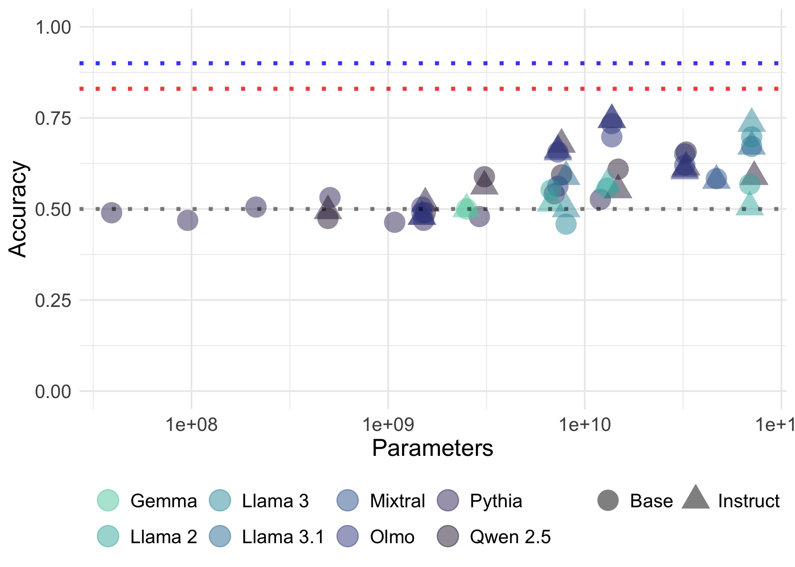
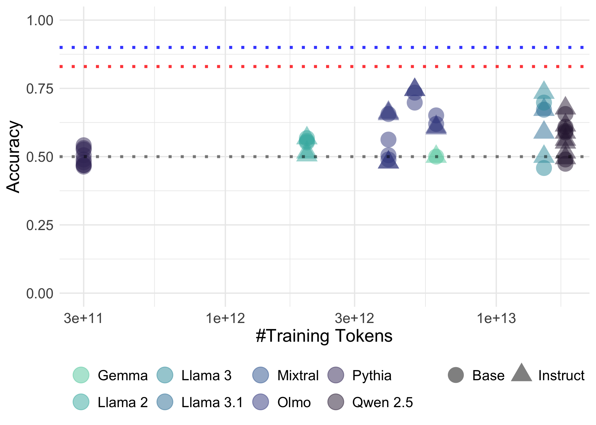

# Load LLM data


``` r
# setwd("/Users/seantrott/Dropbox/UCSD/Research/NLMs/open_llm_tom/src/analysis")
directory_path <- "../../data/processed/fb_all/"
csv_files <- list.files(path = directory_path, pattern = "*.csv", full.names = TRUE)
csv_list <- csv_files %>%
  map(~ read_csv(.))
```

```
## Rows: 192 Columns: 12
## ── Column specification ────────────────────────────────────────────────────────
## Delimiter: ","
## chr (9): passage, start, end, knowledge_cue, first_mention, recent_mention, ...
## dbl (3): start_prob, end_prob, log_odds
## 
## ℹ Use `spec()` to retrieve the full column specification for this data.
## ℹ Specify the column types or set `show_col_types = FALSE` to quiet this message.
## Rows: 192 Columns: 12
## ── Column specification ────────────────────────────────────────────────────────
## Delimiter: ","
## chr (9): passage, start, end, knowledge_cue, first_mention, recent_mention, ...
## dbl (3): start_prob, end_prob, log_odds
## 
## ℹ Use `spec()` to retrieve the full column specification for this data.
## ℹ Specify the column types or set `show_col_types = FALSE` to quiet this message.
## Rows: 192 Columns: 12
## ── Column specification ────────────────────────────────────────────────────────
## Delimiter: ","
## chr (9): passage, start, end, knowledge_cue, first_mention, recent_mention, ...
## dbl (3): lp_start, lp_end, log_odds
## 
## ℹ Use `spec()` to retrieve the full column specification for this data.
## ℹ Specify the column types or set `show_col_types = FALSE` to quiet this message.
## Rows: 192 Columns: 12
## ── Column specification ────────────────────────────────────────────────────────
## Delimiter: ","
## chr (9): passage, start, end, knowledge_cue, first_mention, recent_mention, ...
## dbl (3): lp_start, lp_end, log_odds
## 
## ℹ Use `spec()` to retrieve the full column specification for this data.
## ℹ Specify the column types or set `show_col_types = FALSE` to quiet this message.
## Rows: 192 Columns: 12
## ── Column specification ────────────────────────────────────────────────────────
## Delimiter: ","
## chr (9): passage, start, end, knowledge_cue, first_mention, recent_mention, ...
## dbl (3): lp_start, lp_end, log_odds
## 
## ℹ Use `spec()` to retrieve the full column specification for this data.
## ℹ Specify the column types or set `show_col_types = FALSE` to quiet this message.
## Rows: 192 Columns: 12
## ── Column specification ────────────────────────────────────────────────────────
## Delimiter: ","
## chr (9): passage, start, end, knowledge_cue, first_mention, recent_mention, ...
## dbl (3): lp_start, lp_end, log_odds
## 
## ℹ Use `spec()` to retrieve the full column specification for this data.
## ℹ Specify the column types or set `show_col_types = FALSE` to quiet this message.
## Rows: 192 Columns: 12
## ── Column specification ────────────────────────────────────────────────────────
## Delimiter: ","
## chr (9): passage, start, end, knowledge_cue, first_mention, recent_mention, ...
## dbl (3): lp_start, lp_end, log_odds
## 
## ℹ Use `spec()` to retrieve the full column specification for this data.
## ℹ Specify the column types or set `show_col_types = FALSE` to quiet this message.
## Rows: 192 Columns: 12
## ── Column specification ────────────────────────────────────────────────────────
## Delimiter: ","
## chr (9): passage, start, end, knowledge_cue, first_mention, recent_mention, ...
## dbl (3): lp_start, lp_end, log_odds
## 
## ℹ Use `spec()` to retrieve the full column specification for this data.
## ℹ Specify the column types or set `show_col_types = FALSE` to quiet this message.
## Rows: 192 Columns: 12
## ── Column specification ────────────────────────────────────────────────────────
## Delimiter: ","
## chr (9): passage, start, end, knowledge_cue, first_mention, recent_mention, ...
## dbl (3): lp_start, lp_end, log_odds
## 
## ℹ Use `spec()` to retrieve the full column specification for this data.
## ℹ Specify the column types or set `show_col_types = FALSE` to quiet this message.
## Rows: 192 Columns: 12
## ── Column specification ────────────────────────────────────────────────────────
## Delimiter: ","
## chr (9): passage, start, end, knowledge_cue, first_mention, recent_mention, ...
## dbl (3): lp_start, lp_end, log_odds
## 
## ℹ Use `spec()` to retrieve the full column specification for this data.
## ℹ Specify the column types or set `show_col_types = FALSE` to quiet this message.
## Rows: 192 Columns: 12
## ── Column specification ────────────────────────────────────────────────────────
## Delimiter: ","
## chr (9): passage, start, end, knowledge_cue, first_mention, recent_mention, ...
## dbl (3): lp_start, lp_end, log_odds
## 
## ℹ Use `spec()` to retrieve the full column specification for this data.
## ℹ Specify the column types or set `show_col_types = FALSE` to quiet this message.
## Rows: 192 Columns: 12
## ── Column specification ────────────────────────────────────────────────────────
## Delimiter: ","
## chr (9): passage, start, end, knowledge_cue, first_mention, recent_mention, ...
## dbl (3): lp_start, lp_end, log_odds
## 
## ℹ Use `spec()` to retrieve the full column specification for this data.
## ℹ Specify the column types or set `show_col_types = FALSE` to quiet this message.
## Rows: 192 Columns: 12
## ── Column specification ────────────────────────────────────────────────────────
## Delimiter: ","
## chr (9): passage, start, end, knowledge_cue, first_mention, recent_mention, ...
## dbl (3): lp_start, lp_end, log_odds
## 
## ℹ Use `spec()` to retrieve the full column specification for this data.
## ℹ Specify the column types or set `show_col_types = FALSE` to quiet this message.
## Rows: 192 Columns: 12
## ── Column specification ────────────────────────────────────────────────────────
## Delimiter: ","
## chr (9): passage, start, end, knowledge_cue, first_mention, recent_mention, ...
## dbl (3): start_prob, end_prob, log_odds
## 
## ℹ Use `spec()` to retrieve the full column specification for this data.
## ℹ Specify the column types or set `show_col_types = FALSE` to quiet this message.
## Rows: 192 Columns: 12
## ── Column specification ────────────────────────────────────────────────────────
## Delimiter: ","
## chr (9): passage, start, end, knowledge_cue, first_mention, recent_mention, ...
## dbl (3): start_prob, end_prob, log_odds
## 
## ℹ Use `spec()` to retrieve the full column specification for this data.
## ℹ Specify the column types or set `show_col_types = FALSE` to quiet this message.
## Rows: 192 Columns: 12
## ── Column specification ────────────────────────────────────────────────────────
## Delimiter: ","
## chr (9): passage, start, end, knowledge_cue, first_mention, recent_mention, ...
## dbl (3): lp_start, lp_end, log_odds
## 
## ℹ Use `spec()` to retrieve the full column specification for this data.
## ℹ Specify the column types or set `show_col_types = FALSE` to quiet this message.
## Rows: 192 Columns: 12
## ── Column specification ────────────────────────────────────────────────────────
## Delimiter: ","
## chr (9): passage, start, end, knowledge_cue, first_mention, recent_mention, ...
## dbl (3): lp_start, lp_end, log_odds
## 
## ℹ Use `spec()` to retrieve the full column specification for this data.
## ℹ Specify the column types or set `show_col_types = FALSE` to quiet this message.
## Rows: 192 Columns: 12
## ── Column specification ────────────────────────────────────────────────────────
## Delimiter: ","
## chr (9): passage, start, end, knowledge_cue, first_mention, recent_mention, ...
## dbl (3): start_prob, end_prob, log_odds
## 
## ℹ Use `spec()` to retrieve the full column specification for this data.
## ℹ Specify the column types or set `show_col_types = FALSE` to quiet this message.
## Rows: 192 Columns: 12
## ── Column specification ────────────────────────────────────────────────────────
## Delimiter: ","
## chr (9): passage, start, end, knowledge_cue, first_mention, recent_mention, ...
## dbl (3): start_prob, end_prob, log_odds
## 
## ℹ Use `spec()` to retrieve the full column specification for this data.
## ℹ Specify the column types or set `show_col_types = FALSE` to quiet this message.
## Rows: 192 Columns: 12
## ── Column specification ────────────────────────────────────────────────────────
## Delimiter: ","
## chr (9): passage, start, end, knowledge_cue, first_mention, recent_mention, ...
## dbl (3): start_prob, end_prob, log_odds
## 
## ℹ Use `spec()` to retrieve the full column specification for this data.
## ℹ Specify the column types or set `show_col_types = FALSE` to quiet this message.
## Rows: 192 Columns: 12
## ── Column specification ────────────────────────────────────────────────────────
## Delimiter: ","
## chr (9): passage, start, end, knowledge_cue, first_mention, recent_mention, ...
## dbl (3): start_prob, end_prob, log_odds
## 
## ℹ Use `spec()` to retrieve the full column specification for this data.
## ℹ Specify the column types or set `show_col_types = FALSE` to quiet this message.
## Rows: 192 Columns: 12
## ── Column specification ────────────────────────────────────────────────────────
## Delimiter: ","
## chr (9): passage, start, end, knowledge_cue, first_mention, recent_mention, ...
## dbl (3): start_prob, end_prob, log_odds
## 
## ℹ Use `spec()` to retrieve the full column specification for this data.
## ℹ Specify the column types or set `show_col_types = FALSE` to quiet this message.
## Rows: 192 Columns: 12
## ── Column specification ────────────────────────────────────────────────────────
## Delimiter: ","
## chr (9): passage, start, end, knowledge_cue, first_mention, recent_mention, ...
## dbl (3): start_prob, end_prob, log_odds
## 
## ℹ Use `spec()` to retrieve the full column specification for this data.
## ℹ Specify the column types or set `show_col_types = FALSE` to quiet this message.
## Rows: 192 Columns: 12
## ── Column specification ────────────────────────────────────────────────────────
## Delimiter: ","
## chr (9): passage, start, end, knowledge_cue, first_mention, recent_mention, ...
## dbl (3): start_prob, end_prob, log_odds
## 
## ℹ Use `spec()` to retrieve the full column specification for this data.
## ℹ Specify the column types or set `show_col_types = FALSE` to quiet this message.
## Rows: 192 Columns: 12
## ── Column specification ────────────────────────────────────────────────────────
## Delimiter: ","
## chr (9): passage, start, end, knowledge_cue, first_mention, recent_mention, ...
## dbl (3): start_prob, end_prob, log_odds
## 
## ℹ Use `spec()` to retrieve the full column specification for this data.
## ℹ Specify the column types or set `show_col_types = FALSE` to quiet this message.
## Rows: 192 Columns: 12
## ── Column specification ────────────────────────────────────────────────────────
## Delimiter: ","
## chr (9): passage, start, end, knowledge_cue, first_mention, recent_mention, ...
## dbl (3): start_prob, end_prob, log_odds
## 
## ℹ Use `spec()` to retrieve the full column specification for this data.
## ℹ Specify the column types or set `show_col_types = FALSE` to quiet this message.
## Rows: 192 Columns: 12
## ── Column specification ────────────────────────────────────────────────────────
## Delimiter: ","
## chr (9): passage, start, end, knowledge_cue, first_mention, recent_mention, ...
## dbl (3): start_prob, end_prob, log_odds
## 
## ℹ Use `spec()` to retrieve the full column specification for this data.
## ℹ Specify the column types or set `show_col_types = FALSE` to quiet this message.
## Rows: 192 Columns: 12
## ── Column specification ────────────────────────────────────────────────────────
## Delimiter: ","
## chr (9): passage, start, end, knowledge_cue, first_mention, recent_mention, ...
## dbl (3): start_prob, end_prob, log_odds
## 
## ℹ Use `spec()` to retrieve the full column specification for this data.
## ℹ Specify the column types or set `show_col_types = FALSE` to quiet this message.
## Rows: 192 Columns: 12
## ── Column specification ────────────────────────────────────────────────────────
## Delimiter: ","
## chr (9): passage, start, end, knowledge_cue, first_mention, recent_mention, ...
## dbl (3): start_prob, end_prob, log_odds
## 
## ℹ Use `spec()` to retrieve the full column specification for this data.
## ℹ Specify the column types or set `show_col_types = FALSE` to quiet this message.
## Rows: 192 Columns: 12
## ── Column specification ────────────────────────────────────────────────────────
## Delimiter: ","
## chr (9): passage, start, end, knowledge_cue, first_mention, recent_mention, ...
## dbl (3): start_prob, end_prob, log_odds
## 
## ℹ Use `spec()` to retrieve the full column specification for this data.
## ℹ Specify the column types or set `show_col_types = FALSE` to quiet this message.
## Rows: 192 Columns: 12
## ── Column specification ────────────────────────────────────────────────────────
## Delimiter: ","
## chr (9): passage, start, end, knowledge_cue, first_mention, recent_mention, ...
## dbl (3): start_prob, end_prob, log_odds
## 
## ℹ Use `spec()` to retrieve the full column specification for this data.
## ℹ Specify the column types or set `show_col_types = FALSE` to quiet this message.
## Rows: 192 Columns: 12
## ── Column specification ────────────────────────────────────────────────────────
## Delimiter: ","
## chr (9): passage, start, end, knowledge_cue, first_mention, recent_mention, ...
## dbl (3): start_prob, end_prob, log_odds
## 
## ℹ Use `spec()` to retrieve the full column specification for this data.
## ℹ Specify the column types or set `show_col_types = FALSE` to quiet this message.
## Rows: 192 Columns: 12
## ── Column specification ────────────────────────────────────────────────────────
## Delimiter: ","
## chr (9): passage, start, end, knowledge_cue, first_mention, recent_mention, ...
## dbl (3): start_prob, end_prob, log_odds
## 
## ℹ Use `spec()` to retrieve the full column specification for this data.
## ℹ Specify the column types or set `show_col_types = FALSE` to quiet this message.
## Rows: 192 Columns: 12
## ── Column specification ────────────────────────────────────────────────────────
## Delimiter: ","
## chr (9): passage, start, end, knowledge_cue, first_mention, recent_mention, ...
## dbl (3): start_prob, end_prob, log_odds
## 
## ℹ Use `spec()` to retrieve the full column specification for this data.
## ℹ Specify the column types or set `show_col_types = FALSE` to quiet this message.
## Rows: 192 Columns: 12
## ── Column specification ────────────────────────────────────────────────────────
## Delimiter: ","
## chr (9): passage, start, end, knowledge_cue, first_mention, recent_mention, ...
## dbl (3): start_prob, end_prob, log_odds
## 
## ℹ Use `spec()` to retrieve the full column specification for this data.
## ℹ Specify the column types or set `show_col_types = FALSE` to quiet this message.
## Rows: 192 Columns: 12
## ── Column specification ────────────────────────────────────────────────────────
## Delimiter: ","
## chr (9): passage, start, end, knowledge_cue, first_mention, recent_mention, ...
## dbl (3): start_prob, end_prob, log_odds
## 
## ℹ Use `spec()` to retrieve the full column specification for this data.
## ℹ Specify the column types or set `show_col_types = FALSE` to quiet this message.
## Rows: 192 Columns: 12
## ── Column specification ────────────────────────────────────────────────────────
## Delimiter: ","
## chr (9): passage, start, end, knowledge_cue, first_mention, recent_mention, ...
## dbl (3): start_prob, end_prob, log_odds
## 
## ℹ Use `spec()` to retrieve the full column specification for this data.
## ℹ Specify the column types or set `show_col_types = FALSE` to quiet this message.
## Rows: 192 Columns: 12
## ── Column specification ────────────────────────────────────────────────────────
## Delimiter: ","
## chr (9): passage, start, end, knowledge_cue, first_mention, recent_mention, ...
## dbl (3): start_prob, end_prob, log_odds
## 
## ℹ Use `spec()` to retrieve the full column specification for this data.
## ℹ Specify the column types or set `show_col_types = FALSE` to quiet this message.
## Rows: 192 Columns: 12
## ── Column specification ────────────────────────────────────────────────────────
## Delimiter: ","
## chr (9): passage, start, end, knowledge_cue, first_mention, recent_mention, ...
## dbl (3): start_prob, end_prob, log_odds
## 
## ℹ Use `spec()` to retrieve the full column specification for this data.
## ℹ Specify the column types or set `show_col_types = FALSE` to quiet this message.
## Rows: 192 Columns: 12
## ── Column specification ────────────────────────────────────────────────────────
## Delimiter: ","
## chr (9): passage, start, end, knowledge_cue, first_mention, recent_mention, ...
## dbl (3): start_prob, end_prob, log_odds
## 
## ℹ Use `spec()` to retrieve the full column specification for this data.
## ℹ Specify the column types or set `show_col_types = FALSE` to quiet this message.
## Rows: 192 Columns: 12
## ── Column specification ────────────────────────────────────────────────────────
## Delimiter: ","
## chr (9): passage, start, end, knowledge_cue, first_mention, recent_mention, ...
## dbl (3): start_prob, end_prob, log_odds
## 
## ℹ Use `spec()` to retrieve the full column specification for this data.
## ℹ Specify the column types or set `show_col_types = FALSE` to quiet this message.
## Rows: 192 Columns: 12
## ── Column specification ────────────────────────────────────────────────────────
## Delimiter: ","
## chr (9): passage, start, end, knowledge_cue, first_mention, recent_mention, ...
## dbl (3): start_prob, end_prob, log_odds
## 
## ℹ Use `spec()` to retrieve the full column specification for this data.
## ℹ Specify the column types or set `show_col_types = FALSE` to quiet this message.
## Rows: 192 Columns: 12
## ── Column specification ────────────────────────────────────────────────────────
## Delimiter: ","
## chr (9): passage, start, end, knowledge_cue, first_mention, recent_mention, ...
## dbl (3): start_prob, end_prob, log_odds
## 
## ℹ Use `spec()` to retrieve the full column specification for this data.
## ℹ Specify the column types or set `show_col_types = FALSE` to quiet this message.
## Rows: 192 Columns: 12
## ── Column specification ────────────────────────────────────────────────────────
## Delimiter: ","
## chr (9): passage, start, end, knowledge_cue, first_mention, recent_mention, ...
## dbl (3): start_prob, end_prob, log_odds
## 
## ℹ Use `spec()` to retrieve the full column specification for this data.
## ℹ Specify the column types or set `show_col_types = FALSE` to quiet this message.
## Rows: 192 Columns: 12
## ── Column specification ────────────────────────────────────────────────────────
## Delimiter: ","
## chr (9): passage, start, end, knowledge_cue, first_mention, recent_mention, ...
## dbl (3): start_prob, end_prob, log_odds
## 
## ℹ Use `spec()` to retrieve the full column specification for this data.
## ℹ Specify the column types or set `show_col_types = FALSE` to quiet this message.
## Rows: 192 Columns: 12
## ── Column specification ────────────────────────────────────────────────────────
## Delimiter: ","
## chr (9): passage, start, end, knowledge_cue, first_mention, recent_mention, ...
## dbl (3): start_prob, end_prob, log_odds
## 
## ℹ Use `spec()` to retrieve the full column specification for this data.
## ℹ Specify the column types or set `show_col_types = FALSE` to quiet this message.
## Rows: 192 Columns: 12
## ── Column specification ────────────────────────────────────────────────────────
## Delimiter: ","
## chr (9): passage, start, end, knowledge_cue, first_mention, recent_mention, ...
## dbl (3): start_prob, end_prob, log_odds
## 
## ℹ Use `spec()` to retrieve the full column specification for this data.
## ℹ Specify the column types or set `show_col_types = FALSE` to quiet this message.
## Rows: 192 Columns: 12
## ── Column specification ────────────────────────────────────────────────────────
## Delimiter: ","
## chr (9): passage, start, end, knowledge_cue, first_mention, recent_mention, ...
## dbl (3): start_prob, end_prob, log_odds
## 
## ℹ Use `spec()` to retrieve the full column specification for this data.
## ℹ Specify the column types or set `show_col_types = FALSE` to quiet this message.
## Rows: 192 Columns: 12
## ── Column specification ────────────────────────────────────────────────────────
## Delimiter: ","
## chr (9): passage, start, end, knowledge_cue, first_mention, recent_mention, ...
## dbl (3): start_prob, end_prob, log_odds
## 
## ℹ Use `spec()` to retrieve the full column specification for this data.
## ℹ Specify the column types or set `show_col_types = FALSE` to quiet this message.
## Rows: 192 Columns: 12
## ── Column specification ────────────────────────────────────────────────────────
## Delimiter: ","
## chr (9): passage, start, end, knowledge_cue, first_mention, recent_mention, ...
## dbl (3): start_prob, end_prob, log_odds
## 
## ℹ Use `spec()` to retrieve the full column specification for this data.
## ℹ Specify the column types or set `show_col_types = FALSE` to quiet this message.
## Rows: 192 Columns: 12
## ── Column specification ────────────────────────────────────────────────────────
## Delimiter: ","
## chr (9): passage, start, end, knowledge_cue, first_mention, recent_mention, ...
## dbl (3): start_prob, end_prob, log_odds
## 
## ℹ Use `spec()` to retrieve the full column specification for this data.
## ℹ Specify the column types or set `show_col_types = FALSE` to quiet this message.
## Rows: 192 Columns: 12
## ── Column specification ────────────────────────────────────────────────────────
## Delimiter: ","
## chr (9): passage, start, end, knowledge_cue, first_mention, recent_mention, ...
## dbl (3): start_prob, end_prob, log_odds
## 
## ℹ Use `spec()` to retrieve the full column specification for this data.
## ℹ Specify the column types or set `show_col_types = FALSE` to quiet this message.
## Rows: 192 Columns: 12
## ── Column specification ────────────────────────────────────────────────────────
## Delimiter: ","
## chr (9): passage, start, end, knowledge_cue, first_mention, recent_mention, ...
## dbl (3): lp_start, lp_end, log_odds
## 
## ℹ Use `spec()` to retrieve the full column specification for this data.
## ℹ Specify the column types or set `show_col_types = FALSE` to quiet this message.
## Rows: 192 Columns: 12
## ── Column specification ────────────────────────────────────────────────────────
## Delimiter: ","
## chr (9): passage, start, end, knowledge_cue, first_mention, recent_mention, ...
## dbl (3): start_prob, end_prob, log_odds
## 
## ℹ Use `spec()` to retrieve the full column specification for this data.
## ℹ Specify the column types or set `show_col_types = FALSE` to quiet this message.
## Rows: 192 Columns: 12
## ── Column specification ────────────────────────────────────────────────────────
## Delimiter: ","
## chr (9): passage, start, end, knowledge_cue, first_mention, recent_mention, ...
## dbl (3): start_prob, end_prob, log_odds
## 
## ℹ Use `spec()` to retrieve the full column specification for this data.
## ℹ Specify the column types or set `show_col_types = FALSE` to quiet this message.
```

``` r
df_all_models <- bind_rows(csv_list) %>%
  mutate(model_shorthand = str_to_title(model_shorthand))
nrow(df_all_models)
```

```
## [1] 10560
```

``` r
length(unique(df_all_models$model_shorthand))
```

```
## [1] 55
```

``` r
table(df_all_models$model_path)
```

```
## 
##              allenai/OLMo-2-0325-32B          allenai/OLMo-2-0325-32B-DPO 
##                                  192                                  192 
##     allenai/OLMo-2-0325-32B-Instruct          allenai/OLMo-2-0325-32B-SFT 
##                                  192                                  192 
##               allenai/OLMo-2-0425-1B           allenai/OLMo-2-0425-1B-DPO 
##                                  192                                  192 
##      allenai/OLMo-2-0425-1B-Instruct           allenai/OLMo-2-0425-1B-SFT 
##                                  192                                  192 
##              allenai/OLMo-2-1124-13B          allenai/OLMo-2-1124-13B-DPO 
##                                  192                                  192 
##     allenai/OLMo-2-1124-13B-Instruct          allenai/OLMo-2-1124-13B-SFT 
##                                  192                                  192 
##               allenai/OLMo-2-1124-7B           allenai/OLMo-2-1124-7B-DPO 
##                                  192                                  192 
##      allenai/OLMo-2-1124-7B-Instruct           allenai/OLMo-2-1124-7B-SFT 
##                                  192                                  192 
##               EleutherAI/pythia-1.4b                EleutherAI/pythia-12b 
##                                  192                                  192 
##                EleutherAI/pythia-14m               EleutherAI/pythia-160m 
##                                  192                                  192 
##                 EleutherAI/pythia-1b               EleutherAI/pythia-2.8b 
##                                  192                                  192 
##               EleutherAI/pythia-410m               EleutherAI/pythia-6.9b 
##                                  192                                  192 
##                EleutherAI/pythia-70m                      google/gemma-2b 
##                                  192                                  192 
##                   google/gemma-2b-it       meta-llama/Llama-2-13b-chat-hf 
##                                  192                                  192 
##            meta-llama/Llama-2-13b-hf       meta-llama/Llama-2-70b-chat-hf 
##                                  192                                  192 
##            meta-llama/Llama-2-70b-hf        meta-llama/Llama-2-7b-chat-hf 
##                                  192                                  192 
##             meta-llama/Llama-2-7b-hf             meta-llama/Llama-3.1-70B 
##                                  192                                  192 
##    meta-llama/Llama-3.1-70B-Instruct     meta-llama/Llama-3.1-8B-Instruct 
##                                  192                                  192 
##          meta-llama/Meta-Llama-3-70B meta-llama/Meta-Llama-3-70B-Instruct 
##                                  192                                  192 
##           meta-llama/Meta-Llama-3-8B  meta-llama/Meta-Llama-3-8B-Instruct 
##                                  192                                  192 
## mistralai/Mixtral-8x7B-Instruct-v0.1          mistralai/Mixtral-8x7B-v0.1 
##                                  192                                  192 
##                    Qwen/Qwen2.5-0.5B           Qwen/Qwen2.5-0.5B-Instruct 
##                                  192                                  192 
##                    Qwen/Qwen2.5-1.5B           Qwen/Qwen2.5-1.5B-Instruct 
##                                  192                                  192 
##                     Qwen/Qwen2.5-14B            Qwen/Qwen2.5-14B-Instruct 
##                                  192                                  192 
##                     Qwen/Qwen2.5-32B            Qwen/Qwen2.5-32B-Instruct 
##                                  192                                  192 
##                      Qwen/Qwen2.5-3B             Qwen/Qwen2.5-3B-Instruct 
##                                  192                                  192 
##            Qwen/Qwen2.5-72B-Instruct                      Qwen/Qwen2.5-7B 
##                                  192                                  192 
##             Qwen/Qwen2.5-7B-Instruct 
##                                  192
```

``` r
table(df_all_models$model_shorthand)
```

```
## 
##             Gemma 2 2b    Gemma 2 2b Instruct            Llama 2 13b 
##                    192                    192                    192 
##   Llama 2 13b Instruct            Llama 2 70b   Llama 2 70b Instruct 
##                    192                    192                    192 
##             Llama 2 7b    Llama 2 7b Instruct            Llama 3 70b 
##                    192                    192                    192 
##   Llama 3 70b Instruct             Llama 3 8b    Llama 3 8b Instruct 
##                    192                    192                    192 
##          Llama 3.1 70b Llama 3.1 70b Instruct  Llama 3.1 8b Instruct 
##                    192                    192                    192 
##           Mixtral 8x7b  Mixtral 8x7b Instruct             Olmo 2 13b 
##                    192                    192                    192 
##         Olmo 2 13b Dpo    Olmo 2 13b Instruct         Olmo 2 13b Sft 
##                    192                    192                    192 
##              Olmo 2 1b          Olmo 2 1b Dpo     Olmo 2 1b Instruct 
##                    192                    192                    192 
##          Olmo 2 1b Sft             Olmo 2 32b         Olmo 2 32b Dpo 
##                    192                    192                    192 
##    Olmo 2 32b Instruct         Olmo 2 32b Sft              Olmo 2 7b 
##                    192                    192                    192 
##          Olmo 2 7b Dpo     Olmo 2 7b Instruct          Olmo 2 7b Sft 
##                    192                    192                    192 
##            Pythia 1.4b             Pythia 12b             Pythia 14m 
##                    192                    192                    192 
##            Pythia 160m              Pythia 1b            Pythia 2.8b 
##                    192                    192                    192 
##            Pythia 410m            Pythia 6.9b             Pythia 70m 
##                    192                    192                    192 
##          Qwen 2.5 0.5b Qwen 2.5 0.5b Instruct  Qwen 2.5 1.5 Instruct 
##                    192                    192                    192 
##          Qwen 2.5 1.5b           Qwen 2.5 14b  Qwen 2.5 14b Instruct 
##                    192                    192                    192 
##           Qwen 2.5 32b  Qwen 2.5 32b Instruct            Qwen 2.5 3b 
##                    192                    192                    192 
##   Qwen 2.5 3b Instruct  Qwen 2.5 72b Instruct            Qwen 2.5 7b 
##                    192                    192                    192 
##   Qwen 2.5 7b Instruct 
##                    192
```

``` r
### Load #params
df_model_properties = read_csv("../../data/processed/model_properties.csv") %>% 
  mutate(model_shorthand = str_to_title(model_shorthand))
```

```
## Rows: 58 Columns: 5
## ── Column specification ────────────────────────────────────────────────────────
## Delimiter: ","
## chr (4): model_path, model_shorthand, base_instruct, model_family
## dbl (1): num_params
## 
## ℹ Use `spec()` to retrieve the full column specification for this data.
## ℹ Specify the column types or set `show_col_types = FALSE` to quiet this message.
```

``` r
nrow(df_model_properties)
```

```
## [1] 58
```

``` r
### Load training data
df_training_data = read_csv("../../data/processed/model_training_data.csv")%>% 
  mutate(model_shorthand = str_to_title(model_shorthand))
```

```
## Rows: 58 Columns: 4
## ── Column specification ────────────────────────────────────────────────────────
## Delimiter: ","
## chr (3): model_path, model_shorthand, notes
## dbl (1): num_training_tokens
## 
## ℹ Use `spec()` to retrieve the full column specification for this data.
## ℹ Specify the column types or set `show_col_types = FALSE` to quiet this message.
```

``` r
table(df_training_data$model_shorthand)
```

```
## 
##             Gemma 2 2b    Gemma 2 2b Instruct             Gemma 2 7b 
##                      1                      1                      1 
##    Gemma 2 7b Instruct            Llama 2 13b   Llama 2 13b Instruct 
##                      1                      1                      1 
##            Llama 2 70b   Llama 2 70b Instruct             Llama 2 7b 
##                      1                      1                      1 
##    Llama 2 7b Instruct            Llama 3 70b   Llama 3 70b Instruct 
##                      1                      1                      1 
##             Llama 3 8b    Llama 3 8b Instruct          Llama 3.1 70b 
##                      1                      1                      1 
## Llama 3.1 70b Instruct           Llama 3.1 8b  Llama 3.1 8b Instruct 
##                      1                      1                      1 
##           Mixtral 8x7b  Mixtral 8x7b Instruct             Olmo 2 13b 
##                      1                      1                      1 
##         Olmo 2 13b Dpo    Olmo 2 13b Instruct         Olmo 2 13b Sft 
##                      1                      1                      1 
##              Olmo 2 1b          Olmo 2 1b Dpo     Olmo 2 1b Instruct 
##                      1                      1                      1 
##          Olmo 2 1b Sft             Olmo 2 32b         Olmo 2 32b Dpo 
##                      1                      1                      1 
##    Olmo 2 32b Instruct         Olmo 2 32b Sft              Olmo 2 7b 
##                      1                      1                      1 
##          Olmo 2 7b Dpo     Olmo 2 7b Instruct          Olmo 2 7b Sft 
##                      1                      1                      1 
##            Pythia 1.4b             Pythia 12b             Pythia 14m 
##                      1                      1                      1 
##            Pythia 160m              Pythia 1b            Pythia 2.8b 
##                      1                      1                      1 
##            Pythia 410m            Pythia 6.9b             Pythia 70m 
##                      1                      1                      1 
##          Qwen 2.5 0.5b Qwen 2.5 0.5b Instruct  Qwen 2.5 1.5 Instruct 
##                      1                      1                      1 
##          Qwen 2.5 1.5b           Qwen 2.5 14b  Qwen 2.5 14b Instruct 
##                      1                      1                      1 
##           Qwen 2.5 32b  Qwen 2.5 32b Instruct            Qwen 2.5 3b 
##                      1                      1                      1 
##   Qwen 2.5 3b Instruct  Qwen 2.5 72b Instruct            Qwen 2.5 7b 
##                      1                      1                      1 
##   Qwen 2.5 7b Instruct 
##                      1
```

``` r
### Join
df_all_properties = df_training_data %>%
  inner_join(df_model_properties)
```

```
## Joining with `by = join_by(model_path, model_shorthand)`
```

``` r
table(df_all_properties$model_shorthand)
```

```
## 
##             Gemma 2 2b    Gemma 2 2b Instruct             Gemma 2 7b 
##                      1                      1                      1 
##    Gemma 2 7b Instruct            Llama 2 13b   Llama 2 13b Instruct 
##                      1                      1                      1 
##            Llama 2 70b   Llama 2 70b Instruct             Llama 2 7b 
##                      1                      1                      1 
##    Llama 2 7b Instruct            Llama 3 70b   Llama 3 70b Instruct 
##                      1                      1                      1 
##             Llama 3 8b    Llama 3 8b Instruct          Llama 3.1 70b 
##                      1                      1                      1 
## Llama 3.1 70b Instruct           Llama 3.1 8b  Llama 3.1 8b Instruct 
##                      1                      1                      1 
##           Mixtral 8x7b  Mixtral 8x7b Instruct             Olmo 2 13b 
##                      1                      1                      1 
##         Olmo 2 13b Dpo    Olmo 2 13b Instruct         Olmo 2 13b Sft 
##                      1                      1                      1 
##              Olmo 2 1b          Olmo 2 1b Dpo     Olmo 2 1b Instruct 
##                      1                      1                      1 
##          Olmo 2 1b Sft             Olmo 2 32b         Olmo 2 32b Dpo 
##                      1                      1                      1 
##    Olmo 2 32b Instruct         Olmo 2 32b Sft              Olmo 2 7b 
##                      1                      1                      1 
##          Olmo 2 7b Dpo     Olmo 2 7b Instruct          Olmo 2 7b Sft 
##                      1                      1                      1 
##            Pythia 1.4b             Pythia 12b             Pythia 14m 
##                      1                      1                      1 
##            Pythia 160m              Pythia 1b            Pythia 2.8b 
##                      1                      1                      1 
##            Pythia 410m            Pythia 6.9b             Pythia 70m 
##                      1                      1                      1 
##          Qwen 2.5 0.5b Qwen 2.5 0.5b Instruct  Qwen 2.5 1.5 Instruct 
##                      1                      1                      1 
##          Qwen 2.5 1.5b           Qwen 2.5 14b  Qwen 2.5 14b Instruct 
##                      1                      1                      1 
##           Qwen 2.5 32b  Qwen 2.5 32b Instruct            Qwen 2.5 3b 
##                      1                      1                      1 
##   Qwen 2.5 3b Instruct  Qwen 2.5 72b Instruct            Qwen 2.5 7b 
##                      1                      1                      1 
##   Qwen 2.5 7b Instruct 
##                      1
```

``` r
nrow(df_all_properties)
```

```
## [1] 58
```

``` r
#### Bind with FB data
df_all_models = df_all_models %>%
  inner_join(df_all_properties)
```

```
## Joining with `by = join_by(model_path, model_shorthand)`
```

``` r
nrow(df_all_models)
```

```
## [1] 10560
```

``` r
table(df_all_models$model_shorthand)
```

```
## 
##             Gemma 2 2b    Gemma 2 2b Instruct            Llama 2 13b 
##                    192                    192                    192 
##   Llama 2 13b Instruct            Llama 2 70b   Llama 2 70b Instruct 
##                    192                    192                    192 
##             Llama 2 7b    Llama 2 7b Instruct            Llama 3 70b 
##                    192                    192                    192 
##   Llama 3 70b Instruct             Llama 3 8b    Llama 3 8b Instruct 
##                    192                    192                    192 
##          Llama 3.1 70b Llama 3.1 70b Instruct  Llama 3.1 8b Instruct 
##                    192                    192                    192 
##           Mixtral 8x7b  Mixtral 8x7b Instruct             Olmo 2 13b 
##                    192                    192                    192 
##         Olmo 2 13b Dpo    Olmo 2 13b Instruct         Olmo 2 13b Sft 
##                    192                    192                    192 
##              Olmo 2 1b          Olmo 2 1b Dpo     Olmo 2 1b Instruct 
##                    192                    192                    192 
##          Olmo 2 1b Sft             Olmo 2 32b         Olmo 2 32b Dpo 
##                    192                    192                    192 
##    Olmo 2 32b Instruct         Olmo 2 32b Sft              Olmo 2 7b 
##                    192                    192                    192 
##          Olmo 2 7b Dpo     Olmo 2 7b Instruct          Olmo 2 7b Sft 
##                    192                    192                    192 
##            Pythia 1.4b             Pythia 12b             Pythia 14m 
##                    192                    192                    192 
##            Pythia 160m              Pythia 1b            Pythia 2.8b 
##                    192                    192                    192 
##            Pythia 410m            Pythia 6.9b             Pythia 70m 
##                    192                    192                    192 
##          Qwen 2.5 0.5b Qwen 2.5 0.5b Instruct  Qwen 2.5 1.5 Instruct 
##                    192                    192                    192 
##          Qwen 2.5 1.5b           Qwen 2.5 14b  Qwen 2.5 14b Instruct 
##                    192                    192                    192 
##           Qwen 2.5 32b  Qwen 2.5 32b Instruct            Qwen 2.5 3b 
##                    192                    192                    192 
##   Qwen 2.5 3b Instruct  Qwen 2.5 72b Instruct            Qwen 2.5 7b 
##                    192                    192                    192 
##   Qwen 2.5 7b Instruct 
##                    192
```

``` r
df_all_models = df_all_models %>%
  mutate(model_shorthand = str_to_title(model_shorthand))


length(unique(df_all_models$model_shorthand))
```

```
## [1] 55
```

``` r
length(unique(df_all_models$model_family))
```

```
## [1] 8
```


# LLM Analysis

## Sensitivity to mental states


``` r
### Visualization
df_all_models %>%
  ggplot(aes(x = log_odds,
             y = reorder(model_shorthand, num_params),
             fill = condition)) +
  geom_density_ridges2(aes(height = ..density..), 
                       color=NA, 
                       scale=.85, 
                       # size=1, 
                       alpha = .8,
                       stat="density") +
  labs(x = "Log Odds (Start vs. End)",
       y = "",
       fill = "") +
  theme_minimal() +
  geom_vline(xintercept = 0, linetype = "dotted") +
  theme(
    legend.position = "bottom"
  ) + 
  theme(axis.title = element_text(size=rel(1.2)),
        axis.text = element_text(size = rel(1.2)),
        legend.text = element_text(size = rel(1.2)),
        legend.title = element_text(size = rel(1.2)),
        strip.text.x = element_text(size = rel(1.2))) +
    scale_fill_manual(values = viridisLite::viridis(2, option = "mako", 
                                                    begin = 0.8, end = 0.15)) +
  facet_wrap(~knowledge_cue)
```

```
## Warning: The dot-dot notation (`..density..`) was deprecated in ggplot2 3.4.0.
## ℹ Please use `after_stat(density)` instead.
## This warning is displayed once every 8 hours.
## Call `lifecycle::last_lifecycle_warnings()` to see where this warning was
## generated.
```

<!-- -->

``` r
### Visualization by model family
df_all_models %>%
  group_by(passage, condition, knowledge_cue, model_family) %>%
  summarise(m_lo = mean(log_odds)) %>%
  ggplot(aes(x = m_lo,
             y = model_family,
             fill = condition)) +
  geom_density_ridges2(aes(height = ..density..), 
                       color=NA, 
                       scale=.85, 
                       # size=1, 
                       alpha = .8,
                       stat="density") +
  labs(x = "Log Odds (Start vs. End)",
       y = "",
       fill = "") +
  theme_minimal() +
  geom_vline(xintercept = 0, linetype = "dotted") +
  theme(
    legend.position = "bottom"
  ) + 
  theme(axis.title = element_text(size=rel(1.2)),
        axis.text = element_text(size = rel(1.2)),
        legend.text = element_text(size = rel(1.2)),
        legend.title = element_text(size = rel(1.2)),
        strip.text.x = element_text(size = rel(1.2))) +
    scale_fill_manual(values = viridisLite::viridis(2, option = "mako", 
                                                    begin = 0.8, end = 0.15)) +
  facet_wrap(~knowledge_cue)
```

```
## `summarise()` has grouped output by 'passage', 'condition', 'knowledge_cue'.
## You can override using the `.groups` argument.
```

<!-- -->

``` r
### Visualization altogether
df_all_models %>%
  group_by(passage, condition, knowledge_cue) %>%
  summarise(m_lo = mean(log_odds)) %>%
  ggplot(aes(x = m_lo,
             y = knowledge_cue,
             fill = condition)) +
  geom_density_ridges2(aes(height = ..density..), 
                       color=NA, 
                       scale=.85, 
                       # size=1, 
                       alpha = .8,
                       stat="density") +
  labs(x = "Log Odds (Start vs. End)",
       y = "",
       fill = "") +
  theme_minimal() +
  geom_vline(xintercept = 0, linetype = "dotted") +
  theme(
    legend.position = "bottom"
  ) + 
  theme(axis.title = element_text(size=rel(1.2)),
        axis.text = element_text(size = rel(1.2)),
        legend.text = element_text(size = rel(1.2)),
        legend.title = element_text(size = rel(1.2)),
        strip.text.x = element_text(size = rel(1.2))) +
    scale_fill_manual(values = viridisLite::viridis(2, option = "mako", 
                                                    begin = 0.8, end = 0.15))
```

```
## `summarise()` has grouped output by 'passage', 'condition'. You can override
## using the `.groups` argument.
```

<!-- -->

Each model on its own:


``` r
# Function to fit models and perform model comparison
compare_models <- function(df) {
  if (n_distinct(df$condition) < 2) return(NULL)  # Skip if only one condition
  
  mod_full <- tryCatch(
    lmer(log_odds ~ condition + knowledge_cue + first_mention + recent_mention +
           (1 + condition | start), data = df, REML = FALSE),
    error = function(e) NULL
  )
  
  mod_reduced <- tryCatch(
    lmer(log_odds ~ knowledge_cue + first_mention + recent_mention +
           (1 + condition | start), data = df, REML = FALSE),
    error = function(e) NULL
  )
  
  if (is.null(mod_full) || is.null(mod_reduced)) return(NULL)
  
  anova_result <- anova(mod_full, mod_reduced)
  delta_aic <- AIC(mod_reduced) - AIC(mod_full)
  lrt_stat <- anova_result$Chisq[2]
  p_val <- anova_result$`Pr(>Chisq)`[2]
  
  # Extract coefficients
  coefs <- tryCatch(fixef(mod_full), error = function(e) return(rep(NA, 2)))
  cond_coef <- coefs[grep("^condition", names(coefs))]
  cue_coef <- coefs[grep("^knowledge_cue", names(coefs))]

  tibble(
    model_path = unique(df$model_path),
    delta_AIC = delta_aic,
    LRT_stat = lrt_stat,
    p_value = p_val,
    condition_coef = cond_coef,
    knowledge_cue_coef = cue_coef
  )
}

# Apply to each model_path
results_by_model_path <- df_all_models %>%
  group_by(model_path) %>%
  group_split() %>%
  map_dfr(compare_models)
```

```
## boundary (singular) fit: see help('isSingular')
## boundary (singular) fit: see help('isSingular')
## boundary (singular) fit: see help('isSingular')
## boundary (singular) fit: see help('isSingular')
## boundary (singular) fit: see help('isSingular')
## boundary (singular) fit: see help('isSingular')
## boundary (singular) fit: see help('isSingular')
## boundary (singular) fit: see help('isSingular')
## boundary (singular) fit: see help('isSingular')
## boundary (singular) fit: see help('isSingular')
## boundary (singular) fit: see help('isSingular')
## boundary (singular) fit: see help('isSingular')
## boundary (singular) fit: see help('isSingular')
## boundary (singular) fit: see help('isSingular')
## boundary (singular) fit: see help('isSingular')
## boundary (singular) fit: see help('isSingular')
## boundary (singular) fit: see help('isSingular')
## boundary (singular) fit: see help('isSingular')
## boundary (singular) fit: see help('isSingular')
## boundary (singular) fit: see help('isSingular')
## boundary (singular) fit: see help('isSingular')
```

``` r
results_by_model_path %>%
  arrange(LRT_stat)
```

```
## # A tibble: 55 × 6
##    model_path       delta_AIC LRT_stat p_value condition_coef knowledge_cue_coef
##    <chr>                <dbl>    <dbl>   <dbl>          <dbl>              <dbl>
##  1 meta-llama/Meta…     -2.00  7.77e-5   0.993      -0.000782            0.00235
##  2 EleutherAI/pyth…     -2.00  4.77e-4   0.983       0.00338            -0.240  
##  3 meta-llama/Meta…     -2.00  2.58e-3   0.959      -0.00507             0.0144 
##  4 Qwen/Qwen2.5-1.…     -1.99  6.02e-3   0.938       0.0329             -0.147  
##  5 meta-llama/Llam…     -1.99  7.80e-3   0.930      -0.0446             -1.15   
##  6 Qwen/Qwen2.5-0.…     -1.99  8.76e-3   0.925       0.0348             -0.568  
##  7 allenai/OLMo-2-…     -1.99  1.05e-2   0.918      -0.0443              1.06   
##  8 google/gemma-2b      -1.98  1.54e-2   0.901      -0.0177             -0.103  
##  9 EleutherAI/pyth…     -1.98  2.07e-2   0.886      -0.0298              0.464  
## 10 allenai/OLMo-2-…     -1.98  2.18e-2   0.883       0.102               2.32   
## # ℹ 45 more rows
```

``` r
summary(results_by_model_path$LRT_stat)
```

```
##      Min.   1st Qu.    Median      Mean   3rd Qu.      Max. 
## 7.770e-05 2.230e-01 3.300e+00 7.482e+00 1.428e+01 2.546e+01
```

``` r
summary(results_by_model_path$condition_coef)
```

```
##    Min. 1st Qu.  Median    Mean 3rd Qu.    Max. 
## -6.9767 -2.9649 -0.8921 -1.6393  0.0013  0.7203
```

``` r
summary(results_by_model_path$knowledge_cue_coef)
```

```
##    Min. 1st Qu.  Median    Mean 3rd Qu.    Max. 
## -9.2877 -2.1903 -1.0411 -1.4878 -0.1936  2.9367
```

``` r
### TODO: Should we adjust? What hypothesis are we testing?
results_by_model_path$p_adj = p.adjust(results_by_model_path$p_value, method = "holm")
results_by_model_path = results_by_model_path %>%
  mutate(sig = p_adj < .05)
mean(results_by_model_path$sig)
```

```
## [1] 0.3636364
```

``` r
results_by_model_path %>%
  filter(sig == TRUE) %>%
  select(model_path, LRT_stat, p_adj, condition_coef)
```

```
## # A tibble: 20 × 4
##    model_path                           LRT_stat     p_adj condition_coef
##    <chr>                                   <dbl>     <dbl>          <dbl>
##  1 Qwen/Qwen2.5-14B                         13.5 0.00954            -3.00
##  2 Qwen/Qwen2.5-32B                         17.1 0.00156            -2.57
##  3 Qwen/Qwen2.5-32B-Instruct                12.2 0.0172             -3.25
##  4 Qwen/Qwen2.5-72B-Instruct                21.1 0.000226           -3.17
##  5 allenai/OLMo-2-0325-32B                  17.2 0.00153            -2.67
##  6 allenai/OLMo-2-0325-32B-DPO              20.9 0.000244           -4.66
##  7 allenai/OLMo-2-0325-32B-Instruct         20.3 0.000336           -4.72
##  8 allenai/OLMo-2-0325-32B-SFT              21.4 0.000203           -2.69
##  9 allenai/OLMo-2-1124-13B                  14.5 0.00596            -2.93
## 10 allenai/OLMo-2-1124-13B-DPO              13.4 0.00999            -6.32
## 11 allenai/OLMo-2-1124-13B-Instruct         14.1 0.00716            -6.98
## 12 allenai/OLMo-2-1124-13B-SFT              13.1 0.0113             -3.28
## 13 allenai/OLMo-2-1124-7B-DPO               15.8 0.00300            -4.90
## 14 allenai/OLMo-2-1124-7B-Instruct          16.4 0.00225            -5.38
## 15 allenai/OLMo-2-1124-7B-SFT               11.9 0.0199             -2.18
## 16 meta-llama/Llama-3.1-70B                 25.5 0.0000249          -2.34
## 17 meta-llama/Llama-3.1-70B-Instruct        19.3 0.000529           -3.39
## 18 meta-llama/Llama-3.1-8B-Instruct         17.9 0.00107            -1.59
## 19 meta-llama/Meta-Llama-3-70B              24.4 0.0000419          -2.59
## 20 meta-llama/Meta-Llama-3-70B-Instruct     19.6 0.000468           -6.52
```


All models together:


``` r
### Mixed models
mod_full = lmer(data = df_all_models,
                log_odds ~ condition + knowledge_cue + first_mention + recent_mention + 
                  (1 + condition | model_path) + (1 + condition | start),
                REML = FALSE)

mod_reduced = lmer(data = df_all_models,
                log_odds ~ knowledge_cue + first_mention + recent_mention + 
                  (1 + condition | model_path) + (1 + condition | start),
                REML = FALSE)

summary(mod_full)
```

```
## Linear mixed model fit by maximum likelihood . t-tests use Satterthwaite's
##   method [lmerModLmerTest]
## Formula: 
## log_odds ~ condition + knowledge_cue + first_mention + recent_mention +  
##     (1 + condition | model_path) + (1 + condition | start)
##    Data: df_all_models
## 
##       AIC       BIC    logLik -2*log(L)  df.resid 
##   59398.1   59485.3  -29687.0   59374.1     10548 
## 
## Scaled residuals: 
##      Min       1Q   Median       3Q      Max 
## -11.5087  -0.4004   0.0040   0.4091   7.5753 
## 
## Random effects:
##  Groups     Name                 Variance Std.Dev. Corr 
##  model_path (Intercept)           5.6724  2.3817        
##             conditionTrue Belief  3.9081  1.9769   -0.78
##  start      (Intercept)           0.5061  0.7114        
##             conditionTrue Belief  0.3079  0.5549   -0.30
##  Residual                        15.6299  3.9535        
## Number of obs: 10560, groups:  model_path, 55; start, 10
## 
## Fixed effects:
##                         Estimate Std. Error         df t value Pr(>|t|)    
## (Intercept)            1.509e+00  4.017e-01  5.073e+01   3.756 0.000446 ***
## conditionTrue Belief  -1.639e+00  3.289e-01  4.614e+01  -4.984 9.21e-06 ***
## knowledge_cueImplicit -1.488e+00  7.694e-02  1.043e+04 -19.336  < 2e-16 ***
## first_mentionStart     1.549e-01  7.694e-02  1.043e+04   2.013 0.044145 *  
## recent_mentionStart    2.732e-01  7.694e-02  1.043e+04   3.551 0.000386 ***
## ---
## Signif. codes:  0 '***' 0.001 '**' 0.01 '*' 0.05 '.' 0.1 ' ' 1
## 
## Correlation of Fixed Effects:
##             (Intr) cndtTB knwl_I frst_S
## condtnTrBlf -0.619                     
## knwldg_cImp -0.096  0.000              
## frst_mntnSt -0.096  0.000  0.000       
## rcnt_mntnSt -0.096  0.000  0.000  0.000
```

``` r
anova(mod_full, mod_reduced)
```

```
## Data: df_all_models
## Models:
## mod_reduced: log_odds ~ knowledge_cue + first_mention + recent_mention + (1 + condition | model_path) + (1 + condition | start)
## mod_full: log_odds ~ condition + knowledge_cue + first_mention + recent_mention + (1 + condition | model_path) + (1 + condition | start)
##             npar   AIC   BIC logLik -2*log(L)  Chisq Df Pr(>Chisq)    
## mod_reduced   11 59414 59494 -29696     59392                         
## mod_full      12 59398 59485 -29687     59374 18.172  1  2.018e-05 ***
## ---
## Signif. codes:  0 '***' 0.001 '**' 0.01 '*' 0.05 '.' 0.1 ' ' 1
```


## Accuracy metric


``` r
df_all_models = df_all_models %>%
  mutate(correct = case_when(
    condition == "False Belief" & log_odds > 0 ~ TRUE,
    condition == "True Belief" & log_odds <= 0 ~ TRUE,
    TRUE ~ FALSE  # all other cases are incorrect
  ))


df_summ = df_all_models %>%
  group_by(model_path, model_shorthand, model_family,
           num_params, num_training_tokens, base_instruct) %>%
  summarise(mean_accuracy = mean(correct))
```

```
## `summarise()` has grouped output by 'model_path', 'model_shorthand',
## 'model_family', 'num_params', 'num_training_tokens'. You can override using the
## `.groups` argument.
```

``` r
df_summ %>%
  select(model_shorthand, mean_accuracy)
```

```
## Adding missing grouping variables: `model_path`, `model_family`, `num_params`,
## `num_training_tokens`
```

```
## # A tibble: 55 × 6
## # Groups:   model_path, model_shorthand, model_family, num_params,
## #   num_training_tokens [55]
##    model_path        model_family num_params num_training_tokens model_shorthand
##    <chr>             <chr>             <dbl>               <dbl> <chr>          
##  1 EleutherAI/pythi… Pythia          1.52e 9             3   e11 Pythia 1.4b    
##  2 EleutherAI/pythi… Pythia          1.20e10             3   e11 Pythia 12b     
##  3 EleutherAI/pythi… Pythia          3.92e 7             3   e11 Pythia 14m     
##  4 EleutherAI/pythi… Pythia          2.13e 8             3   e11 Pythia 160m    
##  5 EleutherAI/pythi… Pythia          1.08e 9             3   e11 Pythia 1b      
##  6 EleutherAI/pythi… Pythia          2.91e 9             3   e11 Pythia 2.8b    
##  7 EleutherAI/pythi… Pythia          5.06e 8             3   e11 Pythia 410m    
##  8 EleutherAI/pythi… Pythia          6.99e 9             3   e11 Pythia 6.9b    
##  9 EleutherAI/pythi… Pythia          9.56e 7             3   e11 Pythia 70m     
## 10 Qwen/Qwen2.5-0.5B Qwen 2.5        4.94e 8             1.80e13 Qwen 2.5 0.5b  
## # ℹ 45 more rows
## # ℹ 1 more variable: mean_accuracy <dbl>
```

``` r
mean(df_all_models$correct)
```

```
## [1] 0.5733902
```

``` r
df_summ %>%
  ungroup() %>%
  arrange(desc(mean_accuracy)) %>%
  select(model_shorthand, mean_accuracy) %>%
  head(5)
```

```
## # A tibble: 5 × 2
##   model_shorthand      mean_accuracy
##   <chr>                        <dbl>
## 1 Olmo 2 13b Dpo               0.745
## 2 Olmo 2 13b Instruct          0.745
## 3 Olmo 2 13b Sft               0.734
## 4 Llama 3 70b Instruct         0.734
## 5 Olmo 2 13b                   0.698
```

``` r
### "Wisdom of the crowd"?
df_lo_avg = df_all_models %>%
  group_by(passage, condition) %>%
  summarise(m_lo = mean(log_odds)) %>%
  mutate(correct = case_when(
    condition == "False Belief" & m_lo > 0 ~ TRUE,
    condition == "True Belief" & m_lo <= 0 ~ TRUE,
    TRUE ~ FALSE  # all other cases are incorrect
  )) 
```

```
## `summarise()` has grouped output by 'passage'. You can override using the
## `.groups` argument.
```

``` r
mean(df_lo_avg$correct)
```

```
## [1] 0.7291667
```

``` r
df_summ %>%
  ggplot(aes(x = num_params,
             y = mean_accuracy,
             color = model_family,
             shape = base_instruct)) +
  geom_point(size = 6,
             alpha = .5) +
  geom_hline(yintercept = .83,##TODO: Calculate from scratch
             linetype = "dotted", color = "red",
             size = 1.2, alpha = .8) + 
    geom_hline(yintercept = .9,##TODO: Calculate from scratch
             linetype = "dotted", color = "blue",
             size = 1.2, alpha = .8) + 
  geom_hline(yintercept = .5, linetype = "dotted",
             size = 1.2, alpha = .5) +
  scale_x_log10() +
  # geom_text_repel(aes(label=model_shorthand), size=3) +
  scale_y_continuous(limits = c(0, 1)) +
  labs(x = "Parameters",
       y = "Accuracy",
       color = "",
       shape = "") +
  theme_minimal() +
  scale_color_manual(values = viridisLite::viridis(8, option = "mako", 
                                                  begin = 0.8, end = 0.15)) +
  theme(text = element_text(size = 15),
        legend.position="bottom")
```

```
## Warning: Using `size` aesthetic for lines was deprecated in ggplot2 3.4.0.
## ℹ Please use `linewidth` instead.
## This warning is displayed once every 8 hours.
## Call `lifecycle::last_lifecycle_warnings()` to see where this warning was
## generated.
```

<!-- -->

``` r
df_summ %>%
  ggplot(aes(x = num_training_tokens,
             y = mean_accuracy,
             color = model_family,
             shape = base_instruct)) +
  geom_point(size = 6,
             alpha = .5) +
  geom_hline(yintercept = .83,##TODO: Calculate from scratch
             linetype = "dotted", color = "red",
             size = 1.2, alpha = .8) + 
  geom_hline(yintercept = .5, linetype = "dotted",
             size = 1.2, alpha = .5) +
    geom_hline(yintercept = .9,##TODO: Calculate from scratch
             linetype = "dotted", color = "blue",
             size = 1.2, alpha = .8) + 
  scale_x_log10() +
  # geom_text_repel(aes(label=model_shorthand), size=3) +
  scale_y_continuous(limits = c(0, 1)) +
  labs(x = "#Training Tokens",
       y = "Accuracy",
       color = "",
       shape = "") +
  theme_minimal() +
  scale_color_manual(values = viridisLite::viridis(8, option = "mako", 
                                                  begin = 0.8, end = 0.15)) +
  theme(text = element_text(size = 15),
        legend.position="bottom")
```

```
## Warning: Removed 2 rows containing missing values or values outside the scale range
## (`geom_point()`).
```

<!-- -->

``` r
### How do model properties predict the probability of a correct response?
mod_full = glmer(data = df_all_models,
                 correct ~ condition + knowledge_cue  +
                   log10(num_params) + log10(num_training_tokens) + 
                  base_instruct + 
                   (1 | start) + (1|model_family), 
                 family = binomial())
summary(mod_full)
```

```
## Generalized linear mixed model fit by maximum likelihood (Laplace
##   Approximation) [glmerMod]
##  Family: binomial  ( logit )
## Formula: 
## correct ~ condition + knowledge_cue + log10(num_params) + log10(num_training_tokens) +  
##     base_instruct + (1 | start) + (1 | model_family)
##    Data: df_all_models
## 
##       AIC       BIC    logLik -2*log(L)  df.resid 
##   13704.0   13761.9   -6844.0   13688.0     10168 
## 
## Scaled residuals: 
##     Min      1Q  Median      3Q     Max 
## -1.5581 -1.1117  0.7076  0.8610  1.4216 
## 
## Random effects:
##  Groups       Name        Variance Std.Dev.
##  start        (Intercept) 0.01545  0.1243  
##  model_family (Intercept) 0.01355  0.1164  
## Number of obs: 10176, groups:  start, 10; model_family, 7
## 
## Fixed effects:
##                             Estimate Std. Error z value Pr(>|z|)    
## (Intercept)                -3.496604   1.057875  -3.305 0.000949 ***
## conditionTrue Belief       -0.185417   0.040539  -4.574 4.79e-06 ***
## knowledge_cueImplicit       0.087052   0.040534   2.148 0.031743 *  
## log10(num_params)           0.281655   0.034341   8.202 2.37e-16 ***
## log10(num_training_tokens)  0.082718   0.086765   0.953 0.340410    
## base_instructInstruct      -0.005725   0.044662  -0.128 0.897997    
## ---
## Signif. codes:  0 '***' 0.001 '**' 0.01 '*' 0.05 '.' 0.1 ' ' 1
## 
## Correlation of Fixed Effects:
##             (Intr) cndtTB knwl_I l10(_) l10(__
## condtnTrBlf -0.016                            
## knwldg_cImp -0.021 -0.002                     
## lg10(nm_pr) -0.037 -0.008  0.004              
## lg10(nm_t_) -0.949 -0.001  0.001 -0.272       
## bs_nstrctIn  0.134  0.000  0.000 -0.021 -0.140
```

``` r
### Plot coefficients
df_coef <- broom.mixed::tidy(mod_full, effects = "fixed") %>%
  mutate(term = forcats::fct_reorder(term, estimate))


df_coef %>%
  filter(term != "(Intercept)") %>%
  ggplot(aes(x = term, y = estimate)) +
  geom_point() +
  geom_errorbar(aes(ymin = estimate - std.error, ymax = estimate + std.error),
                width = 0.2) +
  geom_hline(yintercept = 0, linetype = "dashed", color = "gray40") +
  coord_flip() +
  labs(
    x = NULL, y = "Coefficient Estimate",
  ) +
  theme_minimal(base_size = 12)
```

<!-- -->

## Item-wise analysis


``` r
df_item_accuracy = df_all_models %>%
  group_by(start) %>%
  summarise(mean_accuracy = mean(correct)) %>%
  arrange(mean_accuracy)

df_item_accuracy %>%
  ggplot(aes(x = reorder(start, mean_accuracy), y = mean_accuracy)) +
  geom_bar(stat = "identity", alpha = .6) +
  labs(x = "Item",
       y = "Mean Accuracy",
       color = "",
       shape = "") +
  theme_minimal() +
  geom_hline(linetype = "dotted", yintercept = .5) +
  coord_flip() +
  theme(text = element_text(size = 15),
        legend.position="bottom")
```

<!-- -->


# Comparison to human baseline

## Load human data


``` r
df_human = read_csv("../../data/processed/human/human_fb_cleaned.csv") %>%
  select(participant_id, item_id, passage,
         is_correct, is_start, is_end,
         reaction_time, condition, response, first_mention, recent_mention, knowledge_cue)
```

```
## New names:
## Rows: 613 Columns: 51
## ── Column specification
## ──────────────────────────────────────────────────────── Delimiter: "," chr
## (26): item_id, item_type, correct_answer, response, condition, first_men... dbl
## (21): ...1, id, participant_id, item, trial_index, reaction_time, trial_... lgl
## (4): is_correct, is_start, is_end, excluded.attention
## ℹ Use `spec()` to retrieve the full column specification for this data. ℹ
## Specify the column types or set `show_col_types = FALSE` to quiet this message.
## • `` -> `...1`
```

``` r
mean(df_human$is_correct)
```

```
## [1] 0.8270799
```

``` r
df_by_item = df_human %>%
  group_by(condition, passage, knowledge_cue) %>%
  summarise(p_start = mean(is_start) + .0001,
            p_end = mean(is_end) + .0001) %>%
  mutate(log_odds = log((p_start / p_end))) %>%
  mutate(model_shorthand = "Human") %>%
  mutate(correct = case_when(
    condition == "False Belief" & log_odds > 0 ~ TRUE,
    condition == "True Belief" & log_odds <= 0 ~ TRUE,
    TRUE ~ FALSE  # all other cases are incorrect
  ))
```

```
## `summarise()` has grouped output by 'condition', 'passage'. You can override
## using the `.groups` argument.
```

``` r
### Mean using log-odds measure forh umans
mean(df_by_item$correct)
```

```
## [1] 0.8972973
```

``` r
### Merge
df_merged = df_all_models %>%
  bind_rows(df_by_item)
```


## Top-performing models


``` r
df_merged %>%
  filter(model_shorthand %in% c("Human",
                                "Olmo 2 13b Dpo",
                                "Olmo 2 13b Instruct",
                                "Olmo 2 13b Sft",
                                "Llama 3 70b Instruct",
                                "Olmo 2 13b")) %>%
  ggplot(aes(x = log_odds,
             y = model_shorthand,
             fill = condition)) +
  geom_density_ridges2(aes(height = ..density..), 
                       color=NA, 
                       scale=.85, 
                       # size=1, 
                       alpha = .8,
                       stat="density") +
  labs(x = "Log Odds (Start vs. End)",
       y = "",
       fill = "") +
  theme_minimal() +
  geom_vline(xintercept = 0, linetype = "dotted") +
  theme(
    legend.position = "bottom"
  ) + 
  theme(axis.title = element_text(size=rel(1.2)),
        axis.text = element_text(size = rel(1.2)),
        legend.text = element_text(size = rel(1.2)),
        legend.title = element_text(size = rel(1.2)),
        strip.text.x = element_text(size = rel(1.2))) +
    scale_fill_manual(values = viridisLite::viridis(2, option = "mako", 
                                                    begin = 0.8, end = 0.15)) +
  facet_wrap(~knowledge_cue)
```

<!-- -->


## Correlation matrix


``` r
df_model_means = df_all_models %>%
  group_by(passage, condition, knowledge_cue) %>%
  summarise(log_odds = mean(log_odds)) %>%
  mutate(model_shorthand = "All Models")
```

```
## `summarise()` has grouped output by 'passage', 'condition'. You can override
## using the `.groups` argument.
```

``` r
# df_merged = df_merged %>%
#   bind_rows(df_model_means)


df_wide <- df_merged %>%
  select(passage, model_shorthand, log_odds) %>%
  pivot_wider(names_from = model_shorthand, values_from = log_odds)

cor_matrix <- df_wide %>%
  select(-passage) %>%
  cor(use = "pairwise.complete.obs")
cor_matrix
```

```
##                        Gemma 2 2b Instruct    Gemma 2 2b Llama 2 13b Instruct
## Gemma 2 2b Instruct            1.000000000  0.6722852228         -0.455377518
## Gemma 2 2b                     0.672285223  1.0000000000         -0.136248828
## Llama 2 13b Instruct          -0.455377518 -0.1362488281          1.000000000
## Llama 2 13b                   -0.430443081 -0.2095676535          0.875170547
## Llama 2 70b Instruct          -0.567846375 -0.3249761320          0.819181540
## Llama 2 70b                   -0.526272683 -0.3250232879          0.747631965
## Llama 2 7b Instruct           -0.487029077 -0.2728260654          0.867223907
## Llama 2 7b                    -0.455588599 -0.2336015524          0.809921808
## Llama 3.1 70b Instruct        -0.257783261 -0.1614057153          0.334673906
## Llama 3.1 70b                 -0.447401985 -0.3528670325          0.410528002
## Llama 3.1 8b Instruct         -0.123875595 -0.0860866978          0.520200932
## Llama 3 70b Instruct          -0.233349901 -0.0999230900          0.366727102
## Llama 3 70b                   -0.467179646 -0.3421167591          0.440532537
## Llama 3 8b Instruct            0.376631659  0.0307171580         -0.363834021
## Llama 3 8b                     0.204659447 -0.2704714772         -0.269952314
## Mixtral 8x7b Instruct         -0.456066026 -0.2846145058          0.626521493
## Mixtral 8x7b                  -0.514902287 -0.3091203411          0.697092113
## Olmo 2 32b Dpo                -0.268731991 -0.3276903734          0.312914871
## Olmo 2 32b Instruct           -0.265877635 -0.3249597588          0.308630576
## Olmo 2 32b Sft                -0.222031504 -0.2897456531          0.309346911
## Olmo 2 32b                    -0.259617495 -0.2950606285          0.345512286
## Olmo 2 1b Dpo                 -0.366871993 -0.1744724378          0.105188814
## Olmo 2 1b Instruct            -0.310201372 -0.1403751566          0.073647917
## Olmo 2 1b Sft                 -0.429979033 -0.2509243090          0.159629937
## Olmo 2 1b                      0.334363799  0.0282235873         -0.093465625
## Olmo 2 13b Dpo                -0.055796231  0.0005462096          0.516853978
## Olmo 2 13b Instruct           -0.053642530 -0.0032235768          0.512386340
## Olmo 2 13b Sft                -0.106839894 -0.0225046719          0.543185459
## Olmo 2 13b                    -0.057371452 -0.0201578956          0.507096428
## Olmo 2 7b Dpo                  0.012161608  0.0295096248          0.429992932
## Olmo 2 7b Instruct             0.012405072  0.0434048880          0.441618955
## Olmo 2 7b Sft                  0.037875735 -0.0115691823          0.380957048
## Olmo 2 7b                     -0.031654087 -0.1675830716          0.362754895
## Pythia 1.4b                    0.009603831  0.0241794124          0.268290222
## Pythia 12b                     0.044907507  0.2179821432          0.465971881
## Pythia 14m                    -0.122810764 -0.0879402078          0.005675609
## Pythia 160m                    0.270712660  0.0386396823         -0.182986484
## Pythia 1b                     -0.526743842 -0.2986455554          0.359508222
## Pythia 2.8b                    0.110510135  0.2605135744          0.375653486
## Pythia 410m                   -0.395807007  0.0647016129          0.271912692
## Pythia 6.9b                   -0.041708526 -0.0494400439          0.279001416
## Pythia 70m                     0.294286567  0.1237175419         -0.006264252
## Qwen 2.5 0.5b Instruct        -0.013313842 -0.1695754385          0.092635402
## Qwen 2.5 0.5b                 -0.041815769 -0.1046034429          0.026696447
## Qwen 2.5 1.5 Instruct         -0.232230721 -0.1671052932          0.385126424
## Qwen 2.5 1.5b                 -0.276793142 -0.1515846259          0.402595243
## Qwen 2.5 14b Instruct         -0.038042581 -0.2176876162          0.030085275
## Qwen 2.5 14b                  -0.047246281 -0.2199546340          0.174146602
## Qwen 2.5 32b Instruct          0.083448171  0.0229545069          0.068610010
## Qwen 2.5 32b                  -0.003270134  0.0125410809          0.061451445
## Qwen 2.5 3b Instruct           0.003695353  0.0055565414         -0.032110903
## Qwen 2.5 3b                   -0.205550984 -0.1407393656          0.223711469
## Qwen 2.5 72b Instruct          0.238807508  0.2562909966          0.125489964
## Qwen 2.5 7b Instruct          -0.158102063 -0.1049743214          0.254507331
## Qwen 2.5 7b                    0.035990949  0.0585283926          0.147727211
## Human                          0.028923543  0.0091288412          0.214424411
##                         Llama 2 13b Llama 2 70b Instruct   Llama 2 70b
## Gemma 2 2b Instruct    -0.430443081          -0.56784637 -0.5262726832
## Gemma 2 2b             -0.209567653          -0.32497613 -0.3250232879
## Llama 2 13b Instruct    0.875170547           0.81918154  0.7476319648
## Llama 2 13b             1.000000000           0.81015621  0.8705342538
## Llama 2 70b Instruct    0.810156209           1.00000000  0.8540887683
## Llama 2 70b             0.870534254           0.85408877  1.0000000000
## Llama 2 7b Instruct     0.919057551           0.81709285  0.8178476195
## Llama 2 7b              0.960932122           0.79137968  0.8942068065
## Llama 3.1 70b Instruct  0.240569854           0.49875767  0.3190516687
## Llama 3.1 70b           0.345186408           0.57704564  0.4606029269
## Llama 3.1 8b Instruct   0.503729418           0.54197076  0.3851254949
## Llama 3 70b Instruct    0.251357132           0.48889958  0.3134812494
## Llama 3 70b             0.381960369           0.61558193  0.4987954501
## Llama 3 8b Instruct    -0.415213609          -0.40096205 -0.4503173747
## Llama 3 8b             -0.138375140          -0.25717891 -0.0417731546
## Mixtral 8x7b Instruct   0.622445639           0.59956069  0.5891233240
## Mixtral 8x7b            0.739906704           0.72378918  0.7357608660
## Olmo 2 32b Dpo          0.294794756           0.44682547  0.3766510528
## Olmo 2 32b Instruct     0.286943059           0.44270686  0.3649038224
## Olmo 2 32b Sft          0.320502690           0.44709231  0.3982369588
## Olmo 2 32b              0.340737501           0.46312550  0.4384398525
## Olmo 2 1b Dpo           0.049298814           0.18245561  0.1435890148
## Olmo 2 1b Instruct      0.039881865           0.13531670  0.1335709174
## Olmo 2 1b Sft           0.070487137           0.24185939  0.1567253049
## Olmo 2 1b               0.080015299           0.07394447  0.0908610060
## Olmo 2 13b Dpo          0.462989964           0.51736173  0.4140093953
## Olmo 2 13b Instruct     0.459307362           0.52323489  0.4169292244
## Olmo 2 13b Sft          0.506657649           0.53545905  0.4437003495
## Olmo 2 13b              0.429371098           0.48347493  0.3623477768
## Olmo 2 7b Dpo           0.363697138           0.37884347  0.3085271474
## Olmo 2 7b Instruct      0.368128440           0.38647439  0.3059019408
## Olmo 2 7b Sft           0.341651082           0.35708366  0.2817788508
## Olmo 2 7b               0.325594779           0.36848868  0.2701557493
## Pythia 1.4b             0.290153425           0.21330130  0.2073337766
## Pythia 12b              0.449597866           0.44915881  0.3591531898
## Pythia 14m              0.094687910          -0.06368786  0.2278739241
## Pythia 160m            -0.148554379          -0.28843450 -0.1308181439
## Pythia 1b               0.307561976           0.43807501  0.3690260453
## Pythia 2.8b             0.370897011           0.36034944  0.3455654662
## Pythia 410m             0.136403077           0.16980963  0.1344582790
## Pythia 6.9b             0.245940355           0.27742412  0.2132555625
## Pythia 70m             -0.037078049          -0.08178093 -0.0647124820
## Qwen 2.5 0.5b Instruct -0.010331259           0.08425918 -0.0343492902
## Qwen 2.5 0.5b          -0.038862833           0.02590239  0.0121153038
## Qwen 2.5 1.5 Instruct   0.324765069           0.35181156  0.3531401774
## Qwen 2.5 1.5b           0.398027534           0.42323816  0.4226605129
## Qwen 2.5 14b Instruct   0.004240204           0.11689475  0.1043277964
## Qwen 2.5 14b            0.201610773           0.31136252  0.3194456778
## Qwen 2.5 32b Instruct  -0.075367377           0.10300778 -0.0130232225
## Qwen 2.5 32b           -0.061423269           0.16254795  0.0002291193
## Qwen 2.5 3b Instruct   -0.178827516          -0.05293058 -0.1531463961
## Qwen 2.5 3b             0.079176267           0.19515132  0.0716659942
## Qwen 2.5 72b Instruct  -0.021547644           0.03254169 -0.0931586339
## Qwen 2.5 7b Instruct    0.222673386           0.33877909  0.2917473682
## Qwen 2.5 7b             0.150201931           0.23983543  0.2052341271
## Human                   0.113504588           0.18415995  0.0930685828
##                        Llama 2 7b Instruct  Llama 2 7b Llama 3.1 70b Instruct
## Gemma 2 2b Instruct           -0.487029077 -0.45558860            -0.25778326
## Gemma 2 2b                    -0.272826065 -0.23360155            -0.16140572
## Llama 2 13b Instruct           0.867223907  0.80992181             0.33467391
## Llama 2 13b                    0.919057551  0.96093212             0.24056985
## Llama 2 70b Instruct           0.817092855  0.79137968             0.49875767
## Llama 2 70b                    0.817847620  0.89420681             0.31905167
## Llama 2 7b Instruct            1.000000000  0.93351696             0.27182375
## Llama 2 7b                     0.933516961  1.00000000             0.22610095
## Llama 3.1 70b Instruct         0.271823751  0.22610095             1.00000000
## Llama 3.1 70b                  0.363911890  0.33293488             0.86085406
## Llama 3.1 8b Instruct          0.447291883  0.44633773             0.44355283
## Llama 3 70b Instruct           0.265855387  0.21747706             0.89807709
## Llama 3 70b                    0.382693003  0.36271528             0.85468575
## Llama 3 8b Instruct           -0.364370723 -0.42868174            -0.05080792
## Llama 3 8b                    -0.188857045 -0.11260934            -0.10972327
## Mixtral 8x7b Instruct          0.561777086  0.59063184             0.43324826
## Mixtral 8x7b                   0.678456336  0.71674442             0.45913940
## Olmo 2 32b Dpo                 0.269859017  0.28371613             0.58956655
## Olmo 2 32b Instruct            0.262343500  0.27620902             0.59172568
## Olmo 2 32b Sft                 0.273323067  0.30718059             0.54846014
## Olmo 2 32b                     0.299070472  0.32391648             0.55625015
## Olmo 2 1b Dpo                  0.057318850  0.08737688             0.04034964
## Olmo 2 1b Instruct             0.041950545  0.08602484            -0.00434960
## Olmo 2 1b Sft                  0.077973331  0.09842031             0.12281636
## Olmo 2 1b                      0.068027782  0.10616224             0.09677086
## Olmo 2 13b Dpo                 0.433407740  0.41047983             0.56104077
## Olmo 2 13b Instruct            0.429894259  0.40638425             0.57051664
## Olmo 2 13b Sft                 0.484442279  0.46328999             0.50994483
## Olmo 2 13b                     0.417944041  0.37640396             0.50917812
## Olmo 2 7b Dpo                  0.325962764  0.31488415             0.36135596
## Olmo 2 7b Instruct             0.334462042  0.31755264             0.37069583
## Olmo 2 7b Sft                  0.311106197  0.30245569             0.35063386
## Olmo 2 7b                      0.325998013  0.27029108             0.29665598
## Pythia 1.4b                    0.332839311  0.27264813             0.18467125
## Pythia 12b                     0.521143932  0.45821914             0.18581031
## Pythia 14m                     0.073199503  0.15196072            -0.14131014
## Pythia 160m                   -0.160759380 -0.14131209            -0.23249433
## Pythia 1b                      0.304056219  0.27945097             0.35931081
## Pythia 2.8b                    0.293641902  0.35271878             0.10894154
## Pythia 410m                    0.160859247  0.12633337             0.07753735
## Pythia 6.9b                    0.250557626  0.23662931             0.12055821
## Pythia 70m                    -0.006581317 -0.06250119            -0.18021780
## Qwen 2.5 0.5b Instruct         0.052594364 -0.06941880             0.06631334
## Qwen 2.5 0.5b                  0.001633687 -0.05070757             0.02468580
## Qwen 2.5 1.5 Instruct          0.370550193  0.32652450             0.07294145
## Qwen 2.5 1.5b                  0.424330917  0.39397662             0.16623809
## Qwen 2.5 14b Instruct         -0.028440696 -0.01591284             0.40280713
## Qwen 2.5 14b                   0.165129986  0.19818624             0.50802653
## Qwen 2.5 32b Instruct         -0.046519454 -0.10240867             0.32372848
## Qwen 2.5 32b                  -0.036620673 -0.08815587             0.46809143
## Qwen 2.5 3b Instruct          -0.149917176 -0.17523844             0.02442587
## Qwen 2.5 3b                    0.107798227  0.05589994             0.15912046
## Qwen 2.5 72b Instruct         -0.069362215 -0.07526131             0.50129587
## Qwen 2.5 7b Instruct           0.178713042  0.20465624             0.44063594
## Qwen 2.5 7b                    0.071061723  0.13032897             0.35603632
## Human                          0.108824844  0.07404699             0.46293384
##                        Llama 3.1 70b Llama 3.1 8b Instruct Llama 3 70b Instruct
## Gemma 2 2b Instruct      -0.44740199          -0.123875595         -0.233349901
## Gemma 2 2b               -0.35286703          -0.086086698         -0.099923090
## Llama 2 13b Instruct      0.41052800           0.520200932          0.366727102
## Llama 2 13b               0.34518641           0.503729418          0.251357132
## Llama 2 70b Instruct      0.57704564           0.541970765          0.488899576
## Llama 2 70b               0.46060293           0.385125495          0.313481249
## Llama 2 7b Instruct       0.36391189           0.447291883          0.265855387
## Llama 2 7b                0.33293488           0.446337734          0.217477060
## Llama 3.1 70b Instruct    0.86085406           0.443552829          0.898077093
## Llama 3.1 70b             1.00000000           0.409176453          0.840792421
## Llama 3.1 8b Instruct     0.40917645           1.000000000          0.533485613
## Llama 3 70b Instruct      0.84079242           0.533485613          1.000000000
## Llama 3 70b               0.97126692           0.459075279          0.864068518
## Llama 3 8b Instruct      -0.24733703          -0.081363180         -0.011820515
## Llama 3 8b               -0.06978592          -0.038426119         -0.092270527
## Mixtral 8x7b Instruct     0.50063083           0.597191969          0.464313912
## Mixtral 8x7b              0.55460700           0.591095640          0.465740726
## Olmo 2 32b Dpo            0.66508671           0.445455850          0.591764114
## Olmo 2 32b Instruct       0.65722966           0.449593638          0.592803013
## Olmo 2 32b Sft            0.64892502           0.458140403          0.562273867
## Olmo 2 32b                0.69318633           0.394052614          0.586378344
## Olmo 2 1b Dpo             0.10127133          -0.035253076          0.059095088
## Olmo 2 1b Instruct        0.05795927          -0.090043196          0.010082509
## Olmo 2 1b Sft             0.15849691           0.058061912          0.137231782
## Olmo 2 1b                -0.02456292           0.096617796          0.064595978
## Olmo 2 13b Dpo            0.55595704           0.611011045          0.663213762
## Olmo 2 13b Instruct       0.56424461           0.610732795          0.671068012
## Olmo 2 13b Sft            0.51046125           0.602627602          0.605835448
## Olmo 2 13b                0.50402418           0.618961950          0.655055928
## Olmo 2 7b Dpo             0.46216828           0.555795209          0.504154097
## Olmo 2 7b Instruct        0.46460200           0.566096612          0.514499608
## Olmo 2 7b Sft             0.42872330           0.526436884          0.486621490
## Olmo 2 7b                 0.30434313           0.513587335          0.457911680
## Pythia 1.4b               0.21878567           0.253566395          0.282880257
## Pythia 12b                0.11642442           0.371431276          0.234235450
## Pythia 14m               -0.04468846          -0.202569178         -0.188949809
## Pythia 160m              -0.14045004          -0.105894152         -0.277848796
## Pythia 1b                 0.38172348           0.276656570          0.344366913
## Pythia 2.8b               0.03742366           0.352128348          0.171199127
## Pythia 410m               0.16053774          -0.005627089          0.106752072
## Pythia 6.9b               0.12996782           0.173655392          0.171293278
## Pythia 70m               -0.09997244           0.039877150         -0.159879127
## Qwen 2.5 0.5b Instruct    0.13186218           0.035228854          0.060928784
## Qwen 2.5 0.5b             0.07041248          -0.019750613          0.006903611
## Qwen 2.5 1.5 Instruct     0.17031491          -0.005103341         -0.028614507
## Qwen 2.5 1.5b             0.24506094           0.048317929          0.060067359
## Qwen 2.5 14b Instruct     0.54001024           0.417780336          0.514909380
## Qwen 2.5 14b              0.64740850           0.381642020          0.580862418
## Qwen 2.5 32b Instruct     0.34030204           0.267850469          0.458521399
## Qwen 2.5 32b              0.47654577           0.275795725          0.585527870
## Qwen 2.5 3b Instruct      0.02339103           0.059024927          0.054169273
## Qwen 2.5 3b               0.15178875           0.304490251          0.204810882
## Qwen 2.5 72b Instruct     0.38084582           0.314229204          0.563641839
## Qwen 2.5 7b Instruct      0.51658888           0.459818607          0.541649692
## Qwen 2.5 7b               0.35540772           0.460528641          0.454414139
## Human                     0.51723693           0.307820396          0.499488089
##                        Llama 3 70b Llama 3 8b Instruct   Llama 3 8b
## Gemma 2 2b Instruct    -0.46717965         0.376631659  0.204659447
## Gemma 2 2b             -0.34211676         0.030717158 -0.270471477
## Llama 2 13b Instruct    0.44053254        -0.363834021 -0.269952314
## Llama 2 13b             0.38196037        -0.415213609 -0.138375140
## Llama 2 70b Instruct    0.61558193        -0.400962048 -0.257178909
## Llama 2 70b             0.49879545        -0.450317375 -0.041773155
## Llama 2 7b Instruct     0.38269300        -0.364370723 -0.188857045
## Llama 2 7b              0.36271528        -0.428681738 -0.112609341
## Llama 3.1 70b Instruct  0.85468575        -0.050807920 -0.109723268
## Llama 3.1 70b           0.97126692        -0.247337035 -0.069785917
## Llama 3.1 8b Instruct   0.45907528        -0.081363180 -0.038426119
## Llama 3 70b Instruct    0.86406852        -0.011820515 -0.092270527
## Llama 3 70b             1.00000000        -0.229207916 -0.118250812
## Llama 3 8b Instruct    -0.22920792         1.000000000  0.446113729
## Llama 3 8b             -0.11825081         0.446113729  1.000000000
## Mixtral 8x7b Instruct   0.54900635        -0.189348042 -0.077548002
## Mixtral 8x7b            0.60496049        -0.296550637 -0.102458544
## Olmo 2 32b Dpo          0.66875168        -0.034406162  0.195828288
## Olmo 2 32b Instruct     0.66184913        -0.023335519  0.186966220
## Olmo 2 32b Sft          0.65094053        -0.077149769  0.204129428
## Olmo 2 32b              0.69393029        -0.132513410  0.169344385
## Olmo 2 1b Dpo           0.14498167        -0.082454367 -0.086866355
## Olmo 2 1b Instruct      0.09543385        -0.079699016 -0.051810206
## Olmo 2 1b Sft           0.23158933        -0.042260405 -0.158248176
## Olmo 2 1b              -0.03333591         0.178471841  0.205377198
## Olmo 2 13b Dpo          0.56966361        -0.113204479 -0.065440881
## Olmo 2 13b Instruct     0.57663101        -0.112177060 -0.058593468
## Olmo 2 13b Sft          0.53003697        -0.164532535 -0.097869405
## Olmo 2 13b              0.53462676        -0.015505101 -0.053347731
## Olmo 2 7b Dpo           0.47518940        -0.123576188 -0.020576010
## Olmo 2 7b Instruct      0.47846935        -0.122455782 -0.032843156
## Olmo 2 7b Sft           0.44681253        -0.090268168 -0.014475384
## Olmo 2 7b               0.35992463         0.257165586  0.112535184
## Pythia 1.4b             0.19761426         0.135136540  0.219950695
## Pythia 12b              0.13453350        -0.091446109 -0.220672610
## Pythia 14m             -0.08652236        -0.122037085  0.425282893
## Pythia 160m            -0.18121896        -0.030689773  0.197053687
## Pythia 1b               0.41072493        -0.008486793  0.073604728
## Pythia 2.8b             0.09470626        -0.038601716 -0.049826328
## Pythia 410m             0.17150769        -0.261202466 -0.421282869
## Pythia 6.9b             0.14967203         0.075760424  0.017770155
## Pythia 70m             -0.17004700        -0.052836303  0.105603959
## Qwen 2.5 0.5b Instruct  0.11354401        -0.020485786 -0.188110799
## Qwen 2.5 0.5b           0.06035484         0.061590546  0.001420336
## Qwen 2.5 1.5 Instruct   0.14947625        -0.197270451 -0.100168526
## Qwen 2.5 1.5b           0.22624467        -0.204943249 -0.164819152
## Qwen 2.5 14b Instruct   0.55482549         0.126668751  0.244651345
## Qwen 2.5 14b            0.65792841         0.013538822  0.174680264
## Qwen 2.5 32b Instruct   0.36919512         0.001228225 -0.109201760
## Qwen 2.5 32b            0.49356882        -0.122647240 -0.182735101
## Qwen 2.5 3b Instruct    0.04143617         0.246351206 -0.098105445
## Qwen 2.5 3b             0.19631159         0.219186823 -0.112908417
## Qwen 2.5 72b Instruct   0.36419968         0.134932398  0.053596406
## Qwen 2.5 7b Instruct    0.54101562        -0.168362789 -0.006157379
## Qwen 2.5 7b             0.39129274        -0.133100532 -0.005530676
## Human                   0.48424530         0.028148418  0.052040977
##                        Mixtral 8x7b Instruct Mixtral 8x7b Olmo 2 32b Dpo
## Gemma 2 2b Instruct              -0.45606603 -0.514902287    -0.26873199
## Gemma 2 2b                       -0.28461451 -0.309120341    -0.32769037
## Llama 2 13b Instruct              0.62652149  0.697092113     0.31291487
## Llama 2 13b                       0.62244564  0.739906704     0.29479476
## Llama 2 70b Instruct              0.59956069  0.723789180     0.44682547
## Llama 2 70b                       0.58912332  0.735760866     0.37665105
## Llama 2 7b Instruct               0.56177709  0.678456336     0.26985902
## Llama 2 7b                        0.59063184  0.716744420     0.28371613
## Llama 3.1 70b Instruct            0.43324826  0.459139398     0.58956655
## Llama 3.1 70b                     0.50063083  0.554607002     0.66508671
## Llama 3.1 8b Instruct             0.59719197  0.591095640     0.44545585
## Llama 3 70b Instruct              0.46431391  0.465740726     0.59176411
## Llama 3 70b                       0.54900635  0.604960489     0.66875168
## Llama 3 8b Instruct              -0.18934804 -0.296550637    -0.03440616
## Llama 3 8b                       -0.07754800 -0.102458544     0.19582829
## Mixtral 8x7b Instruct             1.00000000  0.942716981     0.43279527
## Mixtral 8x7b                      0.94271698  1.000000000     0.48340113
## Olmo 2 32b Dpo                    0.43279527  0.483401128     1.00000000
## Olmo 2 32b Instruct               0.43807558  0.482558989     0.99842363
## Olmo 2 32b Sft                    0.38860088  0.460821935     0.97310982
## Olmo 2 32b                        0.39003422  0.464677462     0.92893850
## Olmo 2 1b Dpo                     0.05577211  0.083124551     0.18997057
## Olmo 2 1b Instruct                0.01126859  0.042769278     0.16359673
## Olmo 2 1b Sft                     0.17024035  0.178160003     0.23413146
## Olmo 2 1b                        -0.10533078 -0.036090736     0.02686042
## Olmo 2 13b Dpo                    0.50175132  0.538648284     0.49538442
## Olmo 2 13b Instruct               0.49728755  0.536659579     0.50758550
## Olmo 2 13b Sft                    0.52742353  0.572014291     0.47589628
## Olmo 2 13b                        0.46846067  0.485686028     0.43637212
## Olmo 2 7b Dpo                     0.30017668  0.319809011     0.42913757
## Olmo 2 7b Instruct                0.30648467  0.323839765     0.42952589
## Olmo 2 7b Sft                     0.24464144  0.267724273     0.39344614
## Olmo 2 7b                         0.29409683  0.270431250     0.30010754
## Pythia 1.4b                       0.09564842  0.151999551     0.03006352
## Pythia 12b                        0.11728209  0.183177956    -0.01459159
## Pythia 14m                        0.07741670  0.139140355     0.04440013
## Pythia 160m                      -0.00473788  0.003189803    -0.04495257
## Pythia 1b                         0.28193277  0.343824629     0.33934434
## Pythia 2.8b                       0.11318734  0.135495370     0.01432867
## Pythia 410m                       0.17000364  0.165957107    -0.03593991
## Pythia 6.9b                       0.06472750  0.046994532     0.09203062
## Pythia 70m                       -0.14628581 -0.119071195     0.08511552
## Qwen 2.5 0.5b Instruct           -0.11437566 -0.112317444     0.05049015
## Qwen 2.5 0.5b                    -0.08760174 -0.078910118     0.01477185
## Qwen 2.5 1.5 Instruct             0.11920858  0.227064651     0.22382226
## Qwen 2.5 1.5b                     0.14141271  0.262492354     0.20803906
## Qwen 2.5 14b Instruct             0.21721231  0.207378799     0.55168534
## Qwen 2.5 14b                      0.26302285  0.313163455     0.55183577
## Qwen 2.5 32b Instruct             0.12770873  0.114713763     0.28345055
## Qwen 2.5 32b                      0.11828924  0.108881287     0.33276187
## Qwen 2.5 3b Instruct              0.01595507 -0.006845552     0.15932196
## Qwen 2.5 3b                       0.28649586  0.271176411     0.25710327
## Qwen 2.5 72b Instruct             0.25136701  0.145834337     0.26202766
## Qwen 2.5 7b Instruct              0.22832156  0.259136665     0.40119218
## Qwen 2.5 7b                       0.10869269  0.154419588     0.26133639
## Human                             0.33944765  0.318033699     0.49268535
##                        Olmo 2 32b Instruct Olmo 2 32b Sft  Olmo 2 32b
## Gemma 2 2b Instruct           -0.265877635    -0.22203150 -0.25961750
## Gemma 2 2b                    -0.324959759    -0.28974565 -0.29506063
## Llama 2 13b Instruct           0.308630576     0.30934691  0.34551229
## Llama 2 13b                    0.286943059     0.32050269  0.34073750
## Llama 2 70b Instruct           0.442706864     0.44709231  0.46312550
## Llama 2 70b                    0.364903822     0.39823696  0.43843985
## Llama 2 7b Instruct            0.262343500     0.27332307  0.29907047
## Llama 2 7b                     0.276209024     0.30718059  0.32391648
## Llama 3.1 70b Instruct         0.591725678     0.54846014  0.55625015
## Llama 3.1 70b                  0.657229663     0.64892502  0.69318633
## Llama 3.1 8b Instruct          0.449593638     0.45814040  0.39405261
## Llama 3 70b Instruct           0.592803013     0.56227387  0.58637834
## Llama 3 70b                    0.661849129     0.65094053  0.69393029
## Llama 3 8b Instruct           -0.023335519    -0.07714977 -0.13251341
## Llama 3 8b                     0.186966220     0.20412943  0.16934438
## Mixtral 8x7b Instruct          0.438075580     0.38860088  0.39003422
## Mixtral 8x7b                   0.482558989     0.46082194  0.46467746
## Olmo 2 32b Dpo                 0.998423631     0.97310982  0.92893850
## Olmo 2 32b Instruct            1.000000000     0.96676238  0.91578491
## Olmo 2 32b Sft                 0.966762376     1.00000000  0.95127471
## Olmo 2 32b                     0.915784912     0.95127471  1.00000000
## Olmo 2 1b Dpo                  0.188431451     0.18635608  0.22751783
## Olmo 2 1b Instruct             0.160194241     0.16548010  0.20886472
## Olmo 2 1b Sft                  0.236045166     0.22176187  0.25811954
## Olmo 2 1b                      0.027845343     0.09550461  0.05242931
## Olmo 2 13b Dpo                 0.485727352     0.53104746  0.53630203
## Olmo 2 13b Instruct            0.498043853     0.54359023  0.54588190
## Olmo 2 13b Sft                 0.465940515     0.50830469  0.51433926
## Olmo 2 13b                     0.427827584     0.46404018  0.47430018
## Olmo 2 7b Dpo                  0.420789033     0.50200256  0.52532685
## Olmo 2 7b Instruct             0.421769247     0.49971169  0.52178025
## Olmo 2 7b Sft                  0.386642263     0.46584849  0.48355855
## Olmo 2 7b                      0.300632612     0.33587857  0.35207117
## Pythia 1.4b                    0.022020759     0.04307584  0.04618491
## Pythia 12b                    -0.011477420     0.02926448  0.03264969
## Pythia 14m                     0.033887343     0.05204865  0.06067670
## Pythia 160m                   -0.052136591     0.03675959  0.02264439
## Pythia 1b                      0.340253931     0.35764612  0.34508557
## Pythia 2.8b                    0.010657764     0.06578982  0.09181197
## Pythia 410m                   -0.036242930    -0.01368577  0.03966343
## Pythia 6.9b                    0.092584295     0.09195912  0.15927584
## Pythia 70m                     0.077889772     0.16750206  0.16728886
## Qwen 2.5 0.5b Instruct         0.041378227     0.10582455  0.18513817
## Qwen 2.5 0.5b                  0.006072844     0.09283052  0.14909186
## Qwen 2.5 1.5 Instruct          0.223301563     0.23013883  0.24397477
## Qwen 2.5 1.5b                  0.209896151     0.21707263  0.23338514
## Qwen 2.5 14b Instruct          0.546933717     0.57874043  0.55699388
## Qwen 2.5 14b                   0.539831586     0.59950363  0.60565887
## Qwen 2.5 32b Instruct          0.285411703     0.29418103  0.32739804
## Qwen 2.5 32b                   0.330272954     0.33453898  0.37418949
## Qwen 2.5 3b Instruct           0.163240947     0.18441628  0.19573253
## Qwen 2.5 3b                    0.259058756     0.25456494  0.27366834
## Qwen 2.5 72b Instruct          0.266573197     0.24982204  0.25607232
## Qwen 2.5 7b Instruct           0.402293738     0.43206625  0.41226966
## Qwen 2.5 7b                    0.263540114     0.31647610  0.29544058
## Human                          0.486532058     0.47361359  0.49408747
##                        Olmo 2 1b Dpo Olmo 2 1b Instruct Olmo 2 1b Sft
## Gemma 2 2b Instruct    -0.3668719930       -0.310201372  -0.429979033
## Gemma 2 2b             -0.1744724378       -0.140375157  -0.250924309
## Llama 2 13b Instruct    0.1051888144        0.073647917   0.159629937
## Llama 2 13b             0.0492988142        0.039881865   0.070487137
## Llama 2 70b Instruct    0.1824556055        0.135316704   0.241859390
## Llama 2 70b             0.1435890148        0.133570917   0.156725305
## Llama 2 7b Instruct     0.0573188501        0.041950545   0.077973331
## Llama 2 7b              0.0873768770        0.086024836   0.098420313
## Llama 3.1 70b Instruct  0.0403496366       -0.004349600   0.122816361
## Llama 3.1 70b           0.1012713261        0.057959273   0.158496909
## Llama 3.1 8b Instruct  -0.0352530765       -0.090043196   0.058061912
## Llama 3 70b Instruct    0.0590950884        0.010082509   0.137231782
## Llama 3 70b             0.1449816728        0.095433850   0.231589331
## Llama 3 8b Instruct    -0.0824543668       -0.079699016  -0.042260405
## Llama 3 8b             -0.0868663553       -0.051810206  -0.158248176
## Mixtral 8x7b Instruct   0.0557721122        0.011268593   0.170240351
## Mixtral 8x7b            0.0831245508        0.042769278   0.178160003
## Olmo 2 32b Dpo          0.1899705736        0.163596733   0.234131465
## Olmo 2 32b Instruct     0.1884314513        0.160194241   0.236045166
## Olmo 2 32b Sft          0.1863560824        0.165480097   0.221761869
## Olmo 2 32b              0.2275178302        0.208864718   0.258119542
## Olmo 2 1b Dpo           1.0000000000        0.990304776   0.930559083
## Olmo 2 1b Instruct      0.9903047756        1.000000000   0.903794088
## Olmo 2 1b Sft           0.9305590830        0.903794088   1.000000000
## Olmo 2 1b              -0.1205451619       -0.098906337  -0.111310867
## Olmo 2 13b Dpo         -0.0161128886       -0.047880134   0.006284633
## Olmo 2 13b Instruct    -0.0175222180       -0.049179564   0.005036481
## Olmo 2 13b Sft          0.0043886244       -0.028054281   0.032102806
## Olmo 2 13b              0.0162093748       -0.022045443   0.056499619
## Olmo 2 7b Dpo          -0.0048150303       -0.034164957   0.071672642
## Olmo 2 7b Instruct     -0.0137691676       -0.045054745   0.062644862
## Olmo 2 7b Sft           0.0134511363       -0.011883333   0.104903117
## Olmo 2 7b               0.0005876432       -0.041391561   0.099566255
## Pythia 1.4b            -0.1347737416       -0.124267731  -0.141887165
## Pythia 12b             -0.0572204460       -0.073681650  -0.065479952
## Pythia 14m             -0.1887870942       -0.160030904  -0.201939198
## Pythia 160m            -0.1230380399       -0.086767891  -0.164196100
## Pythia 1b               0.3559699277        0.312690457   0.421374527
## Pythia 2.8b             0.2215166814        0.217493550   0.228853205
## Pythia 410m             0.4216237690        0.398387109   0.370064544
## Pythia 6.9b             0.1664297714        0.146954385   0.238639449
## Pythia 70m             -0.2256344037       -0.211977162  -0.275763816
## Qwen 2.5 0.5b Instruct  0.0619853527        0.051003262   0.096267196
## Qwen 2.5 0.5b           0.1189521841        0.119688341   0.139796770
## Qwen 2.5 1.5 Instruct   0.2826837202        0.289992344   0.249415485
## Qwen 2.5 1.5b           0.2291535327        0.222421662   0.210533426
## Qwen 2.5 14b Instruct   0.0070861754       -0.017389356   0.071088587
## Qwen 2.5 14b            0.0206682048        0.007877412   0.087526054
## Qwen 2.5 32b Instruct  -0.0300432226       -0.072499526   0.035085114
## Qwen 2.5 32b            0.0250908581       -0.021668942   0.112688898
## Qwen 2.5 3b Instruct    0.1798014326        0.146527580   0.262349855
## Qwen 2.5 3b             0.2166372868        0.164310684   0.374894055
## Qwen 2.5 72b Instruct  -0.1436185242       -0.165211161  -0.117443789
## Qwen 2.5 7b Instruct    0.1593747618        0.128976191   0.186568705
## Qwen 2.5 7b             0.0901529194        0.069361322   0.105574230
## Human                  -0.0294047682       -0.042456790  -0.037876419
##                           Olmo 2 1b Olmo 2 13b Dpo Olmo 2 13b Instruct
## Gemma 2 2b Instruct     0.334363799  -0.0557962311        -0.053642530
## Gemma 2 2b              0.028223587   0.0005462096        -0.003223577
## Llama 2 13b Instruct   -0.093465625   0.5168539777         0.512386340
## Llama 2 13b             0.080015299   0.4629899638         0.459307362
## Llama 2 70b Instruct    0.073944474   0.5173617337         0.523234890
## Llama 2 70b             0.090861006   0.4140093953         0.416929224
## Llama 2 7b Instruct     0.068027782   0.4334077398         0.429894259
## Llama 2 7b              0.106162239   0.4104798326         0.406384254
## Llama 3.1 70b Instruct  0.096770860   0.5610407730         0.570516638
## Llama 3.1 70b          -0.024562922   0.5559570395         0.564244613
## Llama 3.1 8b Instruct   0.096617796   0.6110110455         0.610732795
## Llama 3 70b Instruct    0.064595978   0.6632137620         0.671068012
## Llama 3 70b            -0.033335908   0.5696636125         0.576631008
## Llama 3 8b Instruct     0.178471841  -0.1132044787        -0.112177060
## Llama 3 8b              0.205377198  -0.0654408811        -0.058593468
## Mixtral 8x7b Instruct  -0.105330779   0.5017513197         0.497287554
## Mixtral 8x7b           -0.036090736   0.5386482841         0.536659579
## Olmo 2 32b Dpo          0.026860417   0.4953844181         0.507585501
## Olmo 2 32b Instruct     0.027845343   0.4857273516         0.498043853
## Olmo 2 32b Sft          0.095504608   0.5310474572         0.543590232
## Olmo 2 32b              0.052429307   0.5363020337         0.545881904
## Olmo 2 1b Dpo          -0.120545162  -0.0161128886        -0.017522218
## Olmo 2 1b Instruct     -0.098906337  -0.0478801342        -0.049179564
## Olmo 2 1b Sft          -0.111310867   0.0062846332         0.005036481
## Olmo 2 1b               1.000000000   0.1031944866         0.117557869
## Olmo 2 13b Dpo          0.103194487   1.0000000000         0.998914719
## Olmo 2 13b Instruct     0.117557869   0.9989147193         1.000000000
## Olmo 2 13b Sft          0.070845916   0.9797863093         0.974952843
## Olmo 2 13b              0.057065511   0.9461344116         0.941044623
## Olmo 2 7b Dpo           0.119526664   0.6265647468         0.631132959
## Olmo 2 7b Instruct      0.112669504   0.6328774009         0.637337044
## Olmo 2 7b Sft           0.190702353   0.5977515079         0.604115254
## Olmo 2 7b               0.189332442   0.5296084690         0.529616174
## Pythia 1.4b             0.146354704   0.2655715266         0.265261076
## Pythia 12b              0.222779580   0.4151317749         0.414389686
## Pythia 14m             -0.001917153  -0.1196895128        -0.115524337
## Pythia 160m             0.120059530   0.0398685511         0.034760596
## Pythia 1b               0.040890215   0.1057222408         0.113218839
## Pythia 2.8b             0.218756160   0.1701853192         0.171326300
## Pythia 410m            -0.384083970   0.1144700882         0.103617608
## Pythia 6.9b             0.153344714   0.0032498434         0.004192458
## Pythia 70m              0.112500652   0.1100751350         0.110481207
## Qwen 2.5 0.5b Instruct  0.052144108   0.1007109701         0.097050893
## Qwen 2.5 0.5b           0.066047125   0.0014700857        -0.001451533
## Qwen 2.5 1.5 Instruct  -0.029098896   0.1789545750         0.181110574
## Qwen 2.5 1.5b           0.024424368   0.2165970121         0.217891888
## Qwen 2.5 14b Instruct   0.087913540   0.3171281374         0.322909278
## Qwen 2.5 14b            0.227187565   0.4431815427         0.453684768
## Qwen 2.5 32b Instruct   0.106164288   0.2478215586         0.257688254
## Qwen 2.5 32b            0.038593774   0.3147997025         0.324572046
## Qwen 2.5 3b Instruct    0.022651858  -0.0053558096        -0.003185889
## Qwen 2.5 3b            -0.027422935   0.1455595321         0.147052815
## Qwen 2.5 72b Instruct   0.017673172   0.4267350774         0.427929209
## Qwen 2.5 7b Instruct    0.066949770   0.3914112388         0.397348385
## Qwen 2.5 7b             0.148268886   0.3437470969         0.346546033
## Human                  -0.049929726   0.5083238940         0.508172353
##                        Olmo 2 13b Sft   Olmo 2 13b Olmo 2 7b Dpo
## Gemma 2 2b Instruct      -0.106839894 -0.057371452    0.01216161
## Gemma 2 2b               -0.022504672 -0.020157896    0.02950962
## Llama 2 13b Instruct      0.543185459  0.507096428    0.42999293
## Llama 2 13b               0.506657649  0.429371098    0.36369714
## Llama 2 70b Instruct      0.535459054  0.483474925    0.37884347
## Llama 2 70b               0.443700349  0.362347777    0.30852715
## Llama 2 7b Instruct       0.484442279  0.417944041    0.32596276
## Llama 2 7b                0.463289995  0.376403961    0.31488415
## Llama 3.1 70b Instruct    0.509944831  0.509178125    0.36135596
## Llama 3.1 70b             0.510461251  0.504024178    0.46216828
## Llama 3.1 8b Instruct     0.602627602  0.618961950    0.55579521
## Llama 3 70b Instruct      0.605835448  0.655055928    0.50415410
## Llama 3 70b               0.530036973  0.534626764    0.47518940
## Llama 3 8b Instruct      -0.164532535 -0.015505101   -0.12357619
## Llama 3 8b               -0.097869405 -0.053347731   -0.02057601
## Mixtral 8x7b Instruct     0.527423535  0.468460671    0.30017668
## Mixtral 8x7b              0.572014291  0.485686028    0.31980901
## Olmo 2 32b Dpo            0.475896278  0.436372120    0.42913757
## Olmo 2 32b Instruct       0.465940515  0.427827584    0.42078903
## Olmo 2 32b Sft            0.508304690  0.464040183    0.50200256
## Olmo 2 32b                0.514339260  0.474300178    0.52532685
## Olmo 2 1b Dpo             0.004388624  0.016209375   -0.00481503
## Olmo 2 1b Instruct       -0.028054281 -0.022045443   -0.03416496
## Olmo 2 1b Sft             0.032102806  0.056499619    0.07167264
## Olmo 2 1b                 0.070845916  0.057065511    0.11952666
## Olmo 2 13b Dpo            0.979786309  0.946134412    0.62656475
## Olmo 2 13b Instruct       0.974952843  0.941044623    0.63113296
## Olmo 2 13b Sft            1.000000000  0.941665762    0.59733456
## Olmo 2 13b                0.941665762  1.000000000    0.62035384
## Olmo 2 7b Dpo             0.597334558  0.620353840    1.00000000
## Olmo 2 7b Instruct        0.603883176  0.628785443    0.99903213
## Olmo 2 7b Sft             0.570609998  0.594466701    0.97304562
## Olmo 2 7b                 0.505039786  0.632616768    0.71398207
## Pythia 1.4b               0.217111217  0.276951333    0.28630209
## Pythia 12b                0.394179955  0.441688763    0.47741483
## Pythia 14m               -0.092422134 -0.172730554   -0.10135782
## Pythia 160m               0.062367212 -0.006062482   -0.03220031
## Pythia 1b                 0.085608135  0.136232735    0.13369550
## Pythia 2.8b               0.129061630  0.196461631    0.29208159
## Pythia 410m               0.118852081  0.137740115    0.08061162
## Pythia 6.9b              -0.028836128  0.065062712    0.31735533
## Pythia 70m                0.108660027  0.087402412    0.19671280
## Qwen 2.5 0.5b Instruct    0.100604779  0.165907277    0.26079462
## Qwen 2.5 0.5b            -0.011096335  0.033207760    0.23342037
## Qwen 2.5 1.5 Instruct     0.204805400  0.152631531    0.17863468
## Qwen 2.5 1.5b             0.235540322  0.183360282    0.13095480
## Qwen 2.5 14b Instruct     0.258818474  0.345771998    0.49930574
## Qwen 2.5 14b              0.379667331  0.435602337    0.54424038
## Qwen 2.5 32b Instruct     0.199356901  0.285343401    0.42925766
## Qwen 2.5 32b              0.267380226  0.332179885    0.44812931
## Qwen 2.5 3b Instruct      0.007940175  0.045082532    0.22365222
## Qwen 2.5 3b               0.169311726  0.201722726    0.34365117
## Qwen 2.5 72b Instruct     0.379499726  0.419267323    0.33971835
## Qwen 2.5 7b Instruct      0.361696892  0.439806610    0.44424877
## Qwen 2.5 7b               0.309776666  0.388440172    0.37634211
## Human                     0.486740785  0.489965655    0.38164894
##                        Olmo 2 7b Instruct Olmo 2 7b Sft     Olmo 2 7b
## Gemma 2 2b Instruct            0.01240507    0.03787573 -0.0316540868
## Gemma 2 2b                     0.04340489   -0.01156918 -0.1675830716
## Llama 2 13b Instruct           0.44161895    0.38095705  0.3627548954
## Llama 2 13b                    0.36812844    0.34165108  0.3255947787
## Llama 2 70b Instruct           0.38647439    0.35708366  0.3684886798
## Llama 2 70b                    0.30590194    0.28177885  0.2701557493
## Llama 2 7b Instruct            0.33446204    0.31110620  0.3259980128
## Llama 2 7b                     0.31755264    0.30245569  0.2702910813
## Llama 3.1 70b Instruct         0.37069583    0.35063386  0.2966559774
## Llama 3.1 70b                  0.46460200    0.42872330  0.3043431311
## Llama 3.1 8b Instruct          0.56609661    0.52643688  0.5135873351
## Llama 3 70b Instruct           0.51449961    0.48662149  0.4579116802
## Llama 3 70b                    0.47846935    0.44681253  0.3599246268
## Llama 3 8b Instruct           -0.12245578   -0.09026817  0.2571655863
## Llama 3 8b                    -0.03284316   -0.01447538  0.1125351839
## Mixtral 8x7b Instruct          0.30648467    0.24464144  0.2940968350
## Mixtral 8x7b                   0.32383976    0.26772427  0.2704312497
## Olmo 2 32b Dpo                 0.42952589    0.39344614  0.3001075365
## Olmo 2 32b Instruct            0.42176925    0.38664226  0.3006326124
## Olmo 2 32b Sft                 0.49971169    0.46584849  0.3358785656
## Olmo 2 32b                     0.52178025    0.48355855  0.3520711679
## Olmo 2 1b Dpo                 -0.01376917    0.01345114  0.0005876432
## Olmo 2 1b Instruct            -0.04505474   -0.01188333 -0.0413915608
## Olmo 2 1b Sft                  0.06264486    0.10490312  0.0995662550
## Olmo 2 1b                      0.11266950    0.19070235  0.1893324421
## Olmo 2 13b Dpo                 0.63287740    0.59775151  0.5296084690
## Olmo 2 13b Instruct            0.63733704    0.60411525  0.5296161735
## Olmo 2 13b Sft                 0.60388318    0.57061000  0.5050397864
## Olmo 2 13b                     0.62878544    0.59446670  0.6326167680
## Olmo 2 7b Dpo                  0.99903213    0.97304562  0.7139820706
## Olmo 2 7b Instruct             1.00000000    0.96799510  0.7171743096
## Olmo 2 7b Sft                  0.96799510    1.00000000  0.7221305980
## Olmo 2 7b                      0.71717431    0.72213060  1.0000000000
## Pythia 1.4b                    0.28765418    0.30082703  0.2530041631
## Pythia 12b                     0.48846032    0.48356270  0.5071267285
## Pythia 14m                    -0.10785845   -0.14759881 -0.2433842066
## Pythia 160m                   -0.04417796   -0.06462760 -0.0977332093
## Pythia 1b                      0.13507121    0.10620891  0.2667100660
## Pythia 2.8b                    0.29210058    0.30266183  0.2787189857
## Pythia 410m                    0.08118128    0.02742072  0.0236920300
## Pythia 6.9b                    0.31896405    0.34243780  0.3959930998
## Pythia 70m                     0.19730627    0.15421563  0.0667561238
## Qwen 2.5 0.5b Instruct         0.25331789    0.26490363  0.3334774669
## Qwen 2.5 0.5b                  0.22241616    0.22344018  0.2834512935
## Qwen 2.5 1.5 Instruct          0.17471874    0.15467891  0.0166640079
## Qwen 2.5 1.5b                  0.12881585    0.10995943  0.0214309431
## Qwen 2.5 14b Instruct          0.49211743    0.46833045  0.3948476316
## Qwen 2.5 14b                   0.53255144    0.54781206  0.4007199987
## Qwen 2.5 32b Instruct          0.43526338    0.40311445  0.3984433953
## Qwen 2.5 32b                   0.45464078    0.43360342  0.3086692579
## Qwen 2.5 3b Instruct           0.22371647    0.22769639  0.2057211102
## Qwen 2.5 3b                    0.34522791    0.33440911  0.3906292594
## Qwen 2.5 72b Instruct          0.35374799    0.30318732  0.2770573341
## Qwen 2.5 7b Instruct           0.44733848    0.42219988  0.3935283655
## Qwen 2.5 7b                    0.37761616    0.37361306  0.3312800530
## Human                          0.39024048    0.31516444  0.2684078998
##                         Pythia 1.4b  Pythia 12b   Pythia 14m  Pythia 160m
## Gemma 2 2b Instruct     0.009603831  0.04490751 -0.122810764  0.270712660
## Gemma 2 2b              0.024179412  0.21798214 -0.087940208  0.038639682
## Llama 2 13b Instruct    0.268290222  0.46597188  0.005675609 -0.182986484
## Llama 2 13b             0.290153425  0.44959787  0.094687910 -0.148554379
## Llama 2 70b Instruct    0.213301303  0.44915881 -0.063687856 -0.288434497
## Llama 2 70b             0.207333777  0.35915319  0.227873924 -0.130818144
## Llama 2 7b Instruct     0.332839311  0.52114393  0.073199503 -0.160759380
## Llama 2 7b              0.272648132  0.45821914  0.151960716 -0.141312090
## Llama 3.1 70b Instruct  0.184671249  0.18581031 -0.141310142 -0.232494334
## Llama 3.1 70b           0.218785666  0.11642442 -0.044688464 -0.140450036
## Llama 3.1 8b Instruct   0.253566395  0.37143128 -0.202569178 -0.105894152
## Llama 3 70b Instruct    0.282880257  0.23423545 -0.188949809 -0.277848796
## Llama 3 70b             0.197614260  0.13453350 -0.086522360 -0.181218959
## Llama 3 8b Instruct     0.135136540 -0.09144611 -0.122037085 -0.030689773
## Llama 3 8b              0.219950695 -0.22067261  0.425282893  0.197053687
## Mixtral 8x7b Instruct   0.095648416  0.11728209  0.077416705 -0.004737880
## Mixtral 8x7b            0.151999551  0.18317796  0.139140355  0.003189803
## Olmo 2 32b Dpo          0.030063521 -0.01459159  0.044400126 -0.044952566
## Olmo 2 32b Instruct     0.022020759 -0.01147742  0.033887343 -0.052136591
## Olmo 2 32b Sft          0.043075840  0.02926448  0.052048651  0.036759591
## Olmo 2 32b              0.046184914  0.03264969  0.060676705  0.022644389
## Olmo 2 1b Dpo          -0.134773742 -0.05722045 -0.188787094 -0.123038040
## Olmo 2 1b Instruct     -0.124267731 -0.07368165 -0.160030904 -0.086767891
## Olmo 2 1b Sft          -0.141887165 -0.06547995 -0.201939198 -0.164196100
## Olmo 2 1b               0.146354704  0.22277958 -0.001917153  0.120059530
## Olmo 2 13b Dpo          0.265571527  0.41513177 -0.119689513  0.039868551
## Olmo 2 13b Instruct     0.265261076  0.41438969 -0.115524337  0.034760596
## Olmo 2 13b Sft          0.217111217  0.39417995 -0.092422134  0.062367212
## Olmo 2 13b              0.276951333  0.44168876 -0.172730554 -0.006062482
## Olmo 2 7b Dpo           0.286302094  0.47741483 -0.101357823 -0.032200308
## Olmo 2 7b Instruct      0.287654185  0.48846032 -0.107858449 -0.044177962
## Olmo 2 7b Sft           0.300827026  0.48356270 -0.147598811 -0.064627599
## Olmo 2 7b               0.253004163  0.50712673 -0.243384207 -0.097733209
## Pythia 1.4b             1.000000000  0.44038391  0.125798687 -0.087970296
## Pythia 12b              0.440383907  1.00000000 -0.172419706 -0.136651896
## Pythia 14m              0.125798687 -0.17241971  1.000000000  0.246905955
## Pythia 160m            -0.087970296 -0.13665190  0.246905955  1.000000000
## Pythia 1b               0.146925766  0.22405541  0.048746691 -0.037728231
## Pythia 2.8b             0.278815398  0.52605933 -0.296317623 -0.295013355
## Pythia 410m             0.024466820  0.23512480 -0.207959382  0.139834211
## Pythia 6.9b             0.239425471  0.37247587 -0.264887355 -0.421297464
## Pythia 70m              0.070019010  0.10578718  0.223135329  0.497411846
## Qwen 2.5 0.5b Instruct -0.078472972  0.16181069 -0.303909377  0.223357477
## Qwen 2.5 0.5b          -0.014560470  0.18303761 -0.173731066  0.271353388
## Qwen 2.5 1.5 Instruct   0.097867094  0.20265159  0.049924767  0.169582139
## Qwen 2.5 1.5b           0.101356842  0.25989029  0.030639761  0.127688446
## Qwen 2.5 14b Instruct   0.225932065  0.03083183 -0.130379289  0.090245569
## Qwen 2.5 14b            0.348172886  0.17052312 -0.042119554  0.008123214
## Qwen 2.5 32b Instruct   0.013803214  0.13930967 -0.205360317  0.038519162
## Qwen 2.5 32b            0.051124713  0.10937750 -0.138445772 -0.187426563
## Qwen 2.5 3b Instruct   -0.196126790 -0.03884673 -0.059521536  0.108877714
## Qwen 2.5 3b            -0.062993052  0.05393751 -0.006929151  0.012089616
## Qwen 2.5 72b Instruct   0.096137844  0.07077963 -0.191349501 -0.026058025
## Qwen 2.5 7b Instruct    0.158092820  0.20730717 -0.118474847 -0.035566112
## Qwen 2.5 7b             0.117395025  0.20624109 -0.230314239 -0.069084418
## Human                   0.077552521  0.07143812 -0.042764449  0.048925527
##                           Pythia 1b Pythia 2.8b  Pythia 410m   Pythia 6.9b
## Gemma 2 2b Instruct    -0.526743842  0.11051014 -0.395807007 -4.170853e-02
## Gemma 2 2b             -0.298645555  0.26051357  0.064701613 -4.944004e-02
## Llama 2 13b Instruct    0.359508222  0.37565349  0.271912692  2.790014e-01
## Llama 2 13b             0.307561976  0.37089701  0.136403077  2.459404e-01
## Llama 2 70b Instruct    0.438075010  0.36034944  0.169809632  2.774241e-01
## Llama 2 70b             0.369026045  0.34556547  0.134458279  2.132556e-01
## Llama 2 7b Instruct     0.304056219  0.29364190  0.160859247  2.505576e-01
## Llama 2 7b              0.279450965  0.35271878  0.126333374  2.366293e-01
## Llama 3.1 70b Instruct  0.359310807  0.10894154  0.077537350  1.205582e-01
## Llama 3.1 70b           0.381723480  0.03742366  0.160537738  1.299678e-01
## Llama 3.1 8b Instruct   0.276656570  0.35212835 -0.005627089  1.736554e-01
## Llama 3 70b Instruct    0.344366913  0.17119913  0.106752072  1.712933e-01
## Llama 3 70b             0.410724927  0.09470626  0.171507687  1.496720e-01
## Llama 3 8b Instruct    -0.008486793 -0.03860172 -0.261202466  7.576042e-02
## Llama 3 8b              0.073604728 -0.04982633 -0.421282869  1.777015e-02
## Mixtral 8x7b Instruct   0.281932767  0.11318734  0.170003644  6.472750e-02
## Mixtral 8x7b            0.343824629  0.13549537  0.165957107  4.699453e-02
## Olmo 2 32b Dpo          0.339344345  0.01432867 -0.035939914  9.203062e-02
## Olmo 2 32b Instruct     0.340253931  0.01065776 -0.036242930  9.258429e-02
## Olmo 2 32b Sft          0.357646119  0.06578982 -0.013685770  9.195912e-02
## Olmo 2 32b              0.345085571  0.09181197  0.039663429  1.592758e-01
## Olmo 2 1b Dpo           0.355969928  0.22151668  0.421623769  1.664298e-01
## Olmo 2 1b Instruct      0.312690457  0.21749355  0.398387109  1.469544e-01
## Olmo 2 1b Sft           0.421374527  0.22885320  0.370064544  2.386394e-01
## Olmo 2 1b               0.040890215  0.21875616 -0.384083970  1.533447e-01
## Olmo 2 13b Dpo          0.105722241  0.17018532  0.114470088  3.249843e-03
## Olmo 2 13b Instruct     0.113218839  0.17132630  0.103617608  4.192458e-03
## Olmo 2 13b Sft          0.085608135  0.12906163  0.118852081 -2.883613e-02
## Olmo 2 13b              0.136232735  0.19646163  0.137740115  6.506271e-02
## Olmo 2 7b Dpo           0.133695502  0.29208159  0.080611618  3.173553e-01
## Olmo 2 7b Instruct      0.135071206  0.29210058  0.081181283  3.189641e-01
## Olmo 2 7b Sft           0.106208909  0.30266183  0.027420720  3.424378e-01
## Olmo 2 7b               0.266710066  0.27871899  0.023692030  3.959931e-01
## Pythia 1.4b             0.146925766  0.27881540  0.024466820  2.394255e-01
## Pythia 12b              0.224055411  0.52605933  0.235124798  3.724759e-01
## Pythia 14m              0.048746691 -0.29631762 -0.207959382 -2.648874e-01
## Pythia 160m            -0.037728231 -0.29501336  0.139834211 -4.212975e-01
## Pythia 1b               1.000000000  0.31466844  0.408479845  2.765660e-01
## Pythia 2.8b             0.314668441  1.00000000  0.130923504  6.175620e-01
## Pythia 410m             0.408479845  0.13092350  1.000000000  2.376283e-02
## Pythia 6.9b             0.276566012  0.61756198  0.023762835  1.000000e+00
## Pythia 70m             -0.156856196 -0.14392443 -0.010271368 -1.803358e-01
## Qwen 2.5 0.5b Instruct  0.159131082  0.06639256  0.279965405  2.258076e-01
## Qwen 2.5 0.5b           0.333429348  0.14254549  0.364932063  2.165243e-01
## Qwen 2.5 1.5 Instruct   0.175297682  0.03476625  0.281315719 -1.174333e-02
## Qwen 2.5 1.5b           0.310767877  0.09777910  0.321535373 -1.490894e-02
## Qwen 2.5 14b Instruct   0.265251740  0.14236706  0.028768751  1.480418e-01
## Qwen 2.5 14b            0.261849086  0.29377271 -0.042767890  3.040191e-01
## Qwen 2.5 32b Instruct   0.038052770  0.06931626  0.013964043  1.822105e-01
## Qwen 2.5 32b            0.011064686  0.06242301 -0.035558688  2.295647e-01
## Qwen 2.5 3b Instruct    0.028574586 -0.06994212  0.105746393  9.972603e-02
## Qwen 2.5 3b             0.237578207  0.02120994  0.141399357  2.111005e-01
## Qwen 2.5 72b Instruct  -0.014757472  0.13241416  0.004869379  1.245918e-01
## Qwen 2.5 7b Instruct    0.344988758  0.18651573  0.171168913  5.837450e-02
## Qwen 2.5 7b             0.260466476  0.32445541  0.093188336  1.228564e-01
## Human                  -0.040319184 -0.03594982  0.039820289  8.817533e-05
##                           Pythia 70m Qwen 2.5 0.5b Instruct Qwen 2.5 0.5b
## Gemma 2 2b Instruct     0.2942865675           -0.013313842 -0.0418157692
## Gemma 2 2b              0.1237175419           -0.169575439 -0.1046034429
## Llama 2 13b Instruct   -0.0062642523            0.092635402  0.0266964466
## Llama 2 13b            -0.0370780493           -0.010331259 -0.0388628329
## Llama 2 70b Instruct   -0.0817809274            0.084259182  0.0259023944
## Llama 2 70b            -0.0647124820           -0.034349290  0.0121153038
## Llama 2 7b Instruct    -0.0065813173            0.052594364  0.0016336866
## Llama 2 7b             -0.0625011888           -0.069418797 -0.0507075711
## Llama 3.1 70b Instruct -0.1802177952            0.066313337  0.0246857954
## Llama 3.1 70b          -0.0999724422            0.131862181  0.0704124822
## Llama 3.1 8b Instruct   0.0398771500            0.035228854 -0.0197506128
## Llama 3 70b Instruct   -0.1598791267            0.060928784  0.0069036112
## Llama 3 70b            -0.1700470013            0.113544007  0.0603548431
## Llama 3 8b Instruct    -0.0528363034           -0.020485786  0.0615905465
## Llama 3 8b              0.1056039590           -0.188110799  0.0014203359
## Mixtral 8x7b Instruct  -0.1462858146           -0.114375662 -0.0876017352
## Mixtral 8x7b           -0.1190711952           -0.112317444 -0.0789101177
## Olmo 2 32b Dpo          0.0851155165            0.050490147  0.0147718513
## Olmo 2 32b Instruct     0.0778897716            0.041378227  0.0060728445
## Olmo 2 32b Sft          0.1675020634            0.105824554  0.0928305243
## Olmo 2 32b              0.1672888603            0.185138167  0.1490918596
## Olmo 2 1b Dpo          -0.2256344037            0.061985353  0.1189521841
## Olmo 2 1b Instruct     -0.2119771615            0.051003262  0.1196883408
## Olmo 2 1b Sft          -0.2757638164            0.096267196  0.1397967704
## Olmo 2 1b               0.1125006523            0.052144108  0.0660471248
## Olmo 2 13b Dpo          0.1100751350            0.100710970  0.0014700857
## Olmo 2 13b Instruct     0.1104812065            0.097050893 -0.0014515328
## Olmo 2 13b Sft          0.1086600266            0.100604779 -0.0110963348
## Olmo 2 13b              0.0874024115            0.165907277  0.0332077597
## Olmo 2 7b Dpo           0.1967127960            0.260794625  0.2334203673
## Olmo 2 7b Instruct      0.1973062740            0.253317885  0.2224161609
## Olmo 2 7b Sft           0.1542156267            0.264903634  0.2234401826
## Olmo 2 7b               0.0667561238            0.333477467  0.2834512935
## Pythia 1.4b             0.0700190103           -0.078472972 -0.0145604705
## Pythia 12b              0.1057871798            0.161810687  0.1830376054
## Pythia 14m              0.2231353286           -0.303909377 -0.1737310661
## Pythia 160m             0.4974118457            0.223357477  0.2713533881
## Pythia 1b              -0.1568561955            0.159131082  0.3334293480
## Pythia 2.8b            -0.1439244349            0.066392561  0.1425454876
## Pythia 410m            -0.0102713683            0.279965405  0.3649320630
## Pythia 6.9b            -0.1803358249            0.225807635  0.2165243477
## Pythia 70m              1.0000000000            0.336347541  0.2162417547
## Qwen 2.5 0.5b Instruct  0.3363475410            1.000000000  0.7878196512
## Qwen 2.5 0.5b           0.2162417547            0.787819651  1.0000000000
## Qwen 2.5 1.5 Instruct   0.1991498842            0.141557939  0.0480478889
## Qwen 2.5 1.5b           0.1635942993            0.143851428  0.0337898789
## Qwen 2.5 14b Instruct   0.0359202151            0.173298606  0.2333692011
## Qwen 2.5 14b            0.0189647090            0.212961014  0.2026544114
## Qwen 2.5 32b Instruct   0.1279911995            0.230856005  0.1361025516
## Qwen 2.5 32b            0.0001579882            0.168703666  0.0187805019
## Qwen 2.5 3b Instruct    0.2288716656            0.172422660  0.1875671386
## Qwen 2.5 3b             0.0606799792            0.173154501  0.1698294833
## Qwen 2.5 72b Instruct   0.0323862465            0.005644175 -0.0306211548
## Qwen 2.5 7b Instruct    0.0129675794            0.131201749  0.1335473026
## Qwen 2.5 7b             0.0175046899            0.121528601  0.1448493636
## Human                   0.0770339315            0.099329823 -0.0002780097
##                        Qwen 2.5 1.5 Instruct Qwen 2.5 1.5b
## Gemma 2 2b Instruct             -0.232230721   -0.27679314
## Gemma 2 2b                      -0.167105293   -0.15158463
## Llama 2 13b Instruct             0.385126424    0.40259524
## Llama 2 13b                      0.324765069    0.39802753
## Llama 2 70b Instruct             0.351811557    0.42323816
## Llama 2 70b                      0.353140177    0.42266051
## Llama 2 7b Instruct              0.370550193    0.42433092
## Llama 2 7b                       0.326524500    0.39397662
## Llama 3.1 70b Instruct           0.072941454    0.16623809
## Llama 3.1 70b                    0.170314911    0.24506094
## Llama 3.1 8b Instruct           -0.005103341    0.04831793
## Llama 3 70b Instruct            -0.028614507    0.06006736
## Llama 3 70b                      0.149476251    0.22624467
## Llama 3 8b Instruct             -0.197270451   -0.20494325
## Llama 3 8b                      -0.100168526   -0.16481915
## Mixtral 8x7b Instruct            0.119208583    0.14141271
## Mixtral 8x7b                     0.227064651    0.26249235
## Olmo 2 32b Dpo                   0.223822257    0.20803906
## Olmo 2 32b Instruct              0.223301563    0.20989615
## Olmo 2 32b Sft                   0.230138829    0.21707263
## Olmo 2 32b                       0.243974774    0.23338514
## Olmo 2 1b Dpo                    0.282683720    0.22915353
## Olmo 2 1b Instruct               0.289992344    0.22242166
## Olmo 2 1b Sft                    0.249415485    0.21053343
## Olmo 2 1b                       -0.029098896    0.02442437
## Olmo 2 13b Dpo                   0.178954575    0.21659701
## Olmo 2 13b Instruct              0.181110574    0.21789189
## Olmo 2 13b Sft                   0.204805400    0.23554032
## Olmo 2 13b                       0.152631531    0.18336028
## Olmo 2 7b Dpo                    0.178634680    0.13095480
## Olmo 2 7b Instruct               0.174718738    0.12881585
## Olmo 2 7b Sft                    0.154678906    0.10995943
## Olmo 2 7b                        0.016664008    0.02143094
## Pythia 1.4b                      0.097867094    0.10135684
## Pythia 12b                       0.202651588    0.25989029
## Pythia 14m                       0.049924767    0.03063976
## Pythia 160m                      0.169582139    0.12768845
## Pythia 1b                        0.175297682    0.31076788
## Pythia 2.8b                      0.034766249    0.09777910
## Pythia 410m                      0.281315719    0.32153537
## Pythia 6.9b                     -0.011743332   -0.01490894
## Pythia 70m                       0.199149884    0.16359430
## Qwen 2.5 0.5b Instruct           0.141557939    0.14385143
## Qwen 2.5 0.5b                    0.048047889    0.03378988
## Qwen 2.5 1.5 Instruct            1.000000000    0.86914703
## Qwen 2.5 1.5b                    0.869147031    1.00000000
## Qwen 2.5 14b Instruct           -0.057789896   -0.02214278
## Qwen 2.5 14b                     0.048426501    0.10216641
## Qwen 2.5 32b Instruct           -0.054839805   -0.11960192
## Qwen 2.5 32b                    -0.169153031   -0.19359515
## Qwen 2.5 3b Instruct             0.062438371   -0.04111950
## Qwen 2.5 3b                      0.045125604   -0.02396310
## Qwen 2.5 72b Instruct           -0.091755269   -0.08186557
## Qwen 2.5 7b Instruct             0.061967048    0.13263280
## Qwen 2.5 7b                      0.004037591    0.10559245
## Human                            0.143355960    0.04600132
##                        Qwen 2.5 14b Instruct Qwen 2.5 14b Qwen 2.5 32b Instruct
## Gemma 2 2b Instruct             -0.038042581 -0.047246281           0.083448171
## Gemma 2 2b                      -0.217687616 -0.219954634           0.022954507
## Llama 2 13b Instruct             0.030085275  0.174146602           0.068610010
## Llama 2 13b                      0.004240204  0.201610773          -0.075367377
## Llama 2 70b Instruct             0.116894747  0.311362524           0.103007783
## Llama 2 70b                      0.104327796  0.319445678          -0.013023223
## Llama 2 7b Instruct             -0.028440696  0.165129986          -0.046519454
## Llama 2 7b                      -0.015912838  0.198186239          -0.102408667
## Llama 3.1 70b Instruct           0.402807135  0.508026529           0.323728484
## Llama 3.1 70b                    0.540010238  0.647408501           0.340302043
## Llama 3.1 8b Instruct            0.417780336  0.381642020           0.267850469
## Llama 3 70b Instruct             0.514909380  0.580862418           0.458521399
## Llama 3 70b                      0.554825486  0.657928411           0.369195122
## Llama 3 8b Instruct              0.126668751  0.013538822           0.001228225
## Llama 3 8b                       0.244651345  0.174680264          -0.109201760
## Mixtral 8x7b Instruct            0.217212306  0.263022852           0.127708727
## Mixtral 8x7b                     0.207378799  0.313163455           0.114713763
## Olmo 2 32b Dpo                   0.551685338  0.551835767           0.283450554
## Olmo 2 32b Instruct              0.546933717  0.539831586           0.285411703
## Olmo 2 32b Sft                   0.578740427  0.599503629           0.294181032
## Olmo 2 32b                       0.556993876  0.605658867           0.327398042
## Olmo 2 1b Dpo                    0.007086175  0.020668205          -0.030043223
## Olmo 2 1b Instruct              -0.017389356  0.007877412          -0.072499526
## Olmo 2 1b Sft                    0.071088587  0.087526054           0.035085114
## Olmo 2 1b                        0.087913540  0.227187565           0.106164288
## Olmo 2 13b Dpo                   0.317128137  0.443181543           0.247821559
## Olmo 2 13b Instruct              0.322909278  0.453684768           0.257688254
## Olmo 2 13b Sft                   0.258818474  0.379667331           0.199356901
## Olmo 2 13b                       0.345771998  0.435602337           0.285343401
## Olmo 2 7b Dpo                    0.499305742  0.544240380           0.429257658
## Olmo 2 7b Instruct               0.492117426  0.532551442           0.435263380
## Olmo 2 7b Sft                    0.468330448  0.547812065           0.403114449
## Olmo 2 7b                        0.394847632  0.400719999           0.398443395
## Pythia 1.4b                      0.225932065  0.348172886           0.013803214
## Pythia 12b                       0.030831832  0.170523124           0.139309674
## Pythia 14m                      -0.130379289 -0.042119554          -0.205360317
## Pythia 160m                      0.090245569  0.008123214           0.038519162
## Pythia 1b                        0.265251740  0.261849086           0.038052770
## Pythia 2.8b                      0.142367065  0.293772714           0.069316258
## Pythia 410m                      0.028768751 -0.042767890           0.013964043
## Pythia 6.9b                      0.148041807  0.304019086           0.182210453
## Pythia 70m                       0.035920215  0.018964709           0.127991200
## Qwen 2.5 0.5b Instruct           0.173298606  0.212961014           0.230856005
## Qwen 2.5 0.5b                    0.233369201  0.202654411           0.136102552
## Qwen 2.5 1.5 Instruct           -0.057789896  0.048426501          -0.054839805
## Qwen 2.5 1.5b                   -0.022142777  0.102166409          -0.119601923
## Qwen 2.5 14b Instruct            1.000000000  0.803472924           0.476964222
## Qwen 2.5 14b                     0.803472924  1.000000000           0.406328360
## Qwen 2.5 32b Instruct            0.476964222  0.406328360           1.000000000
## Qwen 2.5 32b                     0.435998255  0.473061187           0.766826850
## Qwen 2.5 3b Instruct             0.154010781  0.081444359           0.321182915
## Qwen 2.5 3b                      0.196110723  0.149929965           0.345044956
## Qwen 2.5 72b Instruct            0.298868566  0.284325070           0.465703554
## Qwen 2.5 7b Instruct             0.492594581  0.430099328           0.333801798
## Qwen 2.5 7b                      0.477870093  0.410195877           0.354890906
## Human                            0.324903977  0.319639141           0.338522262
##                         Qwen 2.5 32b Qwen 2.5 3b Instruct  Qwen 2.5 3b
## Gemma 2 2b Instruct    -0.0032701337          0.003695353 -0.205550984
## Gemma 2 2b              0.0125410809          0.005556541 -0.140739366
## Llama 2 13b Instruct    0.0614514455         -0.032110903  0.223711469
## Llama 2 13b            -0.0614232689         -0.178827516  0.079176267
## Llama 2 70b Instruct    0.1625479459         -0.052930580  0.195151318
## Llama 2 70b             0.0002291193         -0.153146396  0.071665994
## Llama 2 7b Instruct    -0.0366206732         -0.149917176  0.107798227
## Llama 2 7b             -0.0881558657         -0.175238436  0.055899940
## Llama 3.1 70b Instruct  0.4680914335          0.024425866  0.159120463
## Llama 3.1 70b           0.4765457698          0.023391030  0.151788753
## Llama 3.1 8b Instruct   0.2757957252          0.059024927  0.304490251
## Llama 3 70b Instruct    0.5855278699          0.054169273  0.204810882
## Llama 3 70b             0.4935688239          0.041436170  0.196311591
## Llama 3 8b Instruct    -0.1226472400          0.246351206  0.219186823
## Llama 3 8b             -0.1827351005         -0.098105445 -0.112908417
## Mixtral 8x7b Instruct   0.1182892377          0.015955072  0.286495858
## Mixtral 8x7b            0.1088812866         -0.006845552  0.271176411
## Olmo 2 32b Dpo          0.3327618699          0.159321965  0.257103266
## Olmo 2 32b Instruct     0.3302729542          0.163240947  0.259058756
## Olmo 2 32b Sft          0.3345389843          0.184416285  0.254564940
## Olmo 2 32b              0.3741894888          0.195732533  0.273668338
## Olmo 2 1b Dpo           0.0250908581          0.179801433  0.216637287
## Olmo 2 1b Instruct     -0.0216689419          0.146527580  0.164310684
## Olmo 2 1b Sft           0.1126888985          0.262349855  0.374894055
## Olmo 2 1b               0.0385937741          0.022651858 -0.027422935
## Olmo 2 13b Dpo          0.3147997025         -0.005355810  0.145559532
## Olmo 2 13b Instruct     0.3245720461         -0.003185889  0.147052815
## Olmo 2 13b Sft          0.2673802264          0.007940175  0.169311726
## Olmo 2 13b              0.3321798848          0.045082532  0.201722726
## Olmo 2 7b Dpo           0.4481293066          0.223652220  0.343651173
## Olmo 2 7b Instruct      0.4546407799          0.223716471  0.345227914
## Olmo 2 7b Sft           0.4336034217          0.227696394  0.334409112
## Olmo 2 7b               0.3086692579          0.205721110  0.390629259
## Pythia 1.4b             0.0511247126         -0.196126790 -0.062993052
## Pythia 12b              0.1093774953         -0.038846725  0.053937509
## Pythia 14m             -0.1384457717         -0.059521536 -0.006929151
## Pythia 160m            -0.1874265632          0.108877714  0.012089616
## Pythia 1b               0.0110646862          0.028574586  0.237578207
## Pythia 2.8b             0.0624230051         -0.069942124  0.021209940
## Pythia 410m            -0.0355586885          0.105746393  0.141399357
## Pythia 6.9b             0.2295646522          0.099726026  0.211100483
## Pythia 70m              0.0001579882          0.228871666  0.060679979
## Qwen 2.5 0.5b Instruct  0.1687036658          0.172422660  0.173154501
## Qwen 2.5 0.5b           0.0187805019          0.187567139  0.169829483
## Qwen 2.5 1.5 Instruct  -0.1691530313          0.062438371  0.045125604
## Qwen 2.5 1.5b          -0.1935951535         -0.041119500 -0.023963104
## Qwen 2.5 14b Instruct   0.4359982553          0.154010781  0.196110723
## Qwen 2.5 14b            0.4730611866          0.081444359  0.149929965
## Qwen 2.5 32b Instruct   0.7668268504          0.321182915  0.345044956
## Qwen 2.5 32b            1.0000000000          0.203863344  0.287786831
## Qwen 2.5 3b Instruct    0.2038633439          1.000000000  0.797279690
## Qwen 2.5 3b             0.2877868311          0.797279690  1.000000000
## Qwen 2.5 72b Instruct   0.4136721263          0.127055302  0.101872186
## Qwen 2.5 7b Instruct    0.3090646070          0.040086693  0.091829748
## Qwen 2.5 7b             0.2802413536         -0.014016684 -0.046924768
## Human                   0.3550362989          0.148927671  0.204228488
##                        Qwen 2.5 72b Instruct Qwen 2.5 7b Instruct  Qwen 2.5 7b
## Gemma 2 2b Instruct              0.238807508         -0.158102063  0.035990949
## Gemma 2 2b                       0.256290997         -0.104974321  0.058528393
## Llama 2 13b Instruct             0.125489964          0.254507331  0.147727211
## Llama 2 13b                     -0.021547644          0.222673386  0.150201931
## Llama 2 70b Instruct             0.032541694          0.338779089  0.239835431
## Llama 2 70b                     -0.093158634          0.291747368  0.205234127
## Llama 2 7b Instruct             -0.069362215          0.178713042  0.071061723
## Llama 2 7b                      -0.075261306          0.204656240  0.130328971
## Llama 3.1 70b Instruct           0.501295869          0.440635935  0.356036322
## Llama 3.1 70b                    0.380845820          0.516588880  0.355407720
## Llama 3.1 8b Instruct            0.314229204          0.459818607  0.460528641
## Llama 3 70b Instruct             0.563641839          0.541649692  0.454414139
## Llama 3 70b                      0.364199677          0.541015619  0.391292736
## Llama 3 8b Instruct              0.134932398         -0.168362789 -0.133100532
## Llama 3 8b                       0.053596406         -0.006157379 -0.005530676
## Mixtral 8x7b Instruct            0.251367009          0.228321560  0.108692690
## Mixtral 8x7b                     0.145834337          0.259136665  0.154419588
## Olmo 2 32b Dpo                   0.262027655          0.401192180  0.261336395
## Olmo 2 32b Instruct              0.266573197          0.402293738  0.263540114
## Olmo 2 32b Sft                   0.249822040          0.432066249  0.316476101
## Olmo 2 32b                       0.256072317          0.412269659  0.295440582
## Olmo 2 1b Dpo                   -0.143618524          0.159374762  0.090152919
## Olmo 2 1b Instruct              -0.165211161          0.128976191  0.069361322
## Olmo 2 1b Sft                   -0.117443789          0.186568705  0.105574230
## Olmo 2 1b                        0.017673172          0.066949770  0.148268886
## Olmo 2 13b Dpo                   0.426735077          0.391411239  0.343747097
## Olmo 2 13b Instruct              0.427929209          0.397348385  0.346546033
## Olmo 2 13b Sft                   0.379499726          0.361696892  0.309776666
## Olmo 2 13b                       0.419267323          0.439806610  0.388440172
## Olmo 2 7b Dpo                    0.339718347          0.444248775  0.376342109
## Olmo 2 7b Instruct               0.353747993          0.447338485  0.377616159
## Olmo 2 7b Sft                    0.303187316          0.422199877  0.373613055
## Olmo 2 7b                        0.277057334          0.393528366  0.331280053
## Pythia 1.4b                      0.096137844          0.158092820  0.117395025
## Pythia 12b                       0.070779630          0.207307174  0.206241087
## Pythia 14m                      -0.191349501         -0.118474847 -0.230314239
## Pythia 160m                     -0.026058025         -0.035566112 -0.069084418
## Pythia 1b                       -0.014757472          0.344988758  0.260466476
## Pythia 2.8b                      0.132414159          0.186515734  0.324455410
## Pythia 410m                      0.004869379          0.171168913  0.093188336
## Pythia 6.9b                      0.124591830          0.058374501  0.122856364
## Pythia 70m                       0.032386247          0.012967579  0.017504690
## Qwen 2.5 0.5b Instruct           0.005644175          0.131201749  0.121528601
## Qwen 2.5 0.5b                   -0.030621155          0.133547303  0.144849364
## Qwen 2.5 1.5 Instruct           -0.091755269          0.061967048  0.004037591
## Qwen 2.5 1.5b                   -0.081865575          0.132632796  0.105592452
## Qwen 2.5 14b Instruct            0.298868566          0.492594581  0.477870093
## Qwen 2.5 14b                     0.284325070          0.430099328  0.410195877
## Qwen 2.5 32b Instruct            0.465703554          0.333801798  0.354890906
## Qwen 2.5 32b                     0.413672126          0.309064607  0.280241354
## Qwen 2.5 3b Instruct             0.127055302          0.040086693 -0.014016684
## Qwen 2.5 3b                      0.101872186          0.091829748 -0.046924768
## Qwen 2.5 72b Instruct            1.000000000          0.277929423  0.323473632
## Qwen 2.5 7b Instruct             0.277929423          1.000000000  0.814768216
## Qwen 2.5 7b                      0.323473632          0.814768216  1.000000000
## Human                            0.501441559          0.281365925  0.137389238
##                                Human
## Gemma 2 2b Instruct     2.892354e-02
## Gemma 2 2b              9.128841e-03
## Llama 2 13b Instruct    2.144244e-01
## Llama 2 13b             1.135046e-01
## Llama 2 70b Instruct    1.841599e-01
## Llama 2 70b             9.306858e-02
## Llama 2 7b Instruct     1.088248e-01
## Llama 2 7b              7.404699e-02
## Llama 3.1 70b Instruct  4.629338e-01
## Llama 3.1 70b           5.172369e-01
## Llama 3.1 8b Instruct   3.078204e-01
## Llama 3 70b Instruct    4.994881e-01
## Llama 3 70b             4.842453e-01
## Llama 3 8b Instruct     2.814842e-02
## Llama 3 8b              5.204098e-02
## Mixtral 8x7b Instruct   3.394477e-01
## Mixtral 8x7b            3.180337e-01
## Olmo 2 32b Dpo          4.926853e-01
## Olmo 2 32b Instruct     4.865321e-01
## Olmo 2 32b Sft          4.736136e-01
## Olmo 2 32b              4.940875e-01
## Olmo 2 1b Dpo          -2.940477e-02
## Olmo 2 1b Instruct     -4.245679e-02
## Olmo 2 1b Sft          -3.787642e-02
## Olmo 2 1b              -4.992973e-02
## Olmo 2 13b Dpo          5.083239e-01
## Olmo 2 13b Instruct     5.081724e-01
## Olmo 2 13b Sft          4.867408e-01
## Olmo 2 13b              4.899657e-01
## Olmo 2 7b Dpo           3.816489e-01
## Olmo 2 7b Instruct      3.902405e-01
## Olmo 2 7b Sft           3.151644e-01
## Olmo 2 7b               2.684079e-01
## Pythia 1.4b             7.755252e-02
## Pythia 12b              7.143812e-02
## Pythia 14m             -4.276445e-02
## Pythia 160m             4.892553e-02
## Pythia 1b              -4.031918e-02
## Pythia 2.8b            -3.594982e-02
## Pythia 410m             3.982029e-02
## Pythia 6.9b             8.817533e-05
## Pythia 70m              7.703393e-02
## Qwen 2.5 0.5b Instruct  9.932982e-02
## Qwen 2.5 0.5b          -2.780097e-04
## Qwen 2.5 1.5 Instruct   1.433560e-01
## Qwen 2.5 1.5b           4.600132e-02
## Qwen 2.5 14b Instruct   3.249040e-01
## Qwen 2.5 14b            3.196391e-01
## Qwen 2.5 32b Instruct   3.385223e-01
## Qwen 2.5 32b            3.550363e-01
## Qwen 2.5 3b Instruct    1.489277e-01
## Qwen 2.5 3b             2.042285e-01
## Qwen 2.5 72b Instruct   5.014416e-01
## Qwen 2.5 7b Instruct    2.813659e-01
## Qwen 2.5 7b             1.373892e-01
## Human                   1.000000e+00
```

``` r
# Plot the correlation matrix
ggcorrplot(cor_matrix, 
           hc.order = FALSE,
           method = "square" 
          ) +
  theme(
    axis.text.x = element_text(size = 6, angle = 45, hjust = 1),
    axis.text.y = element_text(size = 6)
  )
```

<!-- -->

``` r
sort(cor_matrix["Human",])
```

```
##              Olmo 2 1b             Pythia 14m     Olmo 2 1b Instruct 
##          -4.992973e-02          -4.276445e-02          -4.245679e-02 
##              Pythia 1b          Olmo 2 1b Sft            Pythia 2.8b 
##          -4.031918e-02          -3.787642e-02          -3.594982e-02 
##          Olmo 2 1b Dpo          Qwen 2.5 0.5b            Pythia 6.9b 
##          -2.940477e-02          -2.780097e-04           8.817533e-05 
##             Gemma 2 2b    Llama 3 8b Instruct    Gemma 2 2b Instruct 
##           9.128841e-03           2.814842e-02           2.892354e-02 
##            Pythia 410m          Qwen 2.5 1.5b            Pythia 160m 
##           3.982029e-02           4.600132e-02           4.892553e-02 
##             Llama 3 8b             Pythia 12b             Llama 2 7b 
##           5.204098e-02           7.143812e-02           7.404699e-02 
##             Pythia 70m            Pythia 1.4b            Llama 2 70b 
##           7.703393e-02           7.755252e-02           9.306858e-02 
## Qwen 2.5 0.5b Instruct    Llama 2 7b Instruct            Llama 2 13b 
##           9.932982e-02           1.088248e-01           1.135046e-01 
##            Qwen 2.5 7b  Qwen 2.5 1.5 Instruct   Qwen 2.5 3b Instruct 
##           1.373892e-01           1.433560e-01           1.489277e-01 
##   Llama 2 70b Instruct            Qwen 2.5 3b   Llama 2 13b Instruct 
##           1.841599e-01           2.042285e-01           2.144244e-01 
##              Olmo 2 7b   Qwen 2.5 7b Instruct  Llama 3.1 8b Instruct 
##           2.684079e-01           2.813659e-01           3.078204e-01 
##          Olmo 2 7b Sft           Mixtral 8x7b           Qwen 2.5 14b 
##           3.151644e-01           3.180337e-01           3.196391e-01 
##  Qwen 2.5 14b Instruct  Qwen 2.5 32b Instruct  Mixtral 8x7b Instruct 
##           3.249040e-01           3.385223e-01           3.394477e-01 
##           Qwen 2.5 32b          Olmo 2 7b Dpo     Olmo 2 7b Instruct 
##           3.550363e-01           3.816489e-01           3.902405e-01 
## Llama 3.1 70b Instruct         Olmo 2 32b Sft            Llama 3 70b 
##           4.629338e-01           4.736136e-01           4.842453e-01 
##    Olmo 2 32b Instruct         Olmo 2 13b Sft             Olmo 2 13b 
##           4.865321e-01           4.867408e-01           4.899657e-01 
##         Olmo 2 32b Dpo             Olmo 2 32b   Llama 3 70b Instruct 
##           4.926853e-01           4.940875e-01           4.994881e-01 
##  Qwen 2.5 72b Instruct    Olmo 2 13b Instruct         Olmo 2 13b Dpo 
##           5.014416e-01           5.081724e-01           5.083239e-01 
##          Llama 3.1 70b                  Human 
##           5.172369e-01           1.000000e+00
```

``` r
### MDS
# Convert correlation matrix to a dissimilarity matrix
dissimilarity <- as.dist(sqrt(1 - cor_matrix))

# Perform classical MDS
mds_result <- cmdscale(dissimilarity, k = 2)  # k = number of dimensions, usually 2 for plotting

# Put into a data frame for plotting
mds_df <- as.data.frame(mds_result)
colnames(mds_df) <- c("Dim1", "Dim2")
mds_df$model_shorthand <- rownames(mds_df)

mds_df = mds_df %>%
  inner_join(df_summ)
```

```
## Joining with `by = join_by(model_shorthand)`
```

``` r
cor(mds_df$Dim1, mds_df$mean_accuracy)
```

```
## [1] 0.5281938
```

``` r
cor(mds_df$Dim2, mds_df$mean_accuracy)
```

```
## [1] 0.6961526
```

``` r
mds_df = mds_df %>%
  inner_join(results_by_model_path)
```

```
## Joining with `by = join_by(model_path)`
```

``` r
ggplot(mds_df, aes(Dim1, Dim2, 
                   color = model_family,
                   size = mean_accuracy,
                   shape = sig)) +
  geom_point(alpha = .5) +
  theme_minimal() +
  labs(x = "MDS 1",
       y = "MDS 2",
       color = "") +
  theme(text = element_text(size = 15),
        legend.position = "none") +
  scale_color_manual(values = viridisLite::viridis(8, option = "mako", 
                                                   begin = 0.8, end = 0.15)) 
```

<!-- -->


## Baselines analysis

First, merge with raw human data.


``` r
df_human_shortened = df_human %>%
  # mutate(human_is_start = is_start) %>%
  select(participant_id, item_id, passage, condition, knowledge_cue, 
         is_start, reaction_time)

df_all_models_with_human = df_all_models %>%
  inner_join(df_human_shortened)
```

```
## Joining with `by = join_by(passage, knowledge_cue, condition)`
```

```
## Warning in inner_join(., df_human_shortened): Detected an unexpected many-to-many relationship between `x` and `y`.
## ℹ Row 1 of `x` matches multiple rows in `y`.
## ℹ Row 102 of `y` matches multiple rows in `x`.
## ℹ If a many-to-many relationship is expected, set `relationship =
##   "many-to-many"` to silence this warning.
```

``` r
table(df_all_models_with_human$model_path)
```

```
## 
##              allenai/OLMo-2-0325-32B          allenai/OLMo-2-0325-32B-DPO 
##                                  613                                  613 
##     allenai/OLMo-2-0325-32B-Instruct          allenai/OLMo-2-0325-32B-SFT 
##                                  613                                  613 
##               allenai/OLMo-2-0425-1B           allenai/OLMo-2-0425-1B-DPO 
##                                  613                                  613 
##      allenai/OLMo-2-0425-1B-Instruct           allenai/OLMo-2-0425-1B-SFT 
##                                  613                                  613 
##              allenai/OLMo-2-1124-13B          allenai/OLMo-2-1124-13B-DPO 
##                                  613                                  613 
##     allenai/OLMo-2-1124-13B-Instruct          allenai/OLMo-2-1124-13B-SFT 
##                                  613                                  613 
##               allenai/OLMo-2-1124-7B           allenai/OLMo-2-1124-7B-DPO 
##                                  613                                  613 
##      allenai/OLMo-2-1124-7B-Instruct           allenai/OLMo-2-1124-7B-SFT 
##                                  613                                  613 
##               EleutherAI/pythia-1.4b                EleutherAI/pythia-12b 
##                                  613                                  613 
##                EleutherAI/pythia-14m               EleutherAI/pythia-160m 
##                                  613                                  613 
##                 EleutherAI/pythia-1b               EleutherAI/pythia-2.8b 
##                                  613                                  613 
##               EleutherAI/pythia-410m               EleutherAI/pythia-6.9b 
##                                  613                                  613 
##                EleutherAI/pythia-70m                      google/gemma-2b 
##                                  613                                  613 
##                   google/gemma-2b-it       meta-llama/Llama-2-13b-chat-hf 
##                                  613                                  613 
##            meta-llama/Llama-2-13b-hf       meta-llama/Llama-2-70b-chat-hf 
##                                  613                                  613 
##            meta-llama/Llama-2-70b-hf        meta-llama/Llama-2-7b-chat-hf 
##                                  613                                  613 
##             meta-llama/Llama-2-7b-hf             meta-llama/Llama-3.1-70B 
##                                  613                                  613 
##    meta-llama/Llama-3.1-70B-Instruct     meta-llama/Llama-3.1-8B-Instruct 
##                                  613                                  613 
##          meta-llama/Meta-Llama-3-70B meta-llama/Meta-Llama-3-70B-Instruct 
##                                  613                                  613 
##           meta-llama/Meta-Llama-3-8B  meta-llama/Meta-Llama-3-8B-Instruct 
##                                  613                                  613 
## mistralai/Mixtral-8x7B-Instruct-v0.1          mistralai/Mixtral-8x7B-v0.1 
##                                  613                                  613 
##                    Qwen/Qwen2.5-0.5B           Qwen/Qwen2.5-0.5B-Instruct 
##                                  613                                  613 
##                    Qwen/Qwen2.5-1.5B           Qwen/Qwen2.5-1.5B-Instruct 
##                                  613                                  613 
##                     Qwen/Qwen2.5-14B            Qwen/Qwen2.5-14B-Instruct 
##                                  613                                  613 
##                     Qwen/Qwen2.5-32B            Qwen/Qwen2.5-32B-Instruct 
##                                  613                                  613 
##                      Qwen/Qwen2.5-3B             Qwen/Qwen2.5-3B-Instruct 
##                                  613                                  613 
##            Qwen/Qwen2.5-72B-Instruct                      Qwen/Qwen2.5-7B 
##                                  613                                  613 
##             Qwen/Qwen2.5-7B-Instruct 
##                                  613
```

Now, fit a baselines model for each LLM.


``` r
fit_compare_glmer_by_model <- function(df) {
  if (n_distinct(df$is_start) < 2) return(NULL)  # skip degenerate cases

  # Fit full model
  mod_full <- tryCatch(
    glmer(is_start ~ condition + knowledge_cue + 
            first_mention + recent_mention + log_odds +
            (1 | item_id),
          data = df,
          family = binomial()),
    error = function(e) NULL
  )

  # Fit reduced model (no condition)
  mod_reduced <- tryCatch(
    glmer(is_start ~ knowledge_cue + 
            first_mention + recent_mention + log_odds +
            (1 | item_id),
          data = df,
          family = binomial()),
    error = function(e) NULL
  )

  if (is.null(mod_full) || is.null(mod_reduced)) return(NULL)

  # Model comparison (Likelihood Ratio Test)
  anova_result <- anova(mod_reduced, mod_full)
  lrt_stat <- anova_result$Chisq[2]
  p_val <- anova_result$`Pr(>Chisq)`[2]
  delta_aic <- AIC(mod_reduced) - AIC(mod_full)

  # Extract coefficient for log_odds
  log_odds_coef <- tryCatch({
    fixef(mod_full)["log_odds"]
  }, error = function(e) NA)

  tibble(
    model_shorthand = unique(df$model_shorthand),
    delta_AIC = delta_aic,
    LRT_stat = lrt_stat,
    p_value = p_val,
    log_odds_coef = log_odds_coef,
    knowledge_cue_coef = fixef(mod_full)["knowledge_cueImplicit"],
    condition_coef = fixef(mod_full)["conditionTrue Belief"],
    
  )
}

# Apply across model_shorthand groups
glmer_model_comparisons <- df_all_models_with_human %>%
  group_by(model_shorthand) %>%
  group_split() %>%
  map_dfr(fit_compare_glmer_by_model)

glmer_model_comparisons
```

```
## # A tibble: 55 × 7
##    model_shorthand  delta_AIC LRT_stat  p_value log_odds_coef knowledge_cue_coef
##    <chr>                <dbl>    <dbl>    <dbl>         <dbl>              <dbl>
##  1 Gemma 2 2b            190.     192. 1.14e-43      -0.0135              -0.968
##  2 Gemma 2 2b Inst…      191.     193. 9.00e-44       0.00616             -0.944
##  3 Llama 2 13b           191.     193. 7.97e-44      -0.0882              -1.05 
##  4 Llama 2 13b Ins…      185.     187. 1.52e-42      -0.0202              -1.01 
##  5 Llama 2 70b           191.     193. 5.60e-44      -0.115               -1.01 
##  6 Llama 2 70b Ins…      188.     190. 2.97e-43      -0.0940              -1.08 
##  7 Llama 2 7b            191.     193. 7.06e-44      -0.0729              -1.01 
##  8 Llama 2 7b Inst…      191.     193. 6.79e-44      -0.0559              -1.05 
##  9 Llama 3 70b           132.     134. 6.21e-31      -0.123               -1.02 
## 10 Llama 3 70b Ins…      135.     137. 1.13e-31      -0.101               -1.28 
## # ℹ 45 more rows
## # ℹ 1 more variable: condition_coef <dbl>
```

``` r
summary(glmer_model_comparisons$log_odds_coef)
```

```
##     Min.  1st Qu.   Median     Mean  3rd Qu.     Max. 
## -0.19328 -0.06085 -0.01341 -0.01413  0.02586  0.12452
```

``` r
summary(glmer_model_comparisons$knowledge_cue_coef)
```

```
##    Min. 1st Qu.  Median    Mean 3rd Qu.    Max. 
## -1.2764 -1.0142 -0.9798 -0.9794 -0.9439 -0.7799
```

``` r
summary(glmer_model_comparisons$condition_coef)
```

```
##    Min. 1st Qu.  Median    Mean 3rd Qu.    Max. 
##  -4.300  -3.632  -3.590  -3.611  -3.570  -3.274
```

``` r
summary(glmer_model_comparisons$LRT_stat)
```

```
##    Min. 1st Qu.  Median    Mean 3rd Qu.    Max. 
##   117.6   163.3   187.0   173.2   192.5   195.4
```

## PPP Analysis


``` r
fit_ppp_by_model <- function(df) {

  # Fit full model
  mod_full <- tryCatch(
    glmer(is_start ~ log_odds+
            (1 | item_id),
          data = df,
          family = binomial()),
    error = function(e) NULL
  )

  # Extract coefficient for log_odds
  log_odds_coef <- tryCatch({
    fixef(mod_full)["log_odds"]
  }, error = function(e) NA)

  tibble(
    model_shorthand = unique(df$model_shorthand),
    AIC = AIC(mod_full),
    log_odds_coef = fixef(mod_full)["log_odds"]
  )
}

# Apply across model_shorthand groups
ppp_models <- df_all_models_with_human %>%
  group_by(model_shorthand) %>%
  group_split() %>%
  map_dfr(fit_ppp_by_model) %>%
  inner_join(df_model_properties)
```

```
## Warning in checkConv(attr(opt, "derivs"), opt$par, ctrl = control$checkConv, :
## Model failed to converge with max|grad| = 0.104545 (tol = 0.002, component 1)
```

```
## Warning in checkConv(attr(opt, "derivs"), opt$par, ctrl = control$checkConv, : Model is nearly unidentifiable: very large eigenvalue
##  - Rescale variables?
```

```
## Joining with `by = join_by(model_shorthand)`
```

``` r
### Rescale AIC
ppp_models = ppp_models %>%
  mutate(delta_AIC = AIC - min(AIC),
         weight = exp(-0.5 * delta_AIC),
         model_prob = weight / sum(weight))


### Add back to original data
ppp_with_accuracy = ppp_models %>%
  select(model_shorthand, model_prob, delta_AIC) %>%
  inner_join(df_summ)
```

```
## Joining with `by = join_by(model_shorthand)`
```

``` r
ppp_with_accuracy %>%
  summarise(
    weighted_accuracy = sum(mean_accuracy * model_prob),
    mean_accuracy = mean(mean_accuracy)
  )
```

```
## # A tibble: 1 × 2
##   weighted_accuracy mean_accuracy
##               <dbl>         <dbl>
## 1             0.603         0.573
```

``` r
ppp_with_accuracy %>%
  ggplot(aes(x = num_training_tokens,
             y = delta_AIC,
             color = model_family,
             shape = base_instruct)) +
  geom_point(size = 6,
             alpha = .5) +
  scale_x_log10() +
  geom_text_repel(aes(label=model_shorthand), size=3) +
  labs(x = "#Training Tokens",
       y = "Delta AIC",
       color = "",
       shape = "") +
  theme_minimal() +
  scale_color_manual(values = viridisLite::viridis(8, option = "mako", 
                                                  begin = 0.8, end = 0.15)) +
  theme(text = element_text(size = 15),
        legend.position="bottom")
```

```
## Warning: Removed 2 rows containing missing values or values outside the scale range
## (`geom_point()`).
```

```
## Warning: Removed 2 rows containing missing values or values outside the scale range
## (`geom_text_repel()`).
```

```
## Warning: ggrepel: 17 unlabeled data points (too many overlaps). Consider
## increasing max.overlaps
```

<!-- -->

``` r
ppp_with_accuracy %>%
  ggplot(aes(x = num_params,
             y = delta_AIC,
             color = model_family,
             shape = base_instruct)) +
  geom_point(size = 6,
             alpha = .5) +
  scale_x_log10() +
  geom_text_repel(aes(label=model_shorthand), size=3) +
  labs(x = "#Parameters",
       y = "Delta AIC",
       color = "",
       shape = "") +
  theme_minimal() +
  scale_color_manual(values = viridisLite::viridis(8, option = "mako", 
                                                  begin = 0.8, end = 0.15)) +
  theme(text = element_text(size = 15),
        legend.position="bottom")
```

```
## Warning: ggrepel: 21 unlabeled data points (too many overlaps). Consider
## increasing max.overlaps
```

<!-- -->

``` r
### Among models that >50% accuracy, better models explain more variance in human data
ppp_with_accuracy %>%
  ggplot(aes(x = mean_accuracy,
             y = delta_AIC,
             color = model_family,
             shape = base_instruct)) +
  geom_point(size = 6,
             alpha = .5) +
  scale_x_log10() +
  geom_text_repel(aes(label=model_shorthand), size=3) +
  labs(x = "Accuracy",
       y = "Delta AIC",
       color = "",
       shape = "") +
  theme_minimal() +
  scale_color_manual(values = viridisLite::viridis(8, option = "mako", 
                                                  begin = 0.8, end = 0.15)) +
  theme(text = element_text(size = 15),
        legend.position="bottom")
```

```
## Warning: ggrepel: 24 unlabeled data points (too many overlaps). Consider
## increasing max.overlaps
```

<!-- -->

``` r
mod_ppp = lmer(data = ppp_with_accuracy,
               delta_AIC ~ # mean_accuracy + 
                 log10(num_params) + log10(num_training_tokens)+
                 (1 | model_family))

summary(mod_ppp)
```

```
## Linear mixed model fit by REML. t-tests use Satterthwaite's method [
## lmerModLmerTest]
## Formula: delta_AIC ~ log10(num_params) + log10(num_training_tokens) +  
##     (1 | model_family)
##    Data: ppp_with_accuracy
## 
## REML criterion at convergence: 437.5
## 
## Scaled residuals: 
##     Min      1Q  Median      3Q     Max 
## -2.0956 -0.7921  0.1029  0.7594  1.6498 
## 
## Random effects:
##  Groups       Name        Variance Std.Dev.
##  model_family (Intercept) 231.8    15.23   
##  Residual                 253.4    15.92   
## Number of obs: 53, groups:  model_family, 7
## 
## Fixed effects:
##                            Estimate Std. Error      df t value Pr(>|t|)    
## (Intercept)                 439.481    130.930   4.280   3.357   0.0256 *  
## log10(num_params)           -23.728      3.739  49.009  -6.346 6.83e-08 ***
## log10(num_training_tokens)  -11.785     10.728   4.602  -1.099   0.3261    
## ---
## Signif. codes:  0 '***' 0.001 '**' 0.01 '*' 0.05 '.' 0.1 ' ' 1
## 
## Correlation of Fixed Effects:
##             (Intr) l10(_)
## lg10(nm_pr)  0.001       
## lg10(nm_t_) -0.961 -0.273
```


## Knowledge cue


``` r
mod_full = glmer(is_start ~ condition + knowledge_cue + 
          first_mention + recent_mention +
          (1 | item_id),
        data = df_human,
        family = binomial())
mod_no_kc = glmer(is_start ~ condition + # knowledge_cue + 
          first_mention + recent_mention +
          (1 | item_id),
        data = df_human,
        family = binomial())

anova(mod_full, mod_no_kc)
```

```
## Data: df_human
## Models:
## mod_no_kc: is_start ~ condition + first_mention + recent_mention + (1 | item_id)
## mod_full: is_start ~ condition + knowledge_cue + first_mention + recent_mention + (1 | item_id)
##           npar    AIC    BIC  logLik -2*log(L)  Chisq Df Pr(>Chisq)    
## mod_no_kc    5 548.97 571.07 -269.49    538.97                         
## mod_full     6 534.97 561.48 -261.48    522.97 16.008  1  6.308e-05 ***
## ---
## Signif. codes:  0 '***' 0.001 '**' 0.01 '*' 0.05 '.' 0.1 ' ' 1
```

``` r
summary(mod_full)
```

```
## Generalized linear mixed model fit by maximum likelihood (Laplace
##   Approximation) [glmerMod]
##  Family: binomial  ( logit )
## Formula: 
## is_start ~ condition + knowledge_cue + first_mention + recent_mention +  
##     (1 | item_id)
##    Data: df_human
## 
##       AIC       BIC    logLik -2*log(L)  df.resid 
##     535.0     561.5    -261.5     523.0       607 
## 
## Scaled residuals: 
##     Min      1Q  Median      3Q     Max 
## -4.1452 -0.4658  0.2244  0.3590  2.5435 
## 
## Random effects:
##  Groups  Name        Variance Std.Dev.
##  item_id (Intercept) 0.1658   0.4072  
## Number of obs: 613, groups:  item_id, 185
## 
## Fixed effects:
##                       Estimate Std. Error z value Pr(>|z|)    
## (Intercept)            2.62696    0.32947   7.973 1.55e-15 ***
## conditionTrue Belief  -3.58666    0.31800 -11.279  < 2e-16 ***
## knowledge_cueImplicit -0.96220    0.24941  -3.858 0.000114 ***
## first_mentionStart     0.01673    0.23516   0.071 0.943277    
## recent_mentionStart    0.32950    0.23738   1.388 0.165115    
## ---
## Signif. codes:  0 '***' 0.001 '**' 0.01 '*' 0.05 '.' 0.1 ' ' 1
## 
## Correlation of Fixed Effects:
##             (Intr) cndtTB knwl_I frst_S
## condtnTrBlf -0.691                     
## knwldg_cImp -0.560  0.330              
## frst_mntnSt -0.368  0.004 -0.029       
## rcnt_mntnSt -0.299 -0.127  0.015  0.025
```

``` r
### Comopare to parameter estimate for LLMs, using binary outcome
df_all_models$is_start = df_all_models$log_odds > 0


coef_human <- fixef(mod_full)

# Create aligned dataframe
group_coefs <- tibble(
  model_path = c("Human"),
  knowledge_cue_coef = c(coef_human["knowledge_cueImplicit"]),
  condition_coef = c(coef_human["conditionTrue Belief"])
)

## Each model on its own
run_models_for_comparison <- function(df) {

  mod_full = glmer(is_start ~ condition + knowledge_cue + 
            first_mention + recent_mention +
            (1 + condition | start),
          data = df,
          family = binomial(),
          control = glmerControl(optimizer = "bobyqa"))
  
  # Extract coefficients
  coefs <- fixef(mod_full)
  cond_coef <- coefs[grep("^condition", names(coefs))]
  cue_coef <- coefs[grep("^knowledge_cue", names(coefs))]

  tibble(
    model_path = unique(df$model_path),
    condition_coef = cond_coef,
    knowledge_cue_coef = cue_coef
  )
}

# Apply to each model_path
results_by_model_path <- df_all_models %>%
  group_by(model_path) %>%
  group_split() %>%
  map_dfr(run_models_for_comparison)
```

```
## boundary (singular) fit: see help('isSingular')
## boundary (singular) fit: see help('isSingular')
## boundary (singular) fit: see help('isSingular')
## boundary (singular) fit: see help('isSingular')
## boundary (singular) fit: see help('isSingular')
## boundary (singular) fit: see help('isSingular')
## boundary (singular) fit: see help('isSingular')
## boundary (singular) fit: see help('isSingular')
## boundary (singular) fit: see help('isSingular')
## boundary (singular) fit: see help('isSingular')
## boundary (singular) fit: see help('isSingular')
## boundary (singular) fit: see help('isSingular')
## boundary (singular) fit: see help('isSingular')
## boundary (singular) fit: see help('isSingular')
## boundary (singular) fit: see help('isSingular')
## boundary (singular) fit: see help('isSingular')
## boundary (singular) fit: see help('isSingular')
## boundary (singular) fit: see help('isSingular')
```

```
## Warning in checkConv(attr(opt, "derivs"), opt$par, ctrl = control$checkConv, :
## Hessian is numerically singular: parameters are not uniquely determined
```

```
## boundary (singular) fit: see help('isSingular')
## boundary (singular) fit: see help('isSingular')
## boundary (singular) fit: see help('isSingular')
```

```
## Warning in checkConv(attr(opt, "derivs"), opt$par, ctrl = control$checkConv, : Model is nearly unidentifiable: large eigenvalue ratio
##  - Rescale variables?
```

```
## boundary (singular) fit: see help('isSingular')
```

```
## Warning in checkConv(attr(opt, "derivs"), opt$par, ctrl = control$checkConv, : Model is nearly unidentifiable: large eigenvalue ratio
##  - Rescale variables?
```

```
## Warning in checkConv(attr(opt, "derivs"), opt$par, ctrl = control$checkConv, :
## unable to evaluate scaled gradient
```

```
## Warning in checkConv(attr(opt, "derivs"), opt$par, ctrl = control$checkConv, :
## Model failed to converge: degenerate Hessian with 1 negative eigenvalues
```

```
## Warning in checkConv(attr(opt, "derivs"), opt$par, ctrl = control$checkConv, :
## unable to evaluate scaled gradient
```

```
## Warning in checkConv(attr(opt, "derivs"), opt$par, ctrl = control$checkConv, :
## Hessian is numerically singular: parameters are not uniquely determined
```

``` r
all_coefs = results_by_model_path %>%
  select(model_path, knowledge_cue_coef, condition_coef) %>%
  bind_rows(group_coefs)


all_coefs_long = all_coefs %>%
  pivot_longer(cols = c(knowledge_cue_coef, condition_coef),
              names_to = "Term",
               values_to = "Estimate") %>%
  mutate(Term = fct_recode(Term, 
                           "Knowledge Cue (Implicit)" = "knowledge_cue_coef",
                           "Condition (True Belief)" = "condition_coef"))


reference_coefs <- all_coefs_long %>%
  filter(model_path %in% c("Human", "LLMs"))

all_coefs_long %>%
  filter(model_path != "Human") %>%
  filter(model_path != "LLMs") %>%
  ggplot(aes(x = Term,
             y = Estimate)) +
  geom_jitter(width = .05, alpha = .3) +
  geom_point(data = reference_coefs,
             aes(x = Term, y = Estimate, color = model_path),
             size = 6,
             alpha = .8,
             shape = 18, 
             inherit.aes = FALSE) +
  theme_minimal() +
  geom_hline(yintercept = 0, linetype = "dotted") +
  theme(
    legend.position = "bottom"
  ) + 
  labs(x = "",
       color = "") + 
  coord_flip() +
  theme(axis.title = element_text(size=rel(1.2)),
        axis.text = element_text(size = rel(1.2)),
        legend.text = element_text(size = rel(1.2)),
        legend.title = element_text(size = rel(1.2)),
        strip.text.x = element_text(size = rel(1.2))) +
    scale_color_manual(values = viridisLite::viridis(2, option = "mako", 
                                                    begin = 0.8, end = 0.15))
```

<!-- -->


